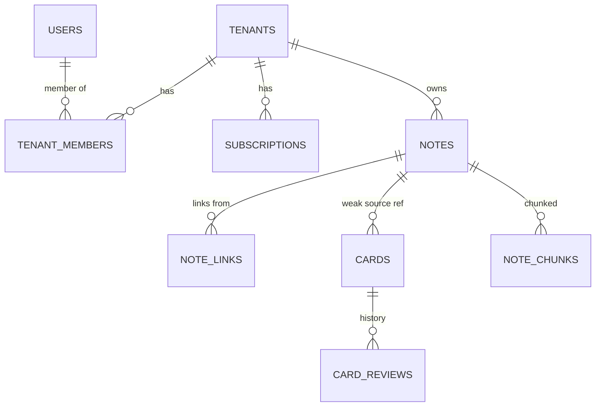

# Synapse — 통합 학습-지식 그래프 SaaS

> 노트(PKM) ↔ 카드(SRS) 양방향 폐쇄 루프로 학습을 자동화하는 **상용 SaaS 플랫폼**.

> **문서 버전**: v2.0 (2026-04-30 전면 재작성)
> **이전 버전**: v1.2 (포트폴리오/상용화 듀얼 트랙) → v2.0에서 **상용 SaaS 단일 트랙**으로 통합
> **Phase**: 1 (MVP)

---

## 0. 문제 정의

### 0.1 시장의 현실
개인 학습 도구는 두 진영으로 분리되어 있고, 각각 결정적 한계가 있다.

| 도구 | 강점 | 결정적 한계 |
|------|------|-------------|
| **PKM (Obsidian, Notion)** | 자유로운 노트, 그래프뷰, 백링크 | **쌓이기만 하고 복습되지 않음.** 1년 전 노트는 "쓴 것 자체를 잊음" |
| **SRS (Anki, RemNote)** | 검증된 망각 곡선 알고리즘 | **카드가 맥락에서 분리됨.** "왜 이 카드를 만들었는지" 기억 안 남 |

> 결과: 정성껏 만든 노트는 묻히고, 외운 카드는 단편 지식으로 떠다닌다.

### 0.2 Synapse의 해결 가설
**노트와 카드를 양방향 폐쇄 루프로 묶으면 두 도구의 한계가 서로를 보완한다.**

- 노트는 카드를 통해 **잊을 만하면 다시 표면 위로** 올라온다.
- 카드는 원본 노트와 그래프 이웃을 통해 **언제나 맥락과 함께** 떠오른다.
- LLM이 노트에서 카드를 자동 생성하고, RAG가 학습 약점을 식별한다.

### 0.3 타깃 사용자
- **1차 (MVP)**: 개발자, 대학원생, 자격증 준비자 — 기술/학술 지식의 장기 기억이 필요한 사용자
- **2차 (Phase 4+)**: 교육자, 학습 코치, 부트캠프 운영자 — Team plan으로 학습 콘텐츠 공유
- **3차 (Phase 6+)**: 기업 교육팀 — Enterprise plan으로 사내 지식관리 + 학습 결합

---

## 1. 제품 정의

### 1.1 한 줄 요약
**Obsidian + Anki + RAG** 를 융합한 SaaS 학습 플랫폼.

### 1.2 핵심 가치 제안 (Value Proposition)

| 사용자 페인 | Synapse 솔루션 |
|-------------|----------------|
| "노트가 쌓이기만 하고 복습 안 됨" | 노트 작성 시 LLM이 카드 자동 생성 → SRS로 강제 복습 |
| "카드가 맥락 없이 단편 지식" | 카드에서 원본 노트로 1-클릭 + 그래프상 이웃 노트 추천 |
| "어디가 약한지 모름" | 그래프뷰에서 정답률 낮은 영역 빨갛게 표시 |
| "검색해도 못 찾음" | 키워드 + 시맨틱 + 그래프 거리를 결합한 하이브리드 검색 |
| "여러 디바이스 동기화 안 됨" | 클라우드 기반 실시간 동기화 + 오프라인 PWA |

### 1.3 차별점 (Competitive Edge)

| 경쟁자 | 한계 | Synapse 차별점 |
|--------|------|----------------|
| Anki | 카드 위주, 노트 작성/연결 약함 | PKM + SRS 통합 |
| Obsidian | 로컬 우선, SRS 플러그인 한계, AI 미통합 | 클라우드 + 1급 SRS + RAG |
| RemNote | 가격 부담, 한국어 약함 | 한국어 nori 형태소 + 합리적 가격 |
| Notion AI | SRS 부재, 망각 곡선 미관리 | 검증된 SM-2/FSRS + 학습 메트릭 |

### 1.4 비즈니스 모델 — Freemium SaaS

| 플랜 | 가격 (월) | 노트 | 카드 | AI 토큰/월 | 그래프뷰 | 팀 멤버 |
|------|-----------|------|------|-----------|---------|---------|
| **Free** | $0 | 1,000 | 500 | 100K | ❌ | 1 |
| **Pro** | $9.99 (₩12,900) | 50,000 | 50,000 | 5M | ✅ | 1 |
| **Team** | $19.99/seat | 무제한 | 무제한 | 20M | ✅ | 5+ |
| **Enterprise** | 협의 | 무제한 | 무제한 | 협의 | ✅ + SSO + Audit | 무제한 |

연간 결제 시 20% 할인. 학생 50% 할인.

---

## 2. 정량적 성공 지표 (KPI)

### 2.1 제품 KPI (제품-시장 적합성)

| 지표 | 목표 (12개월) | 측정 방법 |
|------|--------------|-----------|
| **30일 복습 유지율** | 70%+ | 카드 생성 후 30일 시점 정답률 ≥ 3 |
| **노트 → 카드 전환율** | 60%+ | 작성된 노트 중 카드 1개 이상 생긴 비율 |
| **D7 Retention** | 40%+ | 가입 7일 후 재방문 |
| **D30 Retention** | 25%+ | 가입 30일 후 활성 |
| **Time to First Value** | 5분 이내 | 가입 → 첫 카드 복습 완료까지 |
| **NPS** | 40+ | 분기별 설문 |

### 2.2 비즈니스 KPI

| 지표 | 12개월 목표 | 24개월 목표 |
|------|-------------|-------------|
| **MAU (월간 활성 사용자)** | 10,000 | 100,000 |
| **유료 전환율** | 5% | 10% |
| **MRR** (월간 반복 매출) | $5,000 | $80,000 |
| **CAC** (사용자 획득 비용) | < $20 | < $25 |
| **LTV/CAC 비율** | > 3 | > 4 |
| **Churn (월간)** | < 5% | < 3% |

### 2.3 운영 KPI

| 지표 | SLA / 목표 |
|------|------------|
| **가용성** (Availability) | 99.9% (월 43분 이내 다운타임) |
| **API P99 지연시간** | < 500ms (LLM 제외) |
| **LLM 응답 P95** | < 5초 (스트리밍 first token < 1초) |
| **검색 P95** | < 200ms |
| **데이터 손실** | 0 (RPO 5분, RTO 1시간) |

---

## 3. 시스템 아키텍처

### 3.1 전체 구성도

```mermaid
graph TB
    subgraph Edge[엣지 계층]
        CDN[Cloudflare CDN<br/>+ DDoS 방어]
    end

    subgraph Client[클라이언트]
        Web[Flutter Web<br/>PWA + 오프라인]
        Mobile[Flutter Mobile<br/>iOS/Android]
        DesktopSync[데스크톱 동기화<br/>(Phase 5+)]
    end

    subgraph Gateway[게이트웨이]
        GW[Spring Cloud Gateway<br/>JWT 검증·Tenant 주입·Rate Limit·CORS]
    end

    subgraph CoreServices[코어 서비스]
        Auth[Auth Service<br/>OAuth + MFA + JWT]
        Note[Note Service]
        Card[Card/SRS Service<br/>SM-2 / FSRS plugin]
        Graph[Graph Service]
        AI[AI Service<br/>FastAPI 3 모듈]
        Billing[Billing Service<br/>Stripe 연동]
        Audit[Audit Service]
    end

    subgraph AIModules[AI Service 내부]
        AIGen[generation<br/>LLM 카드 생성]
        AIEmb[embedding<br/>벡터 생성·재임베딩]
        AIRet[retrieval<br/>RAG·시맨틱 검색]
    end

    subgraph DataLayer[데이터 계층]
        PG[(PostgreSQL 16<br/>+ pgvector + RLS)]
        Redis[(Redis Cluster<br/>SRS 큐·세션·캐시)]
        ES[(Elasticsearch 8<br/>풀텍스트 + nori)]
        Kafka[Kafka 3.x<br/>이벤트 버스]
        S3[(S3 / R2<br/>첨부 + 백업)]
        CH[(ClickHouse<br/>장기 분석<br/>(Phase 6+))]
    end

    subgraph External[외부 서비스]
        LLM[LLM Providers<br/>Anthropic·OpenAI·local vLLM]
        Stripe[Stripe<br/>결제]
        SES[Email<br/>SES/Postmark]
        Sentry[Sentry<br/>에러 추적]
        PostHog[PostHog<br/>제품 분석]
    end

    Web --> CDN --> GW
    Mobile --> CDN
    GW --> Auth
    GW --> Note
    GW --> Card
    GW --> Graph
    GW --> AI
    GW --> Billing
    Auth --> PG
    Auth --> Redis
    Note --> PG
    Note --> ES
    Note --> Kafka
    Note --> S3
    Card --> Redis
    Card --> PG
    Card --> Kafka
    Graph --> PG
    AI -.- AIGen
    AI -.- AIEmb
    AI -.- AIRet
    AIGen --> LLM
    AIEmb --> PG
    AIRet --> PG
    AIRet --> ES
    Billing --> Stripe
    Billing --> PG
    Audit --> PG
    Kafka -.->|이벤트 구독| Graph
    Kafka -.->|이벤트 구독| AIEmb
    Kafka -.->|이벤트 구독| ES
    Kafka -.->|이벤트 구독| Audit
    Kafka -.->|배치 ETL| CH
```

### 3.2 서비스별 책임

| 서비스 | 책임 | 핵심 기술 |
|--------|------|-----------|
| **Auth Service** | OAuth/OIDC, MFA(TOTP), JWT, 세션, 테넌트 멤버십 | Spring Security 6, Keycloak (옵션) |
| **Note Service** | 노트 CRUD, 마크다운, 위키링크, 첨부, 검색 라우팅 | Spring Boot 4, JPA, QueryDSL |
| **Card/SRS Service** | 카드 CRUD, SRS 스케줄링, 복습 큐, 통계 | Spring Boot 4, Redis ZSet |
| **Graph Service** | 백링크, PageRank, 클러스터링, 학습 약점 분석 | Spring Boot 4, JGraphT |
| **AI Service** | 3 내부 모듈 (생성/임베딩/검색) | FastAPI, pgvector |
| **Billing Service** | Stripe 연동, 구독 관리, 사용량 집계, 한도 체크 | Spring Boot 4, Stripe SDK |
| **Audit Service** | 감사 로그 수집, GDPR 데이터 export/delete 처리 | Spring Boot 4 |

### 3.3 Multi-Tenancy 모델

**Pool 모델 + Row Level Security (RLS)** 를 채택.

| 측면 | 구현 |
|------|------|
| **격리 수준** | DB 공유 + `tenant_id` + RLS 정책 + 애플리케이션 강제 필터 (이중 방어) |
| **테넌트 단위** | 회원가입 시 1개 personal tenant 자동 생성 |
| **다중 멤버십** | 1명이 여러 tenant 멤버 가능 (`tenant_members`), Pro+에서 활성화 |
| **데이터 위치** | 단일 region (Phase 5+에 multi-region 검토) |
| **Enterprise 격리** | Silo 모델 (별도 DB 인스턴스) — Phase 6+ |

> 모든 도메인 테이블은 `tenant_id` 컬럼 + `(tenant_id, ...)` prefix 인덱스 + RLS 정책을 갖는다.

### 3.4 이벤트 기반 통합 (Event-Driven)

#### 표준 이벤트 봉투 (Envelope)
```json
{
  "eventId": "01941d12-7a8b-7c3e-9f4a-...",
  "eventType": "NoteCreated",
  "schemaVersion": 1,
  "occurredAt": "2026-04-30T12:34:56.789Z",
  "tenantId": "01941a00-...",
  "userId": "01941c8e-...",
  "traceId": "abc-123",
  "payload": { /* 이벤트별 페이로드 */ }
}
```

| 필드 | 역할 |
|------|------|
| `eventId` | 컨슈머 멱등성 (UUIDv7) |
| `eventType` | 이벤트 종류 |
| `schemaVersion` | 스키마 진화 — 미지원 버전은 DLQ |
| `tenantId` | 테넌트 컨텍스트 (모든 이벤트 필수) |
| `traceId` | 분산 추적 |

#### 이벤트 카탈로그

| 이벤트 | 발행자 | 구독자 | 처리 |
|--------|--------|--------|------|
| `NoteCreated` | Note | Graph, AI(emb), ES, Audit, Billing(usage) | 백링크 / 임베딩 / 인덱싱 / 감사 / 사용량 |
| `NoteUpdated` | Note | Graph, AI(emb), ES, Audit | 동일 (incremental) |
| `NoteRenamed` | Note | Graph | 미해결 링크 재해결 |
| `NoteDeleted` | Note | Graph, AI(emb), ES, Card, Audit | 그래프/임베딩 정리, 카드 고아 처리 |
| `CardReviewed` | Card | Graph, Analytics | 학습 통계 갱신 |
| `CardCreated` | Card | Note, Billing(usage) | 노트 카드 카운트 / 사용량 추적 |
| `LLMCalled` | AI | Billing(usage), Audit | 토큰/비용 차감 |
| `SubscriptionChanged` | Billing | Auth(plan 갱신), Audit | 플랜/한도 변경 |
| `UserSignedUp` | Auth | Audit, Email, Analytics | 환영 메일 / 온보딩 |

#### 멱등성 + 스키마 진화
1. 모든 컨슈머는 `processed_events` 테이블로 중복 처리 차단.
2. `(consumer_group, event_id)` PK + INSERT...ON CONFLICT DO NOTHING.
3. 처리 + 기록은 **같은 트랜잭션** (Outbox 패턴).
4. `schemaVersion` 미지원 시 DLQ 토픽 + 알람.

---

## 4. 기술 스택

### 4.1 프론트엔드

| 항목 | 기술 | 선정 이유 |
|------|------|-----------|
| 프레임워크 | Flutter 3.x | 단일 코드베이스 Web/iOS/Android |
| 상태관리 | Riverpod 2 | 선언적, 테스트 용이 |
| 라우팅 | go_router | Web 친화 |
| 마크다운 에디터 | **Plain Markdown + 커스텀 위키링크 파서** | 안정성, 위키링크 자유도 |
| 그래프뷰 | CustomPainter + Isolate | LOD + 200노드 상한 |
| 네트워킹 | Dio + Retrofit | 타입 안전 |
| 로컬 캐시 / 오프라인 | Hive + ServiceWorker (PWA) | 오프라인 복습 |
| 인증 저장 | **httpOnly + Secure 쿠키** (Web) / Secure Storage (Mobile) | XSS 방어 |
| Push 알림 | FCM (Android) + APNs (iOS) | 복습 리마인더 |
| 분석 | PostHog SDK | 제품 사용성 |
| 에러 추적 | Sentry SDK | 운영 |

#### 그래프뷰 성능 대응 (필수)
| 위험 | 대응 |
|------|------|
| 노드 수 증가 | **상한 200개** + LOD + 클러스터 collapse |
| Force-directed 연산 | Dart **Isolate** 분리 |
| 줌 시 디테일 폭주 | LOD: 줌 아웃 시 라벨 숨김, 노드는 점 |
| Web 캔버스 한계 | 100+ 노드 시 CanvasKit 강제 |

### 4.2 백엔드

| 항목 | 기술 | 선정 이유 |
|------|------|-----------|
| 게이트웨이 | Spring Cloud Gateway 4 | JWT, Tenant 주입, Rate limit |
| 코어 서비스 | Spring Boot 4 + Java 21 | LTS, 생태계 |
| ORM | Spring Data JPA + QueryDSL 5 | 동적 쿼리 + 타입 안정성 |
| AI 서비스 | FastAPI + Pydantic v2 | LLM 생태계 |
| 인증 | Spring Security 6 + JWT (httpOnly Cookie) + Refresh + MFA | 표준 |
| 검색 (kw) | PostgreSQL `pg_trgm` (P1) → Elasticsearch + nori (P2+) | 한글 형태소 |
| 검색 (semantic) | pgvector HNSW (P3+) | 단일 DB 운영 단순화 |
| 결제 | Stripe (Checkout + Customer Portal + Webhooks) | 글로벌 표준 |

### 4.3 데이터 계층

| 항목 | 기술 | 비고 |
|------|------|------|
| RDB | PostgreSQL 16 + pgvector 0.7 + RLS | Master + Read Replica |
| 캐시/큐 | Redis 7 Cluster | 복습 큐, 세션, semantic cache |
| 검색 | Elasticsearch 8 + nori | 한글 형태소 |
| 메시징 | Apache Kafka 3.x (또는 Redpanda) | 이벤트 소싱 |
| 객체 저장소 | S3 / Cloudflare R2 | 첨부 + 백업 |
| 장기 분석 | ClickHouse (Phase 6+) | 코호트, A/B |

### 4.4 인프라 / DevOps

| 항목 | 기술 |
|------|------|
| 컨테이너 | Docker + Kubernetes (EKS / GKE) |
| 패키징 | Helm Charts |
| CI/CD | GitHub Actions + ArgoCD (GitOps) |
| 시크릿 | AWS Secrets Manager / HashiCorp Vault |
| 모니터링 | Prometheus + Grafana + Loki |
| 분산 추적 | OpenTelemetry + Tempo / Jaeger |
| LLM 관측 | LangSmith / Phoenix (Arize) |
| 에러 추적 | Sentry |
| 분석 | PostHog (self-hosted 또는 Cloud) |
| CDN / DDoS | Cloudflare |
| Email | Amazon SES / Postmark |

### 4.5 컴플라이언스 / 보안

| 영역 | 기술 / 정책 |
|------|------------|
| 인증 | OAuth 2.0 / OIDC + MFA (TOTP + 백업코드) |
| 비밀번호 | BCrypt cost 12 + haveibeenpwned 차단 |
| Transit 암호화 | TLS 1.3 |
| Rest 암호화 | AWS RDS encryption + S3 SSE-KMS |
| Field-level | AES-256-GCM (KMS 관리 키) — 민감 필드 |
| 감사 로그 | `audit_logs` 테이블 (월별 파티션, 1년+) |
| GDPR/CCPA | `/me/data-export`, `/me/account` DELETE + 30일 grace |
| SOC 2 Type II | Phase 7+ 인증 |
| 한국 개인정보보호법 | Phase 4+ 준수 |

---

## 5. 데이터 모델 핵심 (요약)

> 상세 ERD → [`02_erd_specification.md`](./02_erd_specification.md)

### 5.1 도메인 엔티티 (간략)



### 5.2 핵심 결정사항

| 결정 | 근거 |
|------|------|
| **모든 도메인 테이블에 `tenant_id`** | Multi-tenancy from day 1. 후에 추가 = 마이그레이션 지옥. |
| **PostgreSQL RLS 활성화** | 애플리케이션 실수로 격리 누락 시 DB가 차단 (이중 방어) |
| **카드의 노트 참조는 약결합** (`source_type` + `source_id`) | 외부 임포트, 다중 노트 카드 등 확장성 |
| **SRS 상태는 JSONB** (`srs_state`, `srs_algorithm`) | SM-2 / FSRS / Leitner 등 알고리즘 교체 가능 |
| **임베딩 모델/버전 추적** (`embedding_model`, `embedding_version`) | 모델 마이그레이션 + A/B 테스트 |
| **이벤트 멱등성 테이블** (`processed_events`) | Kafka 중복 소비 방지 |

---

## 6. 단계별 로드맵

> SaaS 출시 + 운영을 가정한 현실적 일정. 1인 풀타임 기준 (외주 활용 시 단축 가능).

### Phase 1: SaaS MVP — "결제 가능한 학습 도구" (8주)
**목표**: 유료 결제까지 가능한 최소 기능 + Multi-tenancy 기반

- [ ] Multi-tenancy 기반 (`tenant_id` + RLS + 강제 필터)
- [ ] 인증: 이메일 + Google/GitHub OAuth + JWT (httpOnly Cookie)
- [ ] 노트 CRUD + 마크다운 + 위키링크 + 백링크
- [ ] 카드 CRUD + SM-2 (`srs_state` JSONB 추상화)
- [ ] 검색: PostgreSQL `pg_trgm` (제목/본문 ILIKE) + `matchReasons`
- [ ] Flutter Web 단일 페이지 (Mobile은 P2)
- [ ] **Stripe 결제 통합** (Free / Pro 2개 플랜)
- [ ] **사용량 추적 + 한도 체크** (`plan_quotas`)
- [ ] **GDPR 데이터 export/delete** (`/me/data-export`, `/me/account` DELETE)
- [ ] **감사 로그** (`audit_logs`) — 인증 + 삭제 행위
- [ ] Sentry + PostHog 통합
- [ ] Docker Compose (개발) + 단일 EC2 또는 ECS Fargate (출시)
- [ ] 기본 모니터링 (Prometheus + Grafana)

**성공 기준**: 첫 100명 베타 사용자 + 첫 유료 결제

### Phase 2: 모바일 + 검색 강화 (6주)
- [ ] Flutter Mobile (iOS + Android) — 스와이프 복습 UX
- [ ] PWA 오프라인 (복습 큐 prefetch + Background Sync)
- [ ] Push 알림 (복습 리마인더, FCM/APNs)
- [ ] Elasticsearch + nori (한글 형태소) 도입
- [ ] 다크모드 + i18n (한/영)
- [ ] Force-directed 그래프뷰 (백링크만, LOD)
- [ ] App Store / Play Store 출시

### Phase 3: AI 통합 (8주)
- [ ] FastAPI AI Service (3 모듈: gen / emb / ret)
- [ ] LLM 카드 자동 생성 (Bloom's Taxonomy 태깅)
- [ ] pgvector 임베딩 + 시맨틱 검색
- [ ] Hybrid Retrieval (BM25 + Vector + RRF)
- [ ] **Semantic Cache** (Redis + 임베딩 매칭, 비용 70% 절감)
- [ ] **Intelligent Routing** (Haiku / Sonnet / Opus 자동 선택)
- [ ] **LLM 사용량 추적 + 한도** (`llm_usage_logs`)
- [ ] Eval 파이프라인 (Recall@10, Faithfulness)
- [ ] AI 카드 생성 → Pro 플랜 가치 검증

### Phase 4: MSA 전환 + 운영 안정화 (10주)
- [ ] 모놀리식 → 6개 서비스 분해 (Auth/Note/Card/Graph/AI/Billing)
- [ ] Kafka 이벤트 기반 통합 (멱등성 + Outbox)
- [ ] Kubernetes (EKS) 운영 환경
- [ ] OpenTelemetry 분산 추적
- [ ] LangSmith LLM 관측
- [ ] **MFA (TOTP)** 도입
- [ ] Backup + DR 훈련
- [ ] Read Replica 도입 (검색/통계 분리)
- [ ] 99.9% 가용성 달성

### Phase 5: 비용 최적화 + 성장 기능 (8주)
- [ ] FSRS 알고리즘 plugin (`srs_algorithm = 'FSRS'`)
- [ ] Graph 고도화 (PageRank + Louvain 클러스터링)
- [ ] **학습 약점 영역 시각화** (히트맵)
- [ ] Admin Dashboard (테넌트 관리, LLM 비용 모니터)
- [ ] A/B 테스트 프레임워크
- [ ] LLM Prompt Compression (LLMLingua)
- [ ] Embedding Quantization (int8)
- [ ] Local vLLM tier (자체 호스팅 비용 절감)
- [ ] **Team Plan 출시** (다중 멤버, 공유 덱)

### Phase 6: Enterprise + 확장 (12주+)
- [ ] **SOC 2 Type II 인증 준비** (감사 시작)
- [ ] **Enterprise SSO** (SAML / OIDC IdP)
- [ ] **Audit Log API** (Enterprise plan)
- [ ] ClickHouse 도입 (장기 분석 + 코호트)
- [ ] Multi-region (US + EU + APAC)
- [ ] Enterprise Silo 옵션 (별도 DB)
- [ ] 한국 개인정보보호법 준수 인증
- [ ] On-premise 옵션 검토

### 합계 일정
- **MVP 출시**: Phase 1 (8주 ≈ 2개월)
- **유료 SaaS 안정화**: Phase 1~3 (22주 ≈ 5.5개월)
- **Production 안정화**: Phase 1~4 (32주 ≈ 8개월)
- **Team plan + 성장**: Phase 1~5 (40주 ≈ 10개월)
- **Enterprise Ready**: Phase 6+ (12개월 이상)

---

## 7. 비용 시뮬레이션

### 7.1 단계별 인프라 + LLM 비용 (월간, USD)

| 단계 | MAU | 인프라 | LLM | 총비용 | 손익분기 (Pro) |
|------|-----|--------|-----|--------|----------------|
| MVP | 100 | $80 | $30 | $110 | 11명 가입 |
| Early | 1,000 | $400 | $400 | $800 | 80명 가입 |
| Growth | 10,000 | $3,000 | $4,000 | $7,000 | 700명 가입 |
| Scale | 100,000 | $25,000 | $30,000 | $55,000 | 5,500명 가입 |

가정:
- LLM 비용: Free 평균 $0.30/월, Pro 평균 $4.00/월 (캐싱 70% 적용 후)
- Pro 전환율 7~13%, 가격 $9.99
- 인프라: AWS RDS, ElastiCache, EKS, S3, CloudFront

### 7.2 LLM 비용 분해 (캐싱 후)

| 작업 | 모델 | 비용/요청 (캐싱 후) |
|------|------|--------------------|
| 카드 생성 (10장) | Sonnet | $0.012 |
| 시맨틱 검색 (1회) | embedding-3-small | $0.00003 |
| Q&A (1회) | Sonnet | $0.015 |
| 노트 요약 | Haiku | $0.0015 |

> Semantic Cache 적중률 70% 가정 시 LLM 비용 70% 절감.

### 7.3 비용 통제 메커니즘

1. **Tenant Quota** (`plan_quotas.max_ai_tokens_monthly`): 플랜별 월간 한도
2. **Budget Alert**: 80% 도달 시 이메일, 100% 도달 시 차단
3. **Anomaly Detection**: 시간당 폭주 감지 → 자동 차단
4. **Intelligent Routing**: 작업 복잡도 + 플랜에 따라 작은 모델 우선
5. **Semantic Cache**: 비슷한 입력 재사용
6. **Local vLLM Tier** (Phase 5+): 자체 호스팅으로 50% 절감

---

## 8. 위험 요소 및 대응

| 위험 | 발생 가능성 | 영향 | 대응 |
|------|------------|------|------|
| **LLM 비용 폭주** | **높음** | **치명적** | Semantic Cache + Intelligent Routing + Tenant Quota + Budget Alert (다층 방어) |
| **Multi-tenant 데이터 유출** | 중 | **치명적** | RLS + 애플리케이션 강제 필터 + 자동화 격리 테스트 + Audit Log |
| **Stripe Webhook 실패 처리 미흡** | 중 | 높음 | Idempotency Key + 재시도 + Dunning + 사용자 알림 |
| **Vector DB 성능 저하** (대규모) | 중 | 중 | Embedding Quantization + Partition + Qdrant 이전 검토 |
| **Cold start (LLM 응답 지연)** | 높음 | 중 | Streaming + Cache + 작은 모델 라우팅 |
| **Phase 4 MSA 전환 일정 지연** | 중 | 높음 | 모놀리식 단계에서 패키지 격리 + 이벤트 봉투 미리 도입 |
| **Flutter Web 그래프뷰 성능** | 중 | 중 | Isolate + LOD + 200노드 상한 + CanvasKit |
| **GDPR 데이터 삭제 누락** | 낮음 | 매우 높음 | 자동화 테스트 + 분기별 감사 + 외부 감사인 검토 |
| **컴플라이언스 인증 지연** | 중 | 중 | SOC 2는 6~12개월 소요, Phase 5부터 준비 |
| **악의적 컨텐츠 생성 (LLM)** | 낮음 | 높음 | Content moderation + 사용자 신고 + 패턴 차단 + Guardrails |
| **모바일 Push 인증서 만료** | 중 | 중 | 자동 갱신 모니터 + 캘린더 알람 |
| **결제 사기 (카드 도용)** | 중 | 중 | Stripe Radar + 의심 거래 검토 |
| **개인정보보호법 위반 (한국)** | 낮음 | **매우 높음** | 한국어 약관 + 동의 흐름 + 분기별 점검 |

---

## 9. 컴플라이언스 로드맵

| 인증/규제 | 우선순위 | 도입 시점 | 비고 |
|-----------|---------|-----------|------|
| **GDPR** | 높음 | Phase 1 | EU 사용자 받으려면 필수 |
| **CCPA** | 높음 | Phase 1 | 캘리포니아 사용자 |
| **한국 개인정보보호법** | 높음 | Phase 1 | 한국 사용자 받으려면 필수 |
| **PCI-DSS** | 자동 | Phase 1 | Stripe Hosted Checkout 사용 시 SAQ A 적용 |
| **SOC 2 Type II** | 중 | Phase 6 | B2B 고객사 요구 |
| **ISO 27001** | 중 | Phase 7 | 글로벌 엔터프라이즈 |
| **HIPAA** | 낮음 | (필요 시) | 의료 도메인 진출 시 |

---

## 10. 다음 단계

1. **상세 ERD 작성** → [`02_erd_specification.md`](./02_erd_specification.md) (v2.0)
2. **API 명세서 작성** → [`03_api_specification.md`](./03_api_specification.md) (v2.0)
3. **운영 / 보안 가이드** → [`04_operations_security.md`](./04_operations_security.md) (v2.0)
4. **CLAUDE.md harness** → [`../CLAUDE.md`](../CLAUDE.md) (v2.0)
5. **첫 ADR 작성**:
   - ADR-001: Multi-tenancy 모델 (Pool + RLS 채택 근거)
   - ADR-002: LLM Cost Optimization 전략
   - ADR-003: 인증 토큰 저장 (httpOnly Cookie 채택 근거)
6. Phase 1 MVP 디렉토리 구조 + 초기 코드 스캐폴딩
7. Stripe + Sentry + PostHog 계정 + API 키 셋업

---

**문서 버전**: v2.0
**최종 수정**: 2026-04-30
**관련 문서**:
- [`02_erd_specification.md`](./02_erd_specification.md) — ERD 명세 (v2.0)
- [`03_api_specification.md`](./03_api_specification.md) — API 명세 (v2.0)
- [`04_operations_security.md`](./04_operations_security.md) — 운영/보안 가이드 (v2.0)
- [`../CLAUDE.md`](../CLAUDE.md) — Claude harness (v2.0)
