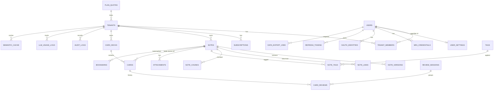

# Synapse — ERD 명세서

> PostgreSQL 16 + pgvector 0.7 + Row Level Security (RLS) 기반 SaaS DB 스키마

> **문서 버전**: v2.0 (2026-04-30 전면 재작성)
> **이전 버전**: v1.2 (포트폴리오/상용화 분리) → v2.0에서 **상용 SaaS 단일 트랙** 통합
> **주요 통합**: 상용화 트랙 전용 테이블 (`semantic_cache`, `llm_usage_logs`, `audit_logs`, `plan_quotas`) 본 문서로 흡수

---

## 0. 설계 철학

이 ERD는 **첫날부터 상용 SaaS** 를 가정하고 설계된다. 핵심 원칙은:

1. **Multi-tenancy from day 1** — 모든 도메인 테이블에 `tenant_id`. RLS로 이중 방어.
2. **Audit by default** — 모든 중요 행위는 `audit_logs` 에 기록.
3. **Cost observability** — 모든 LLM 호출은 `llm_usage_logs` 에 토큰/비용 추적.
4. **Right to be forgotten** — Soft delete + 30일 grace + hard delete + 익명화.
5. **Forward-only migrations** — 롤백 마이그레이션 없음. 백업으로 복구.
6. **Schema versioning** — 임베딩, 알고리즘, 이벤트 모두 version 추적.

---

## 1. 명명 / 인덱스 규칙

### 1.1 명명 규칙
- 테이블명: 복수형 snake_case (`notes`, `card_reviews`)
- 컬럼명: snake_case (`created_at`, `srs_state`)
- PK: `id` (UUID v7)
- FK: `<참조테이블 단수>_id`
- 인덱스: `idx_<테이블>_<컬럼들>`
- Unique: `uq_<테이블>_<컬럼들>`
- 부분 인덱스: `WHERE deleted_at IS NULL` 일반화

### 1.2 인덱스 규칙 (Multi-tenant)
**모든 도메인 테이블의 인덱스는 `tenant_id` 를 prefix 로 가진다.** 이는 카디널리티 유지 + RLS 효율 + 조인 최적화의 3중 효과.

```sql
-- ✅ 올바른 패턴
CREATE INDEX idx_notes_tenant_user_updated
  ON notes(tenant_id, user_id, updated_at DESC)
  WHERE deleted_at IS NULL;

-- ❌ tenant_id 누락 (지양)
CREATE INDEX idx_notes_user_updated ON notes(user_id, updated_at DESC);
```

### 1.3 표준 컬럼

모든 도메인 테이블은 다음 표준 컬럼을 가진다.

```sql
id UUID PRIMARY KEY,                        -- UUID v7
tenant_id UUID NOT NULL REFERENCES tenants(id),
created_at TIMESTAMPTZ NOT NULL DEFAULT NOW(),
updated_at TIMESTAMPTZ NOT NULL DEFAULT NOW(),
deleted_at TIMESTAMPTZ                       -- soft delete (해당되는 경우)
```

---

## 2. 전체 ERD



---

## 3. 테넌시 / 빌링 도메인

### 3.1 `tenants` — 테넌트 (격리 단위)

| 컬럼 | 타입 | 제약 | 설명 |
|------|------|------|------|
| `id` | UUID | PK | UUID v7 |
| `name` | VARCHAR(200) | NOT NULL | 표시 이름 |
| `slug` | VARCHAR(100) | UNIQUE, NOT NULL | URL 식별자 (`synapse.app/t/{slug}`) |
| `plan` | VARCHAR(50) | NOT NULL, DEFAULT 'free', FK → plan_quotas(plan) | `free` / `pro` / `team` / `enterprise` |
| `status` | VARCHAR(20) | NOT NULL, DEFAULT 'active' | `active` / `trialing` / `suspended` / `deleted` |
| `tenant_type` | VARCHAR(20) | NOT NULL, DEFAULT 'personal' | `personal` / `team` / `enterprise` |
| `region` | VARCHAR(20) | NOT NULL, DEFAULT 'ap-northeast-2' | 데이터 거주 region |
| `settings` | JSONB | NOT NULL, DEFAULT '{}'::jsonb | 테넌트 설정 |
| `created_at` | TIMESTAMPTZ | NOT NULL, DEFAULT NOW() |  |
| `updated_at` | TIMESTAMPTZ | NOT NULL, DEFAULT NOW() |  |
| `deleted_at` | TIMESTAMPTZ |  | Soft delete (30일 grace) |

**인덱스**:
- `uq_tenants_slug` UNIQUE (`slug`) WHERE `deleted_at IS NULL`
- `idx_tenants_status` (`status`) WHERE `status != 'active'`
- `idx_tenants_plan` (`plan`)

**비고**:
- 회원가입 시 personal tenant 자동 생성. 사용자명을 slug로 변환.
- Pro 업그레이드 시 동일 tenant의 plan만 변경.
- Team plan은 별도 tenant 생성 (멤버 초대 가능).

---

### 3.2 `tenant_members` — 테넌트 멤버십

| 컬럼 | 타입 | 제약 |
|------|------|------|
| `tenant_id` | UUID | PK, FK → tenants(id) ON DELETE CASCADE |
| `user_id` | UUID | PK, FK → users(id) ON DELETE CASCADE |
| `role` | VARCHAR(20) | NOT NULL, DEFAULT 'member' |
| `invited_by` | UUID | FK → users(id) |
| `joined_at` | TIMESTAMPTZ | NOT NULL, DEFAULT NOW() |

**역할**: `owner` / `admin` / `member` / `viewer`

**인덱스**:
- `idx_tenant_members_user` (`user_id`)
- `idx_tenant_members_tenant_role` (`tenant_id`, `role`)

---

### 3.3 `plan_quotas` — 플랜별 한도

| 컬럼 | 타입 | 제약 | 설명 |
|------|------|------|------|
| `plan` | VARCHAR(50) | PK | `free` / `pro` / `team` / `enterprise` |
| `display_name` | VARCHAR(100) | NOT NULL |  |
| `price_usd_monthly` | NUMERIC(10, 2) | NOT NULL, DEFAULT 0 |  |
| `price_usd_yearly` | NUMERIC(10, 2) |  | 연간 할인가 |
| `max_notes` | INTEGER |  | NULL = 무제한 |
| `max_cards` | INTEGER |  |  |
| `max_storage_bytes` | BIGINT |  |  |
| `max_ai_tokens_monthly` | BIGINT |  |  |
| `max_ai_card_generations_monthly` | INTEGER |  |  |
| `max_users_per_tenant` | INTEGER |  | 1 = personal, NULL = 무제한 |
| `features` | JSONB | NOT NULL, DEFAULT '{}'::jsonb | 기능 플래그 |
| `is_active` | BOOLEAN | NOT NULL, DEFAULT TRUE |  |
| `created_at` | TIMESTAMPTZ | NOT NULL, DEFAULT NOW() |  |

**`features` JSONB 예시**:
```json
{
  "graphView": true,
  "semanticSearch": true,
  "ssoEnabled": false,
  "auditLog": false,
  "prioritySupport": false,
  "maxBackupRetentionDays": 30
}
```

**시드 데이터**:
```sql
INSERT INTO plan_quotas VALUES
('free',       'Free',       0.00,    NULL,     1000,  500,   100000000,  100000,   10,   1, '{"graphView":false,"semanticSearch":false}'),
('pro',        'Pro',        9.99,    95.88,    50000, 50000, 10000000000,5000000,  500,  1, '{"graphView":true,"semanticSearch":true}'),
('team',       'Team',       19.99,   191.88,   NULL,  NULL,  NULL,       20000000, 2000, 50,'{"graphView":true,"semanticSearch":true,"sharedDecks":true}'),
('enterprise', 'Enterprise', NULL,    NULL,     NULL,  NULL,  NULL,       NULL,     NULL, NULL,'{"graphView":true,"semanticSearch":true,"sharedDecks":true,"ssoEnabled":true,"auditLog":true,"prioritySupport":true}');
```

---

### 3.4 `subscriptions` — Stripe 구독

| 컬럼 | 타입 | 제약 | 설명 |
|------|------|------|------|
| `id` | UUID | PK |  |
| `tenant_id` | UUID | FK → tenants(id), NOT NULL, UNIQUE | 1 tenant = 1 active subscription |
| `plan` | VARCHAR(50) | NOT NULL, FK → plan_quotas(plan) |  |
| `status` | VARCHAR(20) | NOT NULL | `trialing` / `active` / `past_due` / `canceled` / `incomplete` |
| `stripe_customer_id` | VARCHAR(100) | UNIQUE |  |
| `stripe_subscription_id` | VARCHAR(100) | UNIQUE |  |
| `stripe_price_id` | VARCHAR(100) |  | 월간/연간 구분 |
| `current_period_start` | TIMESTAMPTZ | NOT NULL |  |
| `current_period_end` | TIMESTAMPTZ | NOT NULL |  |
| `trial_end` | TIMESTAMPTZ |  | 무료 체험 종료 |
| `cancel_at_period_end` | BOOLEAN | NOT NULL, DEFAULT FALSE |  |
| `canceled_at` | TIMESTAMPTZ |  |  |
| `metadata` | JSONB | NOT NULL, DEFAULT '{}'::jsonb |  |
| `created_at` | TIMESTAMPTZ | NOT NULL, DEFAULT NOW() |  |
| `updated_at` | TIMESTAMPTZ | NOT NULL, DEFAULT NOW() |  |

**인덱스**:
- `idx_subscriptions_status` (`status`)
- `idx_subscriptions_period_end` (`current_period_end`) WHERE `status IN ('active','trialing')`
- `uq_subscriptions_stripe_sub` UNIQUE (`stripe_subscription_id`)

**비고**:
- Stripe Webhook 으로 동기화. `customer.subscription.updated` 등 처리.
- `tenants.plan` 과 일치 보장 (트리거 또는 트랜잭션).

---

### 3.5 `usage_counters` — 사용량 집계 (월간 롤업)

| 컬럼 | 타입 | 제약 |
|------|------|------|
| `tenant_id` | UUID | PK, FK → tenants(id) |
| `period` | DATE | PK | 월의 첫째 날 (예: `2026-04-01`) |
| `notes_count` | INTEGER | NOT NULL, DEFAULT 0 |
| `cards_count` | INTEGER | NOT NULL, DEFAULT 0 |
| `storage_bytes` | BIGINT | NOT NULL, DEFAULT 0 |
| `ai_tokens_used` | BIGINT | NOT NULL, DEFAULT 0 |
| `ai_card_generations` | INTEGER | NOT NULL, DEFAULT 0 |
| `cost_usd` | NUMERIC(10, 4) | NOT NULL, DEFAULT 0 |
| `updated_at` | TIMESTAMPTZ | NOT NULL, DEFAULT NOW() |

**인덱스**:
- `idx_usage_counters_period` (`period`)

**비고**:
- 매시간 배치 잡으로 갱신 (Kafka 이벤트 + 집계).
- 한도 체크는 이 테이블 + 실시간 추가 카운트 조합.

---

## 4. 인증 / 사용자 도메인

### 4.1 `users` — 사용자 (글로벌, tenant_id 없음)

| 컬럼 | 타입 | 제약 | 설명 |
|------|------|------|------|
| `id` | UUID | PK |  |
| `email` | VARCHAR(255) | UNIQUE, NOT NULL | 로그인 식별자 |
| `username` | VARCHAR(50) | UNIQUE, NOT NULL | URL용 |
| `password_hash` | VARCHAR(255) |  | NULL = OAuth-only 사용자 |
| `display_name` | VARCHAR(100) |  |  |
| `avatar_url` | VARCHAR(500) |  |  |
| `email_verified_at` | TIMESTAMPTZ |  |  |
| `mfa_enabled` | BOOLEAN | NOT NULL, DEFAULT FALSE |  |
| `password_changed_at` | TIMESTAMPTZ |  | 강제 재로그인 트리거 |
| `last_login_at` | TIMESTAMPTZ |  |  |
| `failed_login_count` | INTEGER | NOT NULL, DEFAULT 0 |  |
| `locked_until` | TIMESTAMPTZ |  | brute force 잠금 |
| `default_tenant_id` | UUID | FK → tenants(id) | 로그인 직후 선택될 tenant |
| `created_at` | TIMESTAMPTZ | NOT NULL, DEFAULT NOW() |  |
| `updated_at` | TIMESTAMPTZ | NOT NULL, DEFAULT NOW() |  |
| `deleted_at` | TIMESTAMPTZ |  | GDPR soft delete |
| `anonymized_at` | TIMESTAMPTZ |  | 익명화 완료 시각 |

**인덱스**:
- `uq_users_email` UNIQUE (`email`) WHERE `deleted_at IS NULL`
- `uq_users_username` UNIQUE (`username`) WHERE `deleted_at IS NULL`
- `idx_users_locked` (`locked_until`) WHERE `locked_until IS NOT NULL`

**비고**:
- `users` 테이블은 글로벌 (`tenant_id` 없음). 한 사용자가 여러 tenant 멤버 가능.
- 비밀번호는 BCrypt cost 12. OAuth-only 사용자는 NULL.
- 30일 grace 후 hard delete + `anonymized_at` 마킹 (분석용 더미 ID로 치환).

---

### 4.2 `oauth_identities` — OAuth 연결

| 컬럼 | 타입 | 제약 | 설명 |
|------|------|------|------|
| `id` | UUID | PK |  |
| `user_id` | UUID | FK → users(id) ON DELETE CASCADE, NOT NULL |  |
| `provider` | VARCHAR(50) | NOT NULL | `google` / `github` / `apple` / `microsoft` |
| `provider_user_id` | VARCHAR(255) | NOT NULL |  |
| `email` | VARCHAR(255) |  |  |
| `metadata` | JSONB | NOT NULL, DEFAULT '{}'::jsonb |  |
| `created_at` | TIMESTAMPTZ | NOT NULL, DEFAULT NOW() |  |

**인덱스**:
- `uq_oauth_provider_user` UNIQUE (`provider`, `provider_user_id`)
- `idx_oauth_user_id` (`user_id`)

---

### 4.3 `mfa_credentials` — MFA 자격증명

| 컬럼 | 타입 | 제약 | 설명 |
|------|------|------|------|
| `id` | UUID | PK |  |
| `user_id` | UUID | FK → users(id) ON DELETE CASCADE, NOT NULL |  |
| `mfa_type` | VARCHAR(20) | NOT NULL | `totp` / `webauthn` / `backup_code` |
| `secret_encrypted` | TEXT |  | KMS 암호화 (TOTP) |
| `metadata` | JSONB | NOT NULL, DEFAULT '{}'::jsonb |  |
| `last_used_at` | TIMESTAMPTZ |  |  |
| `created_at` | TIMESTAMPTZ | NOT NULL, DEFAULT NOW() |  |

**인덱스**:
- `idx_mfa_user_type` (`user_id`, `mfa_type`)

---

### 4.4 `refresh_tokens` — Refresh 토큰

| 컬럼 | 타입 | 제약 | 설명 |
|------|------|------|------|
| `id` | UUID | PK |  |
| `user_id` | UUID | FK → users(id), NOT NULL |  |
| `tenant_id` | UUID | FK → tenants(id), NOT NULL | 발급 시점의 활성 tenant |
| `token_hash` | VARCHAR(64) | UNIQUE, NOT NULL | SHA-256 (raw 미저장) |
| `device_id` | VARCHAR(100) |  | 디바이스 추적 |
| `device_name` | VARCHAR(200) |  | "Chrome on macOS" 등 |
| `expires_at` | TIMESTAMPTZ | NOT NULL |  |
| `revoked_at` | TIMESTAMPTZ |  |  |
| `user_agent` | VARCHAR(500) |  |  |
| `ip_address` | INET |  |  |
| `created_at` | TIMESTAMPTZ | NOT NULL, DEFAULT NOW() |  |
| `last_used_at` | TIMESTAMPTZ |  |  |

**인덱스**:
- `idx_refresh_user_active` (`user_id`) WHERE `revoked_at IS NULL`
- `idx_refresh_expires` (`expires_at`)

**비고**: 디바이스별로 발급. 로그인 세션 관리 UI (디바이스 목록 + 개별 로그아웃).

---

### 4.5 `user_settings`

| 컬럼 | 타입 | 제약 | 설명 |
|------|------|------|------|
| `user_id` | UUID | PK, FK → users(id) ON DELETE CASCADE |  |
| `locale` | VARCHAR(10) | NOT NULL, DEFAULT 'ko-KR' |  |
| `theme` | VARCHAR(20) | NOT NULL, DEFAULT 'system' |  |
| `srs_config` | JSONB | NOT NULL, DEFAULT '{}'::jsonb |  |
| `editor_config` | JSONB | NOT NULL, DEFAULT '{}'::jsonb |  |
| `notification_prefs` | JSONB | NOT NULL, DEFAULT '{}'::jsonb |  |
| `pii_redaction_enabled` | BOOLEAN | NOT NULL, DEFAULT FALSE |  |
| `marketing_opt_in` | BOOLEAN | NOT NULL, DEFAULT FALSE | GDPR 명시 동의 |
| `updated_at` | TIMESTAMPTZ | NOT NULL, DEFAULT NOW() |  |

**`notification_prefs` 예시**:
```json
{
  "reviewReminderTime": "09:00",
  "reviewReminderDays": ["mon","tue","wed","thu","fri"],
  "weeklyDigest": true,
  "emailMarketing": false
}
```

---

### 4.6 `data_export_jobs` — GDPR 데이터 내보내기

| 컬럼 | 타입 | 제약 | 설명 |
|------|------|------|------|
| `id` | UUID | PK |  |
| `user_id` | UUID | FK → users(id), NOT NULL |  |
| `tenant_id` | UUID | FK → tenants(id), NOT NULL |  |
| `format` | VARCHAR(50) | NOT NULL | `obsidian-zip` / `anki-apkg` / `json` |
| `scope` | VARCHAR(50) | NOT NULL, DEFAULT 'all' | `all` / `notes_only` / `cards_only` |
| `status` | VARCHAR(20) | NOT NULL | `pending` / `running` / `completed` / `failed` |
| `progress` | INTEGER | NOT NULL, DEFAULT 0 | 0~100 |
| `download_url` | VARCHAR(1000) |  | S3 signed URL |
| `expires_at` | TIMESTAMPTZ |  | 다운로드 URL 만료 (24h) |
| `size_bytes` | BIGINT |  |  |
| `error` | TEXT |  |  |
| `created_at` | TIMESTAMPTZ | NOT NULL, DEFAULT NOW() |  |
| `completed_at` | TIMESTAMPTZ |  |  |

**인덱스**:
- `idx_export_user` (`user_id`, `created_at` DESC)
- `idx_export_status` (`status`) WHERE `status IN ('pending','running')`

---

## 5. 노트 도메인

### 5.1 `notes`

| 컬럼 | 타입 | 제약 | 설명 |
|------|------|------|------|
| `id` | UUID | PK |  |
| `tenant_id` | UUID | FK → tenants(id), NOT NULL | **격리** |
| `user_id` | UUID | FK → users(id), NOT NULL | 소유자 |
| `title` | VARCHAR(500) | NOT NULL | 위키링크 키 |
| `content_md` | TEXT | NOT NULL, DEFAULT '' |  |
| `content_html` | TEXT |  | 렌더 캐시 |
| `summary_embedding` | VECTOR(1536) |  |  |
| `summary_embedding_model` | VARCHAR(100) |  | `text-embedding-3-small` 등 |
| `summary_embedding_version` | INTEGER |  | 같은 모델 내 버전 |
| `metadata` | JSONB | NOT NULL, DEFAULT '{}'::jsonb |  |
| `is_pinned` | BOOLEAN | NOT NULL, DEFAULT FALSE |  |
| `is_archived` | BOOLEAN | NOT NULL, DEFAULT FALSE |  |
| `word_count` | INTEGER | NOT NULL, DEFAULT 0 |  |
| `created_at` | TIMESTAMPTZ | NOT NULL, DEFAULT NOW() |  |
| `updated_at` | TIMESTAMPTZ | NOT NULL, DEFAULT NOW() |  |
| `deleted_at` | TIMESTAMPTZ |  |  |

**인덱스**:
- `idx_notes_tenant_user` (`tenant_id`, `user_id`) WHERE `deleted_at IS NULL`
- `uq_notes_tenant_user_title` UNIQUE (`tenant_id`, `user_id`, `title`) WHERE `deleted_at IS NULL`
- `idx_notes_tenant_updated` (`tenant_id`, `user_id`, `updated_at` DESC) WHERE `deleted_at IS NULL`
- `idx_notes_title_trgm` USING GIN (`tenant_id`, `title gin_trgm_ops`)
- `idx_notes_embedding` USING HNSW (`summary_embedding vector_cosine_ops`) WHERE `tenant_id IS NOT NULL` ← **partial index 로 tenant 격리 강제**

**RLS 정책**:
```sql
ALTER TABLE notes ENABLE ROW LEVEL SECURITY;

CREATE POLICY tenant_isolation_notes ON notes
  USING (tenant_id = current_setting('app.tenant_id')::uuid);
```

---

### 5.2 `note_versions` — 버전 이력

| 컬럼 | 타입 | 제약 |
|------|------|------|
| `id` | UUID | PK |
| `tenant_id` | UUID | FK → tenants(id), NOT NULL |
| `note_id` | UUID | FK → notes(id) ON DELETE CASCADE, NOT NULL |
| `version_no` | INTEGER | NOT NULL |
| `content_md` | TEXT | NOT NULL |
| `created_by` | UUID | FK → users(id) |
| `created_at` | TIMESTAMPTZ | NOT NULL, DEFAULT NOW() |

**인덱스**:
- `uq_note_versions_note_version` UNIQUE (`note_id`, `version_no`)
- `idx_note_versions_tenant_note` (`tenant_id`, `note_id`, `created_at` DESC)

**보존 정책**: 1시간 내 변경은 같은 버전에 머지 (정책 B). 30일 이상 자동 정리 (Pro+은 90일).

---

### 5.3 `note_links` — 위키링크

| 컬럼 | 타입 | 제약 |
|------|------|------|
| `id` | UUID | PK |
| `tenant_id` | UUID | FK → tenants(id), NOT NULL |
| `src_note_id` | UUID | FK → notes(id) ON DELETE CASCADE, NOT NULL |
| `dst_note_id` | UUID | FK → notes(id) | NULL = 미해결 |
| `link_text` | VARCHAR(500) | NOT NULL |
| `dst_title` | VARCHAR(500) | NOT NULL |
| `position` | INTEGER |  |
| `created_at` | TIMESTAMPTZ | NOT NULL, DEFAULT NOW() |

**인덱스**:
- `idx_note_links_tenant_src` (`tenant_id`, `src_note_id`)
- `idx_note_links_tenant_dst` (`tenant_id`, `dst_note_id`) WHERE `dst_note_id IS NOT NULL`
- `idx_note_links_tenant_dst_title` (`tenant_id`, `dst_title`)
- `uq_note_links_src_pos` UNIQUE (`src_note_id`, `dst_title`, `position`)

---

### 5.4 `note_chunks` — RAG 청크

| 컬럼 | 타입 | 제약 | 설명 |
|------|------|------|------|
| `id` | UUID | PK |  |
| `tenant_id` | UUID | FK → tenants(id), NOT NULL | **벡터 검색 격리 핵심** |
| `note_id` | UUID | FK → notes(id) ON DELETE CASCADE, NOT NULL |  |
| `chunk_index` | INTEGER | NOT NULL |  |
| `content` | TEXT | NOT NULL |  |
| `embedding` | VECTOR(1536) | NOT NULL |  |
| `embedding_model` | VARCHAR(100) | NOT NULL |  |
| `embedding_version` | INTEGER | NOT NULL, DEFAULT 1 |  |
| `chunk_strategy` | VARCHAR(50) | NOT NULL | `fixed-512-50` / `markdown-section` / `semantic` |
| `tokens` | INTEGER |  |  |
| `metadata` | JSONB | NOT NULL, DEFAULT '{}'::jsonb |  |
| `created_at` | TIMESTAMPTZ | NOT NULL, DEFAULT NOW() |  |

**인덱스**:
- `uq_note_chunks_note_index` UNIQUE (`note_id`, `chunk_index`)
- `idx_note_chunks_tenant_note` (`tenant_id`, `note_id`)
- `idx_note_chunks_embedding` USING HNSW (`embedding vector_cosine_ops`) WHERE `tenant_id IS NOT NULL`
- `idx_note_chunks_model_version` (`embedding_model`, `embedding_version`)

#### 청크 재생성 정책

| 트리거 | 정책 |
|--------|------|
| 본문 수정 | 전체 청크 삭제 후 재생성 (Phase 1-3) → diff 기반 (Phase 5+) |
| 모델/버전 업그레이드 | 백그라운드 잡으로 점진 재생성 |
| 단순 메타 변경 (title) | 청크 미변경, summary_embedding만 재생성 |

---

### 5.5 `tags`, `note_tags`, `attachments`, `bookmarks`

#### `tags`
| 컬럼 | 타입 | 제약 |
|------|------|------|
| `id` | UUID | PK |
| `tenant_id` | UUID | FK → tenants(id), NOT NULL |
| `user_id` | UUID | FK → users(id), NOT NULL |
| `name` | VARCHAR(50) | NOT NULL |
| `color` | CHAR(7) | DEFAULT '#808080' |
| `created_at` | TIMESTAMPTZ | NOT NULL, DEFAULT NOW() |

**인덱스**: `uq_tags_tenant_user_name` UNIQUE (`tenant_id`, `user_id`, LOWER(`name`))

#### `note_tags`
| 컬럼 | 타입 | 제약 |
|------|------|------|
| `tenant_id` | UUID | NOT NULL |
| `note_id` | UUID | PK, FK → notes(id) ON DELETE CASCADE |
| `tag_id` | UUID | PK, FK → tags(id) ON DELETE CASCADE |
| `created_at` | TIMESTAMPTZ | NOT NULL, DEFAULT NOW() |

#### `attachments`
| 컬럼 | 타입 | 제약 |
|------|------|------|
| `id` | UUID | PK |
| `tenant_id` | UUID | FK → tenants(id), NOT NULL |
| `note_id` | UUID | FK → notes(id) ON DELETE CASCADE |
| `file_name` | VARCHAR(255) | NOT NULL |
| `mime_type` | VARCHAR(100) | NOT NULL |
| `size_bytes` | BIGINT | NOT NULL |
| `storage_key` | VARCHAR(500) | NOT NULL |
| `storage_provider` | VARCHAR(20) | NOT NULL, DEFAULT 's3' |
| `created_at` | TIMESTAMPTZ | NOT NULL, DEFAULT NOW() |

**인덱스**: `idx_attachments_tenant_note` (`tenant_id`, `note_id`)

#### `bookmarks`
| 컬럼 | 타입 | 제약 |
|------|------|------|
| `tenant_id` | UUID | NOT NULL |
| `user_id` | UUID | PK |
| `note_id` | UUID | PK, FK → notes(id) ON DELETE CASCADE |
| `created_at` | TIMESTAMPTZ | NOT NULL, DEFAULT NOW() |

---

## 6. 카드 / SRS 도메인

### 6.1 `card_decks`

| 컬럼 | 타입 | 제약 |
|------|------|------|
| `id` | UUID | PK |
| `tenant_id` | UUID | FK → tenants(id), NOT NULL |
| `user_id` | UUID | FK → users(id), NOT NULL |
| `name` | VARCHAR(100) | NOT NULL |
| `description` | TEXT |  |
| `color` | CHAR(7) | DEFAULT '#4A90E2' |
| `parent_deck_id` | UUID | FK → card_decks(id) |
| `is_shared` | BOOLEAN | NOT NULL, DEFAULT FALSE | Team plan 공유 |
| `created_at` | TIMESTAMPTZ | NOT NULL, DEFAULT NOW() |
| `updated_at` | TIMESTAMPTZ | NOT NULL, DEFAULT NOW() |
| `deleted_at` | TIMESTAMPTZ |  |

**인덱스**:
- `uq_decks_tenant_user_name` UNIQUE (`tenant_id`, `user_id`, `name`) WHERE `deleted_at IS NULL`

---

### 6.2 `cards`

| 컬럼 | 타입 | 제약 | 설명 |
|------|------|------|------|
| `id` | UUID | PK |  |
| `tenant_id` | UUID | FK → tenants(id), NOT NULL |  |
| `deck_id` | UUID | FK → card_decks(id), NOT NULL |  |
| `source_type` | VARCHAR(20) | NOT NULL, DEFAULT 'NOTE' | `NOTE` / `MANUAL` / `IMPORT` / `MULTI` / `NOTE_DELETED` |
| `source_id` | UUID |  | 약결합 (FK 아님) |
| `card_type` | VARCHAR(20) | NOT NULL | `qa` / `cloze` / `definition` |
| `front` | TEXT | NOT NULL |  |
| `back` | TEXT | NOT NULL |  |
| `bloom_level` | VARCHAR(20) |  |  |
| `srs_algorithm` | VARCHAR(20) | NOT NULL, DEFAULT 'SM2' | `SM2` / `FSRS` / `LEITNER` |
| `srs_state` | JSONB | NOT NULL, DEFAULT '{}'::jsonb | 알고리즘별 상태 |
| `next_review_at` | TIMESTAMPTZ | NOT NULL | 인덱싱용 외부화 |
| `last_reviewed_at` | TIMESTAMPTZ |  |  |
| `state` | VARCHAR(20) | NOT NULL, DEFAULT 'new' | `new` / `learning` / `review` / `relearning` / `suspended` |
| `extra` | JSONB | NOT NULL, DEFAULT '{}'::jsonb |  |
| `created_at` | TIMESTAMPTZ | NOT NULL, DEFAULT NOW() |  |
| `updated_at` | TIMESTAMPTZ | NOT NULL, DEFAULT NOW() |  |
| `deleted_at` | TIMESTAMPTZ |  |  |

**인덱스**:
- `idx_cards_tenant_deck` (`tenant_id`, `deck_id`) WHERE `deleted_at IS NULL`
- `idx_cards_source` (`tenant_id`, `source_type`, `source_id`) WHERE `source_id IS NOT NULL`
- `idx_cards_due` (`tenant_id`, `deck_id`, `next_review_at`) WHERE `state IN ('learning','review','relearning') AND deleted_at IS NULL`

#### `srs_state` JSONB 스키마

**SM-2**:
```json
{ "easeFactor": 2.5, "intervalDays": 7, "repetitions": 3, "lapses": 1 }
```

**FSRS** (Phase 5+):
```json
{ "stability": 12.4, "difficulty": 5.2, "reps": 3, "lapses": 1 }
```

**Leitner**:
```json
{ "box": 3, "intervalDays": 7 }
```

---

### 6.3 `card_reviews`

| 컬럼 | 타입 | 제약 |
|------|------|------|
| `id` | BIGSERIAL | PK |
| `tenant_id` | UUID | NOT NULL |
| `card_id` | UUID | FK → cards(id), NOT NULL |
| `session_id` | UUID | FK → review_sessions(id) |
| `quality` | SMALLINT | NOT NULL, CHECK (0~5) |
| `elapsed_ms` | INTEGER |  |
| `srs_algorithm` | VARCHAR(20) | NOT NULL |
| `prev_srs_state` | JSONB | NOT NULL |
| `new_srs_state` | JSONB | NOT NULL |
| `prev_state` | VARCHAR(20) | NOT NULL |
| `new_state` | VARCHAR(20) | NOT NULL |
| `reviewed_at` | TIMESTAMPTZ | NOT NULL, DEFAULT NOW() |

**파티셔닝**: 월별 RANGE 파티션 (Phase 4+).

**인덱스**:
- `idx_reviews_tenant_card_time` (`tenant_id`, `card_id`, `reviewed_at` DESC)
- `idx_reviews_tenant_time` (`tenant_id`, `reviewed_at` DESC)
- `idx_reviews_session` (`session_id`)

---

### 6.4 `review_sessions`

| 컬럼 | 타입 | 제약 |
|------|------|------|
| `id` | UUID | PK |
| `tenant_id` | UUID | FK → tenants(id), NOT NULL |
| `user_id` | UUID | FK → users(id), NOT NULL |
| `started_at` | TIMESTAMPTZ | NOT NULL, DEFAULT NOW() |
| `ended_at` | TIMESTAMPTZ |  |
| `total_cards` | INTEGER | NOT NULL, DEFAULT 0 |
| `correct_cards` | INTEGER | NOT NULL, DEFAULT 0 |
| `device` | VARCHAR(20) |  |

**인덱스**: `idx_sessions_tenant_user_time` (`tenant_id`, `user_id`, `started_at` DESC)

---

## 7. AI / RAG 도메인

### 7.1 `semantic_cache` — LLM 호출 캐시 (비용 70% 절감 핵심)

| 컬럼 | 타입 | 제약 | 설명 |
|------|------|------|------|
| `id` | UUID | PK |  |
| `tenant_id` | UUID | FK → tenants(id), NOT NULL |  |
| `cache_key` | VARCHAR(64) | NOT NULL | SHA-256(operation + normalized_input) |
| `operation` | VARCHAR(50) | NOT NULL | `card_generation` / `qa` / `summarize` / `similar_notes` |
| `input_hash` | VARCHAR(64) | NOT NULL |  |
| `input_embedding` | VECTOR(1536) |  | 시맨틱 매칭용 |
| `output` | JSONB | NOT NULL |  |
| `model` | VARCHAR(100) | NOT NULL |  |
| `tokens_used` | INTEGER | NOT NULL |  |
| `hit_count` | INTEGER | NOT NULL, DEFAULT 0 |  |
| `last_hit_at` | TIMESTAMPTZ |  |  |
| `expires_at` | TIMESTAMPTZ | NOT NULL | TTL |
| `created_at` | TIMESTAMPTZ | NOT NULL, DEFAULT NOW() |  |

**인덱스**:
- `uq_semantic_cache_key` UNIQUE (`tenant_id`, `cache_key`)
- `idx_semantic_cache_lookup` (`tenant_id`, `operation`, `expires_at`)
- `idx_semantic_cache_embedding` USING HNSW (`input_embedding vector_cosine_ops`) WHERE `tenant_id IS NOT NULL`

**TTL 정책**:
- `card_generation`: 7일
- `qa`: 1일
- `summarize`: 30일
- `similar_notes`: 7일

**무효화**:
- 노트 수정 시 관련 캐시 무효화 (이벤트 기반)
- 모델 버전 변경 시 전체 무효화

---

### 7.2 `llm_usage_logs` — LLM 호출 추적

| 컬럼 | 타입 | 제약 |
|------|------|------|
| `id` | BIGSERIAL | PK |
| `tenant_id` | UUID | NOT NULL |
| `user_id` | UUID | NOT NULL |
| `operation` | VARCHAR(50) | NOT NULL |
| `model` | VARCHAR(100) | NOT NULL |
| `input_tokens` | INTEGER | NOT NULL |
| `output_tokens` | INTEGER | NOT NULL |
| `cost_usd` | NUMERIC(10, 6) | NOT NULL |
| `cache_hit` | BOOLEAN | NOT NULL, DEFAULT FALSE |
| `latency_ms` | INTEGER |  |
| `success` | BOOLEAN | NOT NULL, DEFAULT TRUE |
| `error_code` | VARCHAR(50) |  |
| `metadata` | JSONB | NOT NULL, DEFAULT '{}'::jsonb |
| `occurred_at` | TIMESTAMPTZ | NOT NULL, DEFAULT NOW() |

**파티셔닝**: 월별 RANGE 파티션.

**인덱스**:
- `idx_llm_usage_tenant_time` (`tenant_id`, `occurred_at` DESC)
- `idx_llm_usage_user_time` (`user_id`, `occurred_at` DESC)
- `idx_llm_usage_model_time` (`model`, `occurred_at`)

**용도**:
- `usage_counters` 월간 집계 소스
- 한도 체크 (실시간 SUM)
- 비용 분석 / 알람 / Anomaly Detection

---

### 7.3 `llm_feedback` — 사용자 피드백 (eval 데이터)

| 컬럼 | 타입 | 제약 |
|------|------|------|
| `id` | UUID | PK |
| `tenant_id` | UUID | NOT NULL |
| `user_id` | UUID | NOT NULL |
| `usage_log_id` | BIGINT | FK → llm_usage_logs(id) |
| `operation` | VARCHAR(50) | NOT NULL |
| `rating` | SMALLINT | NOT NULL, CHECK (-1, 0, 1) | -1=down, 0=neutral, 1=up |
| `comment` | TEXT |  |
| `created_at` | TIMESTAMPTZ | NOT NULL, DEFAULT NOW() |

---

## 8. 감사 / 컴플라이언스 도메인

### 8.1 `audit_logs` — 감사 로그

| 컬럼 | 타입 | 제약 | 설명 |
|------|------|------|------|
| `id` | BIGSERIAL | PK |  |
| `tenant_id` | UUID | NOT NULL |  |
| `user_id` | UUID |  | NULL = 시스템 |
| `actor_type` | VARCHAR(20) | NOT NULL | `USER` / `SYSTEM` / `API_KEY` / `ADMIN` |
| `action` | VARCHAR(100) | NOT NULL | `note.delete` / `auth.login` / ... |
| `resource_type` | VARCHAR(50) |  | `note` / `card` / `tenant` |
| `resource_id` | UUID |  |  |
| `metadata` | JSONB | NOT NULL, DEFAULT '{}'::jsonb |  |
| `ip_address` | INET |  |  |
| `user_agent` | VARCHAR(500) |  |  |
| `success` | BOOLEAN | NOT NULL |  |
| `error_code` | VARCHAR(50) |  |  |
| `occurred_at` | TIMESTAMPTZ | NOT NULL, DEFAULT NOW() |  |

**파티셔닝**: 월별 RANGE.

**인덱스**:
- `idx_audit_tenant_time` (`tenant_id`, `occurred_at` DESC)
- `idx_audit_user_time` (`user_id`, `occurred_at` DESC) WHERE `user_id IS NOT NULL`
- `idx_audit_action` (`action`, `occurred_at`)
- `idx_audit_resource` (`resource_type`, `resource_id`)

**기록 대상**:
- **인증**: 로그인 성공/실패, MFA, 비밀번호 변경, OAuth 연결
- **데이터**: 노트/카드 삭제 (특히 일괄), 데이터 내보내기, 멤버 추가/제거
- **결제**: 플랜 변경, 결제 정보 수정, 환불
- **관리자**: tenant 정지, 사용자 강제 로그아웃
- **API**: API key 생성/폐기, rate limit 초과

**보존**: 1년 이상 (Enterprise 7년).

---

### 8.2 `processed_events` — 이벤트 멱등성

| 컬럼 | 타입 | 제약 |
|------|------|------|
| `consumer_group` | VARCHAR(100) | PK |
| `event_id` | UUID | PK |
| `event_type` | VARCHAR(100) | NOT NULL |
| `schema_version` | INTEGER | NOT NULL |
| `tenant_id` | UUID | NOT NULL |
| `processed_at` | TIMESTAMPTZ | NOT NULL, DEFAULT NOW() |

**인덱스**:
- PK: (`consumer_group`, `event_id`)
- `idx_processed_tenant` (`tenant_id`, `processed_at`)
- `idx_processed_at` (`processed_at`) ← 90일 retention

---

## 9. PostgreSQL 확장 + RLS

### 9.1 필요한 확장
```sql
CREATE EXTENSION IF NOT EXISTS "uuid-ossp";
CREATE EXTENSION IF NOT EXISTS "pg_trgm";
CREATE EXTENSION IF NOT EXISTS "vector";
CREATE EXTENSION IF NOT EXISTS "btree_gin";
CREATE EXTENSION IF NOT EXISTS "pgcrypto";   -- 필드 암호화
```

### 9.2 RLS 정책 (모든 도메인 테이블)

```sql
-- 1. RLS 활성화
ALTER TABLE notes ENABLE ROW LEVEL SECURITY;
-- (동일하게 모든 도메인 테이블에 적용)

-- 2. 정책 정의 (tenant_id = 현재 세션 tenant)
CREATE POLICY tenant_isolation ON notes
  USING (tenant_id = current_setting('app.tenant_id')::uuid);

-- 3. application 사용자에는 BYPASSRLS 미부여
-- DB 슈퍼유저만 BYPASSRLS 권한 보유 (운영 작업용)
```

### 9.3 애플리케이션 측 컨텍스트 주입

```java
// JPA Interceptor 또는 AOP
@Component
public class TenantContextInjector {
    @Around("execution(@org.springframework.transaction.annotation.Transactional * *(..))")
    public Object inject(ProceedingJoinPoint pjp) throws Throwable {
        UUID tenantId = TenantContext.getCurrent();
        Connection conn = DataSourceUtils.getConnection(dataSource);
        try (Statement stmt = conn.createStatement()) {
            stmt.execute("SET LOCAL app.tenant_id = '" + tenantId + "'");
        }
        return pjp.proceed();
    }
}
```

> **이중 방어**: RLS (DB 레벨) + 애플리케이션 강제 필터 (Repository where 절). 한쪽 누락돼도 다른 쪽 차단.

---

## 10. 주요 쿼리 패턴

### 10.1 노트 검색 (자동완성)
```sql
SELECT id, title FROM notes
WHERE tenant_id = $1 AND user_id = $2
  AND deleted_at IS NULL
  AND title ILIKE $3 || '%'
ORDER BY title LIMIT 10;
```

### 10.2 백링크 조회
```sql
SELECT n.id, n.title
FROM note_links nl
JOIN notes n ON n.id = nl.src_note_id
WHERE nl.tenant_id = $1 AND nl.dst_note_id = $2
  AND n.deleted_at IS NULL;
```

### 10.3 due 카드
```sql
SELECT id, front, back, srs_algorithm, srs_state, state
FROM cards
WHERE tenant_id = $1
  AND deck_id = ANY($2::uuid[])
  AND state IN ('learning','review','relearning')
  AND next_review_at <= NOW()
  AND deleted_at IS NULL
ORDER BY next_review_at LIMIT 50;
```

### 10.4 시맨틱 검색 (tenant 격리 강제)
```sql
SELECT n.id, n.title,
       1 - (n.summary_embedding <=> $1::vector) AS similarity
FROM notes n
WHERE n.tenant_id = $2
  AND n.deleted_at IS NULL
ORDER BY n.summary_embedding <=> $1::vector
LIMIT 10;
```

### 10.5 시맨틱 캐시 조회
```sql
-- Exact match
SELECT output, hit_count FROM semantic_cache
WHERE tenant_id = $1 AND cache_key = $2 AND expires_at > NOW();

-- Semantic match (fallback, similarity ≥ 0.95)
SELECT output, 1 - (input_embedding <=> $2::vector) AS sim
FROM semantic_cache
WHERE tenant_id = $1 AND operation = $3 AND expires_at > NOW()
ORDER BY input_embedding <=> $2::vector LIMIT 1;
```

### 10.6 사용량 한도 체크
```sql
-- 현재 월 사용량 조회
SELECT
  COALESCE(uc.ai_tokens_used, 0) + COALESCE(realtime.tokens, 0) AS used,
  pq.max_ai_tokens_monthly AS limit
FROM tenants t
JOIN plan_quotas pq ON pq.plan = t.plan
LEFT JOIN usage_counters uc
  ON uc.tenant_id = t.id AND uc.period = DATE_TRUNC('month', NOW())
LEFT JOIN LATERAL (
  SELECT SUM(input_tokens + output_tokens) AS tokens
  FROM llm_usage_logs
  WHERE tenant_id = t.id
    AND occurred_at >= COALESCE(uc.updated_at, DATE_TRUNC('month', NOW()))
) realtime ON true
WHERE t.id = $1;
```

### 10.7 학습 통계
```sql
SELECT DATE_TRUNC('day', reviewed_at) AS day,
       COUNT(*) AS total,
       COUNT(*) FILTER (WHERE quality >= 3) AS correct
FROM card_reviews
WHERE tenant_id = $1 AND reviewed_at >= NOW() - INTERVAL '30 days'
GROUP BY 1 ORDER BY 1;
```

---

## 11. 데이터 무결성

### 11.1 표준 트리거: `updated_at` 자동 갱신
```sql
CREATE OR REPLACE FUNCTION trg_set_updated_at()
RETURNS TRIGGER AS $$
BEGIN NEW.updated_at = NOW(); RETURN NEW; END;
$$ LANGUAGE plpgsql;

-- 모든 도메인 테이블에 적용
CREATE TRIGGER trg_notes_updated_at BEFORE UPDATE ON notes
  FOR EACH ROW EXECUTE FUNCTION trg_set_updated_at();
```

### 11.2 CHECK 제약
```sql
ALTER TABLE cards ADD CONSTRAINT chk_cards_card_type
  CHECK (card_type IN ('qa','cloze','definition'));
ALTER TABLE cards ADD CONSTRAINT chk_cards_state
  CHECK (state IN ('new','learning','review','relearning','suspended'));
ALTER TABLE cards ADD CONSTRAINT chk_cards_source_type
  CHECK (source_type IN ('NOTE','MANUAL','IMPORT','MULTI','NOTE_DELETED'));
ALTER TABLE cards ADD CONSTRAINT chk_cards_srs_algorithm
  CHECK (srs_algorithm IN ('SM2','FSRS','LEITNER'));
ALTER TABLE card_reviews ADD CONSTRAINT chk_quality
  CHECK (quality BETWEEN 0 AND 5);
ALTER TABLE tenants ADD CONSTRAINT chk_tenants_status
  CHECK (status IN ('active','trialing','suspended','deleted'));
ALTER TABLE subscriptions ADD CONSTRAINT chk_sub_status
  CHECK (status IN ('trialing','active','past_due','canceled','incomplete'));
```

### 11.3 이벤트 처리 규칙

| 이벤트 | 처리 |
|--------|------|
| `NoteRenamed` | `note_links.dst_title` 일괄 갱신 + `dst_note_id` 재해결 |
| `NoteDeleted` (soft) | 카드 `source_type='NOTE_DELETED'` 마킹 |
| `NoteDeleted` (hard) | CASCADE: `note_links`, `note_chunks`, `note_tags`, `attachments`, `note_versions` |
| `UserDeleted` (hard, 30일 후) | CASCADE 모든 사용자 데이터 + `card_reviews` 익명화 |
| `TenantDeleted` (hard, 30일 후) | CASCADE 모든 테넌트 데이터 + 백업도 30일 후 정리 |
| `SubscriptionCanceled` | `tenants.plan` 다운그레이드 (period_end 시점) |

### 11.4 GDPR 데이터 삭제 처리

```sql
-- 30일 grace 후 hard delete + 익명화 (배치 잡, 일별 실행)
WITH expired_users AS (
  SELECT id FROM users
  WHERE deleted_at < NOW() - INTERVAL '30 days'
    AND anonymized_at IS NULL
)
-- 1. 사용자 데이터 삭제
DELETE FROM notes WHERE user_id IN (SELECT id FROM expired_users);
DELETE FROM cards WHERE source_type='NOTE'
  AND source_id IN (SELECT id FROM notes WHERE user_id IN (SELECT id FROM expired_users));
-- 2. card_reviews 는 익명화 (분석 보존)
UPDATE card_reviews SET tenant_id='00000000-0000-0000-0000-000000000000'
  WHERE tenant_id IN (SELECT default_tenant_id FROM expired_users);
-- 3. users 익명화
UPDATE users SET email=CONCAT('deleted-', id, '@anonymized'),
                 username=CONCAT('deleted-', id),
                 password_hash=NULL,
                 anonymized_at=NOW()
  WHERE id IN (SELECT id FROM expired_users);
```

---

## 12. 마이그레이션 전략 (Flyway)

### 12.1 파일 구조
```
src/main/resources/db/migration/
├── V1__init_extensions.sql
├── V2__init_tenants_and_plans.sql
├── V3__init_users_and_auth.sql
├── V4__init_subscriptions.sql
├── V5__init_notes.sql
├── V6__init_note_links_and_chunks.sql
├── V7__init_tags_and_attachments.sql
├── V8__init_card_decks_and_cards.sql
├── V9__init_card_reviews_and_sessions.sql
├── V10__init_semantic_cache.sql
├── V11__init_llm_usage_and_feedback.sql
├── V12__init_audit_logs.sql
├── V13__init_processed_events.sql
├── V14__init_data_export_jobs.sql
├── V15__init_usage_counters.sql
├── V16__enable_rls_policies.sql
├── V17__create_triggers.sql
├── V18__seed_plan_quotas.sql
└── V19__create_indexes_partial.sql
```

### 12.2 Zero-downtime 마이그레이션 패턴

```
Step 1: 컬럼 추가 (NULLABLE) + 코드는 둘 다 읽음
Step 2: 모든 행 백필 (배치)
Step 3: 코드를 새 컬럼만 사용하도록 배포
Step 4: 옛 컬럼 제거
```

### 12.3 운영 규칙
- **Hibernate `ddl-auto=validate` 만 허용** (자동 변경 절대 금지)
- **Forward-only**: 롤백 마이그레이션 작성 안 함, 백업으로 복구
- **PR 리뷰 필수**: 운영 영향 검토
- **Backward-compatible**: 무중단 배포 가능한 변경만

---

## 13. 파티셔닝 전략

### 13.1 월별 RANGE 파티션 적용 테이블
- `card_reviews` (Phase 4+)
- `llm_usage_logs` (Phase 1부터)
- `audit_logs` (Phase 1부터)

### 13.2 파티션 자동 생성

```sql
-- pg_partman 또는 자체 cron job
CREATE TABLE audit_logs (
  ...
) PARTITION BY RANGE (occurred_at);

CREATE TABLE audit_logs_2026_04 PARTITION OF audit_logs
  FOR VALUES FROM ('2026-04-01') TO ('2026-05-01');
-- 매월 자동 생성 + 24개월 이전 detach + S3 archive
```

---

## 14. 용량 추정 (1만 MAU 기준)

| 테이블 | 월간 증가 | 6개월 후 | 비고 |
|--------|-----------|----------|------|
| `notes` | 200K | 1.2M | 사용자당 평균 20개/월 |
| `note_chunks` | 2M | 12M | 노트당 평균 10개 청크 |
| `cards` | 100K | 600K | 사용자당 평균 10개/월 |
| `card_reviews` | 5M | 30M | 사용자당 평균 500개/월 |
| `llm_usage_logs` | 1M | 6M |  |
| `audit_logs` | 500K | 3M |  |
| **총 DB 크기** | ~30 GB | ~180 GB |  |
| **벡터 인덱스** (HNSW) | ~5 GB | ~30 GB |  |

> 10만 MAU 시점에 ClickHouse + 벡터 DB 분리 검토 (Qdrant / Pinecone).

---

## 15. 다음 단계

1. **API 명세서** → [`03_api_specification.md`](./03_api_specification.md)
2. **운영/보안 가이드** → [`04_operations_security.md`](./04_operations_security.md)
3. Flyway V1~V19 SQL 작성
4. JPA 엔티티 + Repository 스캐폴딩
5. RLS 정책 자동화 테스트 (격리 누락 검증)

---

**문서 버전**: v2.0
**최종 수정**: 2026-04-30
**v1.2 → v2.0 주요 변경**:
- 포트폴리오/상용화 분리 → **상용 SaaS 단일 트랙**으로 통합
- 상용화 트랙 전용 테이블 모두 본 문서로 흡수: `semantic_cache`, `llm_usage_logs`, `llm_feedback`, `audit_logs`, `plan_quotas`, `subscriptions`, `usage_counters`, `data_export_jobs`, `oauth_identities`, `mfa_credentials`
- RLS 정책 명시 (DB 레벨 이중 방어)
- 파티셔닝 전략 추가 (`audit_logs`, `llm_usage_logs`, `card_reviews`)
- 월별 용량 추정 + 10만 MAU 분기점
