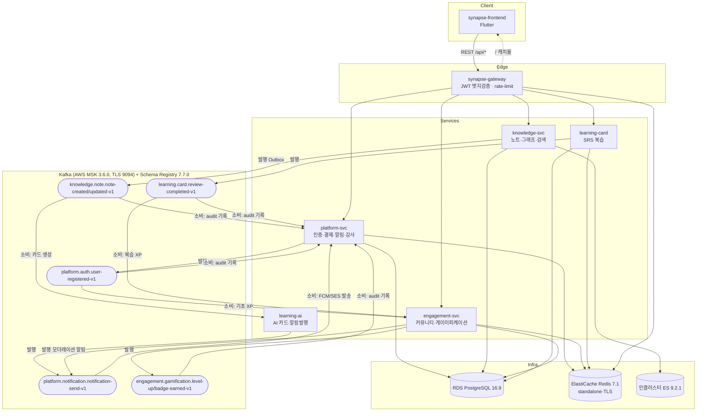

# SYNAPSE 아키텍처 현황 보고서

- **기준일**: 2026-06-08
- **기준 소스**: 각 레포 origin/main · origin/dev (전 레포 `git fetch origin --prune` 후 origin ref로만 판단, 로컬 워킹트리 미사용)
- **작성 방법**: §7 부록 참조
- **독자**: SYNAPSE 팀 전체 (공유용)

## 1. 개요

SYNAPSE는 PKM(노트)·SRS(학습카드)·커뮤니티/게이미피케이션을 제공하는 멀티테넌트 SaaS로, **Spring Modulith 기반 4개 백엔드 서비스 + API Gateway + Flutter 프론트엔드**가 **Kafka(Avro) 이벤트와 REST**로 통신하고, **ArgoCD GitOps(EKS)** 로 배포된다.

이 보고서가 답하는 질문:
1. 지금 각 레포·인프라·CI/CD가 실제로 어떤 상태인가? (origin 기준)
2. 알려진 간극 8건(G1~G8)은 오늘 기준 어디까지 해소됐는가?
3. 다음 작업의 우선순위를 어디에 둬야 하는가?

**요약**: 간극 8건 중 **해소 3건(G3 engagement 컨슈머, G6 ES 정합, G8 deploy/mirror 표준화)**, **진행 4건(G1 Kafka TLS, G4 버전 드리프트, G5 Flyway 가드, G7 main↔dev 발산)**, **미해결 1건(G2 S3)**.

## 2. 시스템 맵

### 핵심 레포

| 레포 | 유형 | 통합 브랜치 | 역할 |
|---|---|---|---|
| synapse-platform-svc | Spring Boot 4.0.0 / Java 21 | dev (+main) | 인증 허브(JWT RS256)·사용자·결제(Stripe)·알림(FCM/SES)·감사로그 |
| synapse-knowledge-svc | Spring Boot 4.0.0 / Java 21 | dev (+main) | 노트·버전이력·태그·그래프·검색(ES)·AI 시맨틱 검색 |
| synapse-learning-svc | 모노레포: Java 21 + Python 3.12 | dev (+main) | learning-card(SRS 복습) + learning-ai(FastAPI, AI 카드 생성·알림 발행) |
| synapse-engagement-svc | Spring Boot 4.0.0 / Java 21 | dev (+main) | 커뮤니티(그룹/공유/신고) + 게이미피케이션(XP/배지/리더보드) |
| synapse-gateway | Spring Cloud Gateway (WebFlux) | main | 라우팅·JWT 엣지검증·Redis rate-limit·frontend 캐치올 |
| synapse-shared | Java 라이브러리 | main | Avro 이벤트 계약 단일 소스 + reusable CI 워크플로우 + 팀 표준 문서 |
| synapse-frontend | Flutter 3.x / Riverpod 3 manual | dev (+main) | 웹/모바일 클라이언트 (서비스 경계별 `lib/services/*`) |
| synapse-gitops | Kustomize + ArgoCD + Terraform | main | dev/staging/prod 배포 매니페스트 + AWS 인프라(IaC) |
| synapse-onboarding | Flutter Web | main | 신입 온보딩 포털 (GitHub Pages, 6/2 이후 변경 없음) |

보조 레포(한 줄): synapse-svc-template(서비스 스켈레톤, 워크플로 없음) · synapse-prototype(디자인 프로토타입, gh-pages) · synapse-flow-simulator(흐름 시뮬레이터, Pages 호스팅) · workflow-dashboard(7개 레포 진행 현황 대시보드, 스케줄 동기화) · documents/documents.wiki(산출물·위키) · moking-data-guide/schedule-repo/workflow-guide(가이드·일정).

### 통신 다이어그램

> knowledge는 내부 search-sync 컨슈머(`knowledge-search-indexer` 그룹)로 자체 노트 이벤트를 소비해 ES 인덱싱한다. learning-ai의 `learning.ai.cards-generated-v1`은 gitops configmap에 토픽이 정의되어 있으나 learning-card는 HTTP로 수신(EVENT_FLOW_MATRIX 기준).

## 3. 애플리케이션 서비스 현황

### platform-svc — 인증 허브
- **스택**: Java 21, Spring Boot 4.0.0, Modulith 2.0.6, Avro **1.12.0**/Confluent **7.7.0**, jjwt, Stripe, Firebase Admin, AWS SES (`synapse-platform-svc:build.gradle.kts`)
- **API**: `/api/v1/auth/*`(OAuth Google/GitHub/Apple, MFA), `/api/v1/billing/*`, `/api/v1/notifications/devices`, `/api/v1/admin/*`(audit-logs/users/tenants)
- **Kafka**: 발행 user-registered-v1(**Outbox 완비**) / 소비 notification-send + 6개 토픽 audit 기록, 그룹 `platform-svc-group`
- **TLS/게이트**: security.protocol @Value 배선 + `synapse.kafka.enabled` 게이트 ✅ (`synapse-platform-svc:src/main/java/com/synapse/platform/global/kafka/KafkaConsumerConfig.java:24`)
- **6/2 이후**: W4 마무리 릴리스(#73), notification CORS·FCM 실패 처리(#74, dev)

### knowledge-svc — 노트·그래프·검색
- **스택**: Java 21, Spring Boot 4.0.0, Modulith 2.0.6, Avro **1.11.3**/Confluent **7.5.0**, MapStruct (`synapse-knowledge-svc:build.gradle.kts`)
- **API**: `/api/v1/notes`(+versions/백링크), `/api/v1/tags`, `/api/v1/notes/search`, `/api/v1/ai/search/semantic|hybrid`(RRF), `/api/v1/graph*`, `/api/v1/admin/search/*`
- **Kafka**: 발행 note-created/updated-v1(**Outbox**, claim-lease — `note/kafka/outbox/NoteEventOutboxDispatcher.java`) / 소비 내부 search-sync(ES 인덱싱)
- **TLS/게이트**: security.protocol 배선 ✅(`global/config/KafkaConfig.java:21,55` + `search/config/KafkaConfig.java`) / **`synapse.kafka.enabled` 게이트 ❌ — 이슈 #46 미해결** (origin/dev grep 0건)
- **6/2 이후 (dev)**: 검색 E2E·coverage gate 복구(#52), Flyway 표준 설정(#51), MSK TLS 배선(#45), 노트 버전이력+태그(#43)

### learning-svc — SRS + AI (모노레포)
- **learning-card**: Java 21, Spring Boot 4.0.0, Avro **1.12.0**/Confluent **7.7.0**, ShedLock, Redis. API: `/decks`, `/decks/{id}/cards`, `/reviews/*`, `/stats/*`. 발행 review-completed-v1, 소비 없음(cards-generated는 HTTP 수신). 게이트 ✅(#49 해소, PR #54 — `learning-card/src/main/java/com/synapse/learning/config/KafkaConfig.java:28`)
- **learning-ai**: Python ≥3.12, FastAPI, aiokafka + confluent-kafka[avro], OpenAI·Anthropic SDK 직접 호출 (`learning-svc:learning-ai/pyproject.toml`). 발행 notification-send-v1, 소비 note-created-v1. `Settings.kafka_security_protocol` 배선 ✅
- **6/2 이후 (dev)**: W5 E2E 검증+데모(#58), Kafka 이벤트 안정화(#56), KAFKA_ENABLED 게이트(#53/#54), security.protocol 배선(#48)

### engagement-svc — 커뮤니티·게이미피케이션
- **스택**: Java 21, Spring Boot 4.0.0, Modulith 2.0.5, Avro **1.11.3**/Confluent **7.5.0**(직접 확인: `synapse-engagement-svc:build.gradle.kts` origin/dev), MapStruct, ShedLock
- **API**: `/api/v1/community/*`(groups/share/fork/search/reports), `/api/v1/gamification/*`(me/xp/badges/leaderboard)
- **Kafka**: 발행 level-up·badge-earned-v1 + 모더레이션 notification-send-v1 / **소비 user-registered·review-completed-v1 구현 완료** (`src/main/java/com/synapse/engagement/gamification/application/event/EngagementKafkaConsumer.java`), 그룹 `engagement-svc-group`
- **TLS**: Producer/ConsumerConfig에서 security.protocol 주입 ✅
- **6/2 이후**: 모더레이션→알림 발행(#23, main), W4 step9-11(#24, dev), 배포 선결조건+Flyway guard 보강(#29, dev)

### gateway — API Gateway
- **스택**: Java 21, Spring Boot 4.0.6, Spring Cloud Gateway(WebFlux) 2025.1.1, Redis Reactive (`synapse-gateway:build.gradle.kts`)
- **라우팅**: `/api/{platform|engagement|knowledge|learning}/**` → 각 svc(StripPrefix 2), `/` → frontend 캐치올 (`src/main/java/com/synapse/gateway/config/RoutesConfig.java`)
- **기능**: JWT 엣지검증+신원 헤더 전파(#5), Redis rate-limit(1 rps, burst 60)
- **6/2 이후**: 캐치올 라우트(#6), JWT 엣지검증(#5), deploy 수동 트리거

### shared — 계약·표준 단일 소스
- **내용**: Avro `.avsc`(`src/main/avro/{platform,knowledge,learning,engagement}/`), reusable 워크플로우 3종(deploy-service/mirror-service/flyway-guard), 표준 문서(EVENT_CONTRACT_STANDARD, EVENT_FLOW_MATRIX, 12-flyway-migration)
- **버전 정본**: Avro/Confluent **1.11.3/7.5.0 확정**(#14) — 단 build와 표준이 일치하나 platform·learning은 1.12.0/7.7.0 사용 중(→ G4)
- **6/2 이후**: dev-latest 태그 병행 푸시(#23), ecr-login v2 수정(#24), **Flyway 가드 머지(#22)**, ES 정합 문서(#16), engagement 컨슈머 완료 반영(#15)

### frontend — Flutter 클라이언트
- **스택**: Flutter 3.x, Dart 3.11, Riverpod 3(manual), GoRouter, Dio, Hive (`synapse-frontend:pubspec.yaml`)
- **구조**: `lib/services/{platform,learning,knowledge,engagement}/` 서비스 경계 매핑, mock+개발용 인증 바이패스에서 실 API 연동 진행 중
- **6/2 이후**: main은 dev→main 배포 머지(#26), Docker화+same-origin API(#21); **dev는 ui-completion 머지(#25) 후 2회 리버트(#28/#29)로 요동** — main↔dev 8/16 커밋 상호 발산(→ G7)

### onboarding — 신입 포털
- Flutter Web + 마크다운 9섹션, GitHub Pages 자동 배포. **6/2 이후 origin/main 변경 없음** (직접 확인)

## 4. 인프라/gitops 현황

기준: `synapse-gitops` origin/main (최신 커밋 ab256aa, 2026-06-08 "db split + gateway JWT" #136)

### 배포 토폴로지

| 환경 | sync | 특성 |
|---|---|---|
| dev | ArgoCD 자동 | `synapse-dev` ns, 앱 7개 (`argocd/applicationset.yaml`) |
| staging | ArgoCD 자동 | `synapse-staging` ns, 2 replica (`argocd/applicationset-staging.yaml`) |
| prod | ArgoCD **수동** | `synapse-prod` ns, 3 replica + PDB + anti-affinity (`argocd/applicationset-prod.yaml`) |
| local-k8s | 독립 kustomize | minikube, 인프라 전체 패키징 (`local-k8s/`) |

- 도구: ArgoCD ApplicationSet ×3 + Kustomize(base+overlay 21조합) + Terraform(`infra/aws/dev/`만) + External Secrets Operator(AWS SM)
- 배포 앱: platform/engagement/knowledge/learning-card/learning-ai/gateway/frontend + schema-registry + elasticsearch, ECR `963773969059.dkr.ecr.ap-northeast-2.amazonaws.com/synapse/*`

### 미들웨어

| 컴포넌트 | 구성 | 근거 |
|---|---|---|
| Kafka | **AWS MSK 3.6.0**, 브로커 3, TLS 전용(client_broker=TLS, 9094), 복제 3/min.isr 2, 자동 토픽생성 off, 브로커 주소는 Terraform 생성 ConfigMap `kafka-brokers` | `synapse-gitops:infra/aws/dev/msk.tf`, `infra/aws/dev/k8s-kafka-config/` |
| Schema Registry | 인클러스터 Deployment cp 7.7.0, :8081, K8s 내부 PLAINTEXT | `synapse-gitops:apps/schema-registry/base/deployment.yaml` |
| Redis | **ElastiCache 7.1 standalone**(num_cache_clusters=1, failover off), TLS+AUTH, prod는 DB index 1로 분리 | `synapse-gitops:infra/aws/dev/redis.tf`, `apps/platform-svc/overlays/prod/kustomization.yaml` |
| Elasticsearch | **인클러스터 StatefulSet 9.2.1**, single-node, xpack off, PVC 10Gi gp3 (AWS OpenSearch 도메인 제거됨 — D-003) | `synapse-gitops:apps/elasticsearch/base/statefulset.yaml` |
| PostgreSQL | **RDS 16.9**, force_ssl=1, dev/staging은 DB `synapse` 공유·prod는 `synapse_prod` 논리 분리, Multi-AZ off | `synapse-gitops:infra/aws/dev/rds.tf` |

### 통신 환경변수 정합 (요점)

- Kafka: 4개 Java svc + learning-ai에 `KAFKA_BOOTSTRAP_SERVERS`(ConfigMap) + `SPRING_KAFKA_SECURITY_PROTOCOL=SSL`(dev/staging/prod overlay) + `SCHEMA_REGISTRY_URL=http://schema-registry:8081` + `KAFKA_ENABLED=true` 주입 (`apps/*/overlays/*/kustomization.yaml`)
- knowledge: `ELASTICSEARCH_URIS=http://elasticsearch:9200` — 앱이 읽는 변수명과 정합 ✅ (`apps/knowledge-svc/overlays/dev/kustomization.yaml:26`)
- gateway: 백엔드 URI 4종(`apps/gateway/base/configmap.yaml`) + Redis TLS

### gitops-s6 (로컬 사본 기준 — git 클론 아님)

2026-05-26 시점 스냅샷(OpenSearch terraform 포함, ES 전환 이전). 참조용 보관본이며 배포에 사용되지 않음. 현행과의 주요 차이: OpenSearch→인클러스터 ES 전환, kafka-config/kafka-topics Terraform 모듈 추가, staging/prod ApplicationSet 분리.

## 5. CI/CD 현황

### 표준화 상태 (reusable workflow, synapse-shared@main)

| 레포 | deploy→`deploy-service.yml` | mirror→`mirror-service.yml` | flyway-guard caller |
|---|---|---|---|
| platform-svc | ✅ | ✅ | ✅ main+dev (`synapse-platform-svc:.github/workflows/flyway-guard.yml`) |
| knowledge-svc | ✅ | ✅ | ❌ (설정만 적용: `application.yml` out-of-order/baseline #51) |
| learning-svc | ✅ ×2 (ai/card 병렬) | ✅ | ❌ (이슈 #55) |
| engagement-svc | ✅ | ✅ | ⚠️ dev만 (`.github/workflows/flyway-guard.yml`, main 미반영) |
| gateway | ✅ | ❌ mirror.yml 없음 | N/A(마이그레이션 없음) |
| frontend | ✅ (main만 — dev에 deploy.yml 없음) | ✅ | N/A |
| shared | (정의 제공) | ✅ | (reusable 정의: `flyway-guard.yml` + `scripts/flyway_guard.py`) |

> 표의 ✅/❌ 근거: 각 레포 origin 기준 `.github/workflows/deploy.yml`·`mirror.yml`(caller, `synapse-shared/.github/workflows/*-service.yml@main` 참조)와 `git ls-tree origin/<branch> .github/workflows/` 전수 목록.

- **registry**: 전 서비스 ECR `synapse/*` 접두사·ap-northeast-2 통일 ✅ (`synapse-shared:.github/workflows/deploy-service.yml`의 ecr_repository 파라미터)
- **CI Kafka 하니스**: Schema Registry를 CI에서 띄우는 건 여전히 **engagement만**(`docker-compose.ci.yml`) — BACKWARD 계약 검증 부재 지속(06-02 감사와 동일)
- **머지 대기 워크플로 브랜치**: knowledge `fix/ci-build-infra`, learning·engagement `ci/deploy-dispatch`(workflow_dispatch 추가 — main 직행 PR 재타겟 건), gateway `feat/deploy-caller` 등
- 기타: 각 svc `parse-workflow.yml` → workflow-dashboard 동기화(스케줄 09/14/19 KST), gitops `validate-manifests.yml`(kustomize/yamllint/kubeconform + PR diff 코멘트), `image-updater-pr.yml`

## 6. 간극 및 리스크 (G1~G8, 2026-06-08 origin 기준 재판정)

| # | 항목 | 상태 | 근거 (origin) | 추적 | 베이스라인(최종확인일) 대비 |
|---|---|---|---|---|---|
| G1 | Kafka TLS MSK 앱 배선 | **진행** (배선 완료, 잔여 2건) | security.protocol: platform `global/kafka/KafkaProducerConfig.java`, knowledge `global/config/KafkaConfig.java:21,55`, learning-card `config/KafkaConfig.java`, learning-ai `pyproject.toml`+Settings — 4모듈 전부 ✅. gitops SSL env 3환경 주입 ✅. 게이트: platform ✅·learning ✅(#54) / **knowledge ❌**(grep 0건) | knowledge#46 | 06-05 대비 platform·learning 게이트 해소. 잔여: knowledge 게이트, **EKS 위 TLS E2E 미검증(정적 감사로 확인 불가)** |
| G2 | S3 AttachmentService | **미해결** | knowledge `build.gradle.kts`(origin/dev)에 awssdk 의존성 없음, S3 코드 0건 | W4+ 일정 | 05-28과 동일 (변화 없음) |
| G3 | engagement Kafka 소비측 | **해소** | `gamification/application/event/EngagementKafkaConsumer.java`(origin/dev) — user-registered·review-completed @KafkaListener | — | 06-02 "P0 미구현" → 구현 완료 (shared#15도 반영) |
| G4 | Avro/serializer 버전 드리프트 + CI registry | **진행** | engagement·knowledge·shared=1.11.3/7.5.0(직접 확인), platform·learning-card=1.12.0/7.7.0. **정본은 1.11.3/7.5.0 확정**(shared#14) → platform·learning이 정본 초과. CI Schema Registry는 engagement만 | (이슈 미등록) | 06-02와 드리프트 동일하나 정본 확정으로 정렬 방향 명확해짐 |
| G5 | Flyway 표준 롤아웃 | **진행** | shared 가드 머지 ✅(`scripts/flyway_guard.py`+`flyway-guard.yml`@main, #22). caller: platform main+dev ✅, engagement dev만 ⚠️, knowledge 설정만(#51), learning ❌. 신규 마이그레이션 전부 기존 정수 버전(타임스탬프 신규분 없음 — 표준 위반 아님) | knowledge#48(부분), learning#55, engagement main 반영 | 06-05 "PR#22 머지 대기" → **머지 완료** + 2.5/4 서비스 적용 |
| G6 | knowledge 검색 ES 정합 | **해소** | gitops `apps/elasticsearch/base/statefulset.yaml`(9.2.1) + `apps/knowledge-svc/overlays/*/kustomization.yaml` ELASTICSEARCH_URIS ✅, 검색 코드 origin/main 반영 ✅(#40) | — | 06-05 해소 확인 유지, "knowledge dev→main 반영" 잔여 항목도 해소 |
| G7 | main↔dev 발산 | **진행** | rev-list(main↔dev): platform 0/1, knowledge 0/6, engagement 1/2, **learning 2/19**, **frontend 8/16(상호 발산 + dev 리버트 2회)**. gateway/shared/gitops/onboarding dev 없음 | engagement#31, learning#59 | 06-08 정리 직후 상태 — learning·frontend가 위험 지점 |
| G8 | Deploy/Mirror 표준화 | **해소** (소항목 잔여) | shared `deploy-service.yml`·`mirror-service.yml`(workflow_call)@main ✅, 6개 레포 caller 전환 ✅, gitops `apps/gateway` ✅. 잔여: gateway mirror.yml 없음, frontend dev에 deploy.yml 없음 | — | 05-27 "PR 세트 머지 대기" → **전부 머지·적용 완료** |

### 리스크 우선순위 제언

1. **frontend main↔dev 발산(G7)** — 리버트 반복으로 어느 쪽이 정본인지 불명확. 통합 방향 결정 필요.
2. **CI 계약 검증 부재(G4)** — Schema Registry 하니스가 engagement 외 부재 → Avro BACKWARD 호환이 CI에서 안 걸러짐. 버전 정본(1.11.3/7.5.0) 확정됐으니 platform·learning 정렬과 함께 처리 권장.
3. **knowledge KAFKA_ENABLED 게이트(G1, #46)** — gitops `KAFKA_ENABLED`가 knowledge에서 no-op. 4서비스 중 유일한 잔여.
4. **TLS MSK E2E 미검증(G1)** — 배선·env는 완료됐으나 EKS 런타임 검증 기록을 코드 감사로 확인 불가.

## 7. 부록 — 검증 방법·미확인 영역

### 검증 방법
1. 19개 git 클론 전체 `git fetch origin --prune` (전부 성공) → 이후 모든 판단은 origin ref
2. 베이스라인 로드: `docs/kafka-service-audit-2026-06-02.md` + 메모리 간극 기록 8건
3. Explore 에이전트 4개 병렬 탐색(서비스/인프라/CI·CD/간극 재검증)
4. 교차 대조에서 상충 3건 발견 → 직접 `git show`/`git grep`으로 재확인 후 에이전트 보고 정정:
   - engagement Avro 버전 1.12.0→**1.11.3** 정정
   - knowledge KAFKA_ENABLED 게이트 "있음"→**없음** 정정
   - G5 "미해결"→**진행** 정정 (platform·engagement 가드 caller 직접 확인)

### 미확인 영역
| 항목 | 사유 |
|---|---|
| synapse-gitops-s6 | git 클론 아님 — 로컬 사본(2026-05-26 스냅샷) 기준으로만 기술 |
| TLS MSK 위 E2E 검증 여부 | 정적 코드 감사로 런타임 검증 이력 확인 불가 |
| shared `publish.yml`·`schema-check.yml` 트리거 상세 | 에이전트 미확인 — 보고서 판단에 미사용 |
| learning-card gitops overlay 환경변수 전체 | base configmap만 확인(토픽명 1건), overlay는 패턴 추정이라 표에서 제외 |
| frontend 대기 브랜치(ui-completion 등)의 워크플로 변경 여부 | diff 미수행 |
| GitHub 이슈/PR 실시간 상태(#46, #55, #31, #59 등) | gh 조회 미수행 — 코드 반영 여부로만 판정 |
