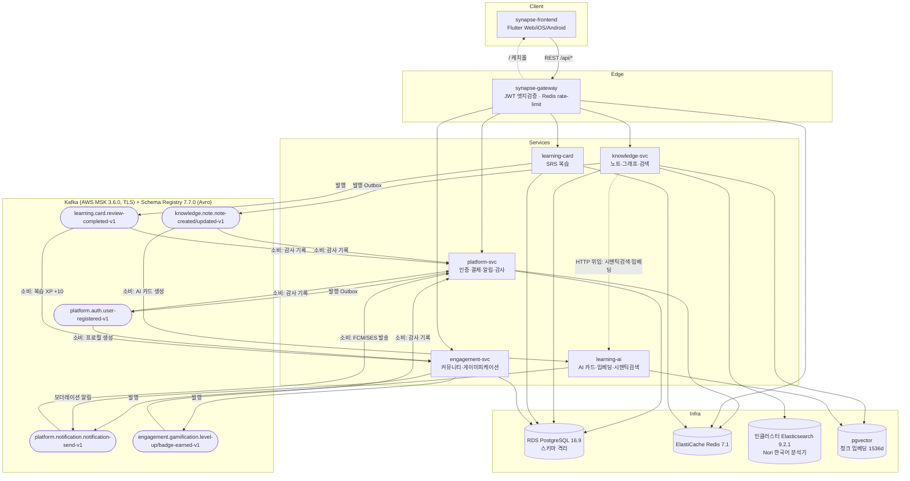

# 팀별 프로젝트 결과보고서 — SYNAPSE

> **K-Digital Training**
> 노트(PKM)·학습카드(SRS)·AI를 하나로 통합한 멀티테넌트 학습 SaaS **SYNAPSE** 의 설계·구현·운영 결과 보고서.
> 본 문서는 `2. 팀별 프로젝트 결과보고서` 양식의 목차/구성/세부항목을 모두 포함하여 작성되었습니다. *(시연 동영상·자체 평가 의견 항목 제외)*
>
> *작성 기준: 각 레포 origin/main·origin/dev 최신 소스 + `documents`/`documents.wiki` 산출물 + ADR(0001~0003) + 프로젝트 관리 문서(PRD/SCOPE/TASK/스케줄).*

---

## 표지

| 항목 | 내용 |
|---|---|
| **팀 프로젝트명(주제)** | **SYNAPSE — 노트가 카드가 되는 AI 통합 학습 플랫폼** (PKM + SRS + AI) |
| **TEAM** | SYNAPSE (7인) |
| **팀원** | 김민구(팀장)·김해준·한승완·김현지·박은서·김나경·조유지 |
| **개발 기간** | 2026-05-12(화) ~ 2026-06-15(월), 5주 (발표 6/15) |

---

## 목 차

1. **프로젝트 개요** — 주제·배경·기획의도 / 차별화 포인트 / 프로젝트 내용 / 프로젝트 구조 / 활용 장비 및 재료 / 활용방안 및 기대효과
2. **프로젝트 팀 구성 및 역할**
3. **프로젝트 수행 절차 및 방법**
4. **프로젝트 수행 경과** — ① 탐색적 분석 및 전처리 / ② 모델 개요 / ③ 모델 선정 및 분석 / ④ 모델 평가 및 개선
5. ~~자체 평가 의견~~ *(본 문서에서 제외)*

---

## 01. 프로젝트 개요

### 01-1. 프로젝트 주제 및 선정 배경, 기획의도

**프로젝트 주제**

> **SYNAPSE** — "노트가 카드가 되고, 복습이 노트를 다시 살린다."
> 개인 지식 관리(PKM, *Personal Knowledge Management*)와 간격 반복 학습(SRS, *Spaced Repetition System*)을 **하나의 워크플로우로 통합**하고, 그 사이를 **AI(LLM)** 가 자동으로 연결하는 멀티테넌트 SaaS.

한 줄 정의: *노트 작성 → AI 플래시카드 자동 생성 → 간격 반복 복습 → 지식 그래프·시맨틱 검색으로 재발견* 의 학습 순환을 단일 제품에서 완결한다. 포지셔닝은 "**Obsidian + Anki + RAG 융합 플랫폼**"이다.

**선정 배경 (해결하려는 문제)**

기존 학습 도구 시장은 두 진영으로 분리되어 있다.

- **PKM 도구(Obsidian·Notion 등)** — 자유로운 노트 작성·위키링크·백링크가 강점이나, *과학적 복습 메커니즘이 없다*.
- **SRS 도구(Anki·Quizlet 등)** — 망각곡선 기반 반복 학습은 강력하나, 카드가 *원본 맥락과 단절된 단편 지식*이고 카드를 일일이 손으로 만들어야 한다.

두 도구를 함께 쓰려면 사용자가 노트를 카드로 수동 복사해야 하므로 워크플로우가 끊긴다. 본 프로젝트는 이 단절에서 발생하는 5가지 문제를 정의했다.

1. **워크플로우 단절** — PKM과 SRS가 분리되어 학습 흐름이 끊김
2. **맥락 상실** — 복습 카드가 원본 노트와 연결되지 않음
3. **수동 카드 생성 부담** — 카드 제작 노동이 학습 의욕을 저하시킴
4. **지식 관계 시각화 부재** — 노트 간 연결을 한눈에 보기 어려움
5. **검색 한계** — 키워드 매칭만 가능하고 의미 기반(시맨틱) 검색이 없음

**기획 의도 (목표 G1~G6)**

| 목표 | 내용 | 정량 지표 |
|---|---|---|
| G1 | PKM-SRS 통합 워크플로우 | 노트→카드 전환율 60%+ |
| G2 | AI 카드 자동 생성(LLM 기반) | 카드 생성 시간 90% 단축 |
| G3 | 지식 그래프(백링크 + PageRank) | 2D 그래프 시각화 |
| G4 | 하이브리드 시맨틱 검색 | 검색 정확도 MRR@10 0.7+ |
| G5 | 크로스 플랫폼 클라이언트 | Flutter Web/iOS/Android 단일 코드베이스 |
| G6 | SaaS 수익화 | Freemium 4단계(Free/Pro/Team/Enterprise) |

- 디자인 컨셉: **"Warm Intellectual"** — 서점·도서관의 따뜻하고 지적인 톤.
- 비즈니스 모델: Freemium — Free($0) / Pro($9.99) / Team($19.99·seat) / Enterprise.

> 근거: `documents.wiki/01_프로젝트_계획서.md`(§1.1~1.6), `documents/docs/project-management/KICKOFF.md`.

### 01-2. 차별화 포인트

**(A) 제품 측면 — "통합과 자동화"**

- **PKM + SRS의 단일 플랫폼 통합**: 노트 작성과 카드 복습을 끊김 없이 연결. 카드는 항상 원본 노트에 링크되어 맥락이 유지된다(Anki의 맥락 상실 문제 해결).
- **AI 카드 자동 생성**: LLM(Claude 3.5 Sonnet)이 노트 본문을 분석해 플래시카드(앞/뒤)를 자동 생성 → 수동 제작 노동 제거.
- **위키링크 기반 지식 그래프**: `[[링크]]` 문법으로 노트 간 관계를 자동 감지하고 백링크·PageRank로 중요 노트를 식별, 2D로 시각화.
- **하이브리드 시맨틱 검색**: 키워드(BM25)와 의미(임베딩 코사인 유사도) 검색을 **RRF(Reciprocal Rank Fusion)** 로 융합해 단일 랭킹 제공.

**(B) 아키텍처 측면 — "올바른 MSA를 학습·구현" (ADR 3건)**

기존 학습 토이 프로젝트가 단일 모놀리식에 머무는 것과 달리, 본 팀은 **아키텍처 의사결정 기록(ADR)** 을 남기며 현업형 마이크로서비스(MSA)를 정공법으로 구현했다.

| ADR | 결정 | 핵심 근거 |
|---|---|---|
| **0001** | **MSA** (모듈러 모놀리식 대신) | 도메인이 Platform/Learning/Knowledge/Engagement 4개로 자연 분리. 경계를 코드리뷰 관습이 아닌 **네트워크·배포 경계로 강제**. 단 비용 통제를 위해 K8s·DB·Kafka는 1개씩 공유 |
| **0002** | **Kafka + Avro Schema Registry + Outbox** (동기 REST 대신) | "결제→학습 활성화" 같은 시나리오에서 서비스 가용성 결합 제거, 새 컨슈머 무료 추가, 이벤트 재생 가능. Avro로 **BACKWARD 호환성 강제** |
| **0003** | **단일 PostgreSQL + 스키마 격리** (서비스별 DB 대신) | 7인 졸업팀에 DB 4개 운영은 비현실적 → 단일 클러스터 + 서비스별 SCHEMA 격리 + 계정별 권한 분리. 크로스 스키마 SELECT 금지(필요 시 이벤트로 복제) |

> 근거: `documents/decisions/0001~0003-*.md`(모두 Accepted, 2026-05-23).

### 01-3. 프로젝트 내용

SYNAPSE는 **4개 백엔드 서비스 + API Gateway + Flutter 프론트엔드**로 구성되며, 서비스 간은 **Kafka(Avro) 이벤트**와 **REST**로 통신하고, **ArgoCD GitOps(AWS EKS)** 로 배포된다.

| 도메인 서비스 | 책임 | 대표 기능 |
|---|---|---|
| **platform-svc** | 인증 허브·사용자·결제·알림·감사 | OAuth(Google/GitHub/Apple)+JWT(RS256)+MFA, Stripe 결제, FCM/SES 알림 발송, 감사로그(전 이벤트 소비·90일 보존), GDPR 데이터 요청 관리(Admin, W5) |
| **knowledge-svc** | 노트·그래프·검색 | Markdown 노트 CRUD·버전이력·태그, 위키링크 파싱·백링크·PageRank 그래프, Elasticsearch BM25 검색, RRF 하이브리드 검색 |
| **learning-svc** | SRS 복습 + AI (모노레포) | **learning-card**(Java): 덱·카드·SM-2 복습 스케줄링·통계 / **learning-ai**(Python/FastAPI): Claude 카드 자동 생성·OpenAI 임베딩·pgvector 시맨틱 검색 |
| **engagement-svc** | 커뮤니티·게이미피케이션 | 그룹·덱/노트 공유·신고/모더레이션, XP·레벨·배지·리더보드 |

여기에 **gateway**(라우팅·JWT 엣지검증·Redis rate-limit), **shared**(Avro 이벤트 계약 단일 소스 + 재사용 CI 워크플로우 + 팀 표준 문서), **frontend**(Flutter 크로스플랫폼 클라이언트), **gitops**(Kustomize/ArgoCD/Terraform 배포·인프라)가 더해진다.

**훈련 내용과의 연관성** — 본 프로젝트는 K-Digital Training에서 학습한 풀스택·클라우드 네이티브·DevOps·AI 전 영역을 통합 적용한다.

- **백엔드**: Spring Boot 4 / Java 21, Spring Modulith + ArchUnit 모듈 경계 검증, Transactional Outbox·Saga·CQRS 패턴
- **AI/LLM**: Anthropic Claude SDK·OpenAI Embeddings 직접 호출, pgvector 시맨틱 검색, RAG, RRF 하이브리드 랭킹
- **프론트엔드**: Flutter 3 / Dart, Riverpod 상태관리, 단일 코드베이스 크로스플랫폼
- **데이터/메시징**: PostgreSQL·Redis·Elasticsearch·Kafka(Avro·Schema Registry)
- **DevOps/인프라**: AWS EKS, Terraform(IaC), Docker, GitHub Actions CI/CD, ArgoCD GitOps, Kustomize
- **소프트웨어 공학 방법론**: ADR 기록, Conventional Commits + PR 리뷰, TDD·커버리지 게이트, 5종 문서체계(SCOPE→PRD→TASK→WORKFLOW→HISTORY), 1주 스프린트 Agile

### 01-4. 프로젝트 구조

**시스템 구성도 (통신 흐름)**



**데이터 동기화 구조(요약)**

- **서비스 간 통신**: Avro 직렬화 + Schema Registry(BACKWARD 호환) 위의 Kafka 이벤트. 발행 측은 **Transactional Outbox**(쓰기 트랜잭션과 원자적 enqueue → 별도 디스패처가 발행)로 신뢰성 보장.
- **읽기 모델(CQRS)**: knowledge-svc는 노트 쓰기 후 `AFTER_COMMIT` 이벤트로 Elasticsearch 인덱스(`notes-v1`)를 비동기 동기화(search-sync indexer).
- **AI 위임**: 임베딩 *계산*은 learning-ai(OpenAI)가 전담한다. knowledge-svc는 ① 시맨틱 검색(`/api/v1/ai/search/semantic`)을 learning-ai로 HTTP 위임하고, ② 자체 **청킹 모듈**이 노트 저장 직후(AFTER_COMMIT 비동기) 본문을 청크로 분할해 learning-ai `/ai/embeddings`로 배치 임베딩을 받아 자기 DB의 `note_chunks`(pgvector)에 저장한다. BM25·RRF 융합·그래프는 knowledge-svc가 직접 담당.

> 상세 시스템 맵·인프라 토폴로지는 `docs/synapse-architecture-status-2026-06-08.md` 참조.

### 01-5. 활용 장비 및 재료 (개발환경)

**① 언어·런타임**

| 영역 | 기술·버전 |
|---|---|
| JVM 서비스(5개) | **Java 21** (Gradle toolchain 21) |
| AI 서비스 | **Python 3.12** (ruff/mypy target py312) |
| 프론트엔드 | **Dart ≥3.11** / **Flutter 3.x** (stable 채널) |

**② 백엔드 프레임워크·라이브러리**

| 항목 | 버전 / 비고 |
|---|---|
| Spring Boot | platform·knowledge·engagement·learning-card **4.0.0** / gateway **4.0.6** |
| Spring Cloud Gateway | **2025.1.1** (WebFlux, gateway 전용) |
| Spring Modulith | platform·knowledge **2.0.6** / engagement **2.0.5** / learning-card **1.3.0** |
| Avro / Confluent serializer | knowledge·engagement·shared **1.11.3 / 7.5.0**(정본) / platform·learning-card **1.12.0 / 7.7.0**(드리프트) |
| 인증·보안 | jjwt 0.12.6, Spring Security + OAuth2, TOTP(samstevens 1.7.1, MFA) |
| 결제·알림 | Stripe Java 32.1.0, Firebase Admin 9.4.1(FCM), AWS SES v2 2.26.29 |
| 매핑·스케줄 | MapStruct 1.6.3, ShedLock 7.7.0(분산 스케줄 잠금), Lombok |
| 영속성·검색 | Flyway, PostgreSQL JDBC, Spring Data Redis(Lettuce), Spring Data Elasticsearch(knowledge) |
| 보안 유틸 | OWASP HTML Sanitizer 20240325.1(knowledge), uuid-creator 5.3.3 |
| 정적분석 | Checkstyle 10.12.5 · SpotBugs 4.8.3(platform), ArchUnit 1.3.0(knowledge 모듈 경계) |
| API 문서 | springdoc-openapi(Swagger UI) 3.0.3 / 2.8.9 |

**③ AI / Python 스택 (learning-ai)**

| 항목 | 버전(하한) |
|---|---|
| 웹/검증 | FastAPI ≥0.115, Uvicorn[standard] ≥0.30, Pydantic ≥2.9, pydantic-settings ≥2.5 |
| **LLM SDK(직접 호출)** | **anthropic ≥0.40**, **openai ≥1.50** (LangChain 미사용) |
| 영속성·벡터 | SQLAlchemy ≥2.0, alembic ≥1.13, asyncpg ≥0.29, **pgvector ≥0.2**, numpy ≥1.26 |
| 이벤트·기타 | aiokafka ≥0.11, confluent-kafka[avro] ≥2.5, redis[hiredis] ≥5.0, tenacity(재시도), jinja2(프롬프트 렌더), httpx |

**④ 프론트엔드 스택 (Flutter)**

| 항목 | 버전 |
|---|---|
| 상태관리 | flutter_riverpod ^3.3.1 (manual provider, codegen 미사용) |
| 라우팅·통신 | go_router ^17.2.3, dio ^5.9.2 |
| 저장·UI | hive_flutter ^1.1.0, flutter_markdown ^0.7.6, flutter_secure_storage ^10.3.0, lottie ^3.1.0, google_fonts ^8.1.0 |
| 폰트 | Pretendard (임베드) |
| 테스트 | flutter_test, integration_test, mockito ^5.6.4, fake_async |

`lib/` 구조: `core/`(auth·network·router·theme·services), `services/`(platform·knowledge·learning·engagement — 서비스 경계별 data/domain/presentation/providers, Port/Adapter), `shared/`(features·widgets·utils).

**⑤ 데이터·미들웨어 (AWS dev)**

| 컴포넌트 | 구성 |
|---|---|
| PostgreSQL | **RDS 16.9**, gp3, force_ssl, 스키마 격리 |
| Redis | **ElastiCache 7.1** standalone, TLS + at-rest 암호화 |
| Kafka | **AWS MSK 3.6.0**, 브로커 3, TLS 전용, RF 3 / min.insync 2, auto.create.topics off |
| Schema Registry | confluent cp-schema-registry **7.7.0** (인클러스터) |
| Elasticsearch | 커스텀 **nori-9.2.1**(한국어 분석기 내장), single-node StatefulSet |
| 벡터 검색 | pgvector(임베딩 1536차원, HNSW `vector_cosine_ops`) |

**⑥ 인프라·IaC·배포**

| 항목 | 구성 |
|---|---|
| 오케스트레이션 | **AWS EKS (Kubernetes 1.30)**, managed node group(t3.medium×4), IRSA(OIDC), VPC CNI(NetworkPolicy) |
| IaC | **Terraform** — vpc, eks, rds, redis, msk, acm, addons, alb-controller-irsa, eso-irsa, image-updater-irsa, bastion, velero(백업) |
| 배포 매니페스트 | **Kustomize** base + overlays(dev/staging/prod) |
| GitOps | **ArgoCD ApplicationSet ×3** — dev/staging 자동 sync, **prod 수동 승인 게이트** + Image Updater(semver, git write-back PR) |
| 시크릿 | External Secrets Operator(AWS Secrets Manager, ClusterSecretStore) |
| 레지스트리 | ECR `963773969059.dkr.ecr.ap-northeast-2.amazonaws.com/synapse/*` |

**⑦ CI/CD (GitHub Actions)**

- **재사용 워크플로우(synapse-shared@main)**: `deploy-service.yml`(ECR build/push → gitops overlay 이미지 태그 bump), `mirror-service.yml`(통합 미러 레포 동기화), `flyway-guard.yml`(마이그레이션 표준 가드 — W5에 platform `V20260611103000__create_gdpr_data_requests.sql` 타임스탬프 버전 형식으로 실적용), `schema-check.yml`(Avro 호환성), `ci-java`, `build-elasticsearch`, `parse-workflow`.
- 각 서비스 레포는 caller 워크플로우로 이를 호출(트리거는 main push 또는 semver 태그). 프론트는 CI(analyze/test/build web).

**⑧ 테스트**

| 영역 | 도구 |
|---|---|
| JVM | JUnit5, Spring Boot Test, spring-kafka-test, **Testcontainers**(PostgreSQL/Kafka/Elasticsearch), H2(test) |
| 커버리지 게이트 | JaCoCo LINE 0.80 (platform `billing*`, knowledge **서비스 전역**(Application·Avro 생성물·dto/entity/internal 제외, #80), learning-card 전역) |
| 모듈 경계 | ArchUnit(knowledge) |
| Python | pytest, pytest-asyncio, testcontainers[postgres,kafka], respx |
| 프론트 | flutter test, integration_test |

**⑨ 협업·형상관리**

- **Git 멀티레포**(서비스/인프라/문서 19개 레포) — 서비스 코드, gitops, shared 계약, mirror 통합 레포, 산출물(`documents`/`documents.wiki`)을 분리.
- **workflow-dashboard** — 7개 레포 진행 현황을 스케줄(09/14/19 KST) 동기화로 시각화.
- **이슈/PR 워크플로우** — 레포별 브랜치 → 커밋 → 푸시 → dev PR → 머지, Conventional Commits, PR 크로스리뷰.
- **shared Avro 계약** → GitHub Packages 배포(`maven.pkg.github.com/.../synapse-shared`).

### 01-(추가). 활용방안 및 기대 효과

| 구분 | 내용 |
|---|---|
| **학습자 효용** | 노트 작성만으로 복습 카드가 자동 생성되어 학습 준비 노동이 사라지고, 망각곡선 기반 복습으로 장기 기억 정착. 시맨틱 검색·지식 그래프로 과거 지식을 재발견 |
| **비즈니스 활용성** | Freemium SaaS(개인 Pro / 스터디 Team / 기업·교육기관 Enterprise)로 확장 가능. 멀티테넌트 설계로 B2B/B2C 동시 대응 |
| **기술적 자산** | MSA·이벤트 드리븐·CQRS·Outbox·GitOps·LLM 응용을 **현업 표준대로** 구현한 레퍼런스. 신규 도메인 서비스를 svc-template로 빠르게 증설 가능 |
| **교육적 효과** | 7인 팀이 트랙을 나눠 풀스택+인프라+AI 전 영역을 분담·통합 — 협업·문서화·아키텍처 의사결정 역량 체득 |

---

## 02. 프로젝트 팀 구성 및 역할

팀 **SYNAPSE** 는 팀장 1명 + 팀원 6명 = **총 7명**으로 구성되며, 도메인 트랙별로 백엔드를 분담하고 **Flutter 프론트엔드는 각자 자기 도메인 화면을 전원 공동 작업**한다. 규모가 큰 knowledge·learning 서비스는 모듈 경계를 기준으로 2명씩(C-1/C-2, D-1/D-2) 분할했다.

| 훈련생 | 역할 | 트랙 | 담당 서비스 | 담당 업무 |
|---|---|---|---|---|
| **김민구** | **팀장** | Gateway·인프라 | gateway / gitops | CI/CD·ArgoCD·Schema Registry, EKS/RDS/MSK/Redis/ES 인프라(IaC), Docker Compose, API Gateway(JWT 엣지검증·rate-limit), 전체 PR 크로스리뷰·통합테스트 조율 |
| **김해준** | 팀원 | A | platform-svc | 인증(OAuth+JWT+MFA), 결제(Stripe), 알림(FCM/SES), 감사로그(전 이벤트 소비), 테넌트·사용자 관리 |
| **한승완** | 팀원 | B | engagement-svc | 커뮤니티(그룹 CRUD·멤버·덱/노트 공유), 게이미피케이션(XP·레벨·배지·스트릭·리더보드), 신고·모더레이션 |
| **김현지** | 팀원 | C-1 | knowledge-svc | 노트 Markdown CRUD, 위키링크 파싱·백링크, 지식 그래프 시각화, ES 동기화, 노트 버전·태그 |
| **박은서** | 팀원 | C-2 | knowledge-svc | 비동기 청킹, BM25·RRF 하이브리드 검색·정확도 측정, Spring Modulith 경계 검증(ArchUnit), Avro 스키마 등록 |
| **김나경** | 팀원 | D-1 | learning-card(Java) | 덱·카드 CRUD, **SM-2 복습 알고리즘**, 복습 세션·통계, review-completed/review-due 이벤트 발행 |
| **조유지** | 팀원 | D-2 | learning-ai(Python) | **Claude 카드 자동 생성**, OpenAI 임베딩, pgvector 시맨틱 검색, note-created 소비 자동 생성, RAG |

- **프론트엔드(Flutter)** — 별도 owner 없이 각 트랙 담당자가 자기 도메인 UI를 구현(전원 협업).

> 근거: `documents/docs/project-management/KICKOFF.md`(§2 역할표), `README.md`(§8 매핑), SCOPE/TASK 트랙 파일명.

---

## 03. 프로젝트 수행 절차 및 방법

기획 단계에서 도출한 주제·아키텍처(ADR)를 기반으로, **1주 스프린트(W1~W5)** 단위로 수행했다. 공휴일(5/25 부처님오신날, 6/3 지방선거)을 제외해 W3·W4는 4영업일로 운영했다. 주차는 **이벤트 흐름 축(producer→consumer)** 기준으로 분할했다.

| 구분 | 기간 | 활동 | 비고 |
|---|---|---|---|
| **사전 기획** | ~ 05-11 | 주제·페르소나·요구사항 정의, 아키텍처 의사결정(ADR 0001~0003), 5종 문서체계 수립 | 아이디어 선정 |
| **W1 — 환경구축·골격** | 05-12(화)~05-15(금) | EKS/RDS/MSK/SR/Redis/ES/ArgoCD 셋업, Docker Compose, 4서비스 골격 + 기본 CRUD(노트·카드·커뮤니티), auth(OAuth/JWT/MFA), Modulith 모듈 정의·ArchUnit, Flutter 앱 쉘·로그인·대시보드 | 인프라·서비스 골격 |
| **W2 — 핵심 모델링/구현** | 05-18(월)~05-22(금) | SRS 복습 세션(SM-2), AI 카드 골격(Claude), 그래프·ES 동기화, 청킹·BM25 검색, 커뮤니티 공유, XP 적립, billing/notification 기초, Schema Registry v1 Avro 등록 | 데이터 전처리(청킹·임베딩)·모델링 |
| **W3 — 이벤트·고도화** | 05-26(화)~05-29(금) | 전 producer 토픽 Kafka 발행, 게이미피케이션 완성(배지·레벨·스트릭·리더보드), 검색 RRF 하이브리드·정확도 측정, AI 카드 자동 생성 안정화·시맨틱 캐시, 노트 버전·태그 | 5/25 공휴일 제외(4일), 팀별 중간보고 |
| **W4 — 통합·소비자** | 06-01(월)~06-05(금) | 이벤트 소비자(notification FCM/SES, audit 90일 보존), 관리자/모더레이션·신고, 검색 튜닝·하이브리드 E2E, AI 자동생성 E2E, ArgoCD dev/staging 배포 검증 | 6/3 공휴일 제외(4일) |
| **W5 — 안정화·발표준비** | 06-08(월)~06-12(금) | 전체 E2E(핵심 10시나리오), P0 버그 0건, 커버리지 80%+, 성능 SLA(P95<200ms), Staging 배포, API 문서, 발표자료·시연 리허설 | 최적화·오류 수정 |
| **발표** | **06-15(월)** | 최종 발표·라이브 시연·제출, 코드 동결(긴급 P0 hotfix만 허용) | — |
| **총 개발기간** | **2026-05-12 ~ 06-15 (5주, 약 22 영업일)** | | |

**프로젝트 수행 흐름**

```text
주제·페르소나 정의 → 아키텍처 의사결정(ADR) → 인프라·서비스 골격(W1)
→ 데이터 전처리(노트 청킹·임베딩) → 핵심 모델 구현(SM-2·Claude 생성·BM25/임베딩 검색)(W2)
→ 이벤트 발행·게이미피케이션·RRF 하이브리드·AI 자동생성 안정화(W3)
→ 이벤트 소비·통합·E2E·배포 검증(W4)
→ 전체 E2E·성능·커버리지·Staging 배포·발표 준비(W5)
```

> 근거: `documents/docs/project-management/prd/PRD_W1~W5.md`, `documents.wiki/17_스케줄.md`, `schedule-repo/src/data/schedule.json`, `KICKOFF.md`.

---

## 04. 프로젝트 수행 경과

> 본 프로젝트는 단일 ML 모델이 아니라 **여러 AI 모델·알고리즘과 시스템 구현의 결합**이다. 따라서 보고서 04장의 "탐색적 분석·전처리 → 모델 개요 → 모델 선정·분석 → 모델 평가·개선" 흐름을 **SYNAPSE의 핵심 모델(생성·임베딩·검색 랭킹·복습 스케줄링)** 에 매핑하여 작성한다. 코드 근거는 origin 최신 소스 기준.

### 04-① 결과 제시 ① — 탐색적 분석 및 전처리

**(가) 학습/지식 데이터 — 노트 코퍼스**

SYNAPSE의 "데이터"는 외부 공개 데이터셋이 아니라 **사용자 노트(Markdown)** 다. 노트는 두 갈래로 전처리된다.

- **검색 인덱싱 전처리(BM25)** — 노트를 Elasticsearch 인덱스 `notes-v1`에 색인. 한국어 형태소 분석을 위해 **Nori 분석기**(`nori-9.2.1` 커스텀 이미지)와 BM25 튜닝 유사도(`bm25_tuned`, k1=1.4 / b=0.65)를 적용하고, title^4 / content^1 / tags^2.5로 필드 부스트.
- **임베딩 전처리(시맨틱)** — 노트 저장/수정 커밋 직후(`AFTER_COMMIT` 비동기 이벤트) knowledge-svc **청킹 모듈**이 동작한다: 빈 줄 기준 문단 분리·공백 정규화 → 토큰화 후 **최대 512토큰 / 50토큰 중첩(overlap)** 슬라이딩 윈도우로 청크 구성 → learning-ai `/ai/embeddings`에 배치 위임해 OpenAI `text-embedding-3-small`로 **1536차원 임베딩** 생성(개수·차원 검증 후 저장) → `note_chunks` 테이블 pgvector 컬럼에 저장(`CHUNKING_AI_ENABLED` 게이트, 타임아웃 3s). learning-ai 측 시맨틱 검색 저장소도 동일 모델 임베딩을 L2 정규화해 pgvector `Vector(1536)`(HNSW `vector_cosine_ops`)로 보관한다.

**(나) 위키링크·그래프 전처리**

- `[[노트제목]]` 위키링크를 `WikiLinkParser`로 파싱해 `note_links` 테이블에 관계 저장.
- 재귀 CTE로 이웃 노트를 탐색하고, **PageRank(damping 0.85, 10 iterations)** 와 in-degree로 노트 중요도를 산정.

**(다) 텍스트 정제 — 불용어·HTML 새니타이즈**

- 사용자 입력 노트는 OWASP HTML Sanitizer로 XSS 위험 요소를 제거한 뒤 저장.
- 멱등 처리를 위해 내부 BIGINT ID ↔ 외부 UUID 매핑(`note_identity_map`)을 유지.

> 근거: `synapse-knowledge-svc`(`ElasticsearchNoteSearchRepository`, `WikiLinkParser`, `GraphService`), `synapse-learning-svc/learning-ai`(`models/note_chunk.py`, `services/openai_service.py`).

### 04-② 결과 제시 ② — 모델 개요

SYNAPSE는 4종의 "모델/알고리즘"을 사용한다.

| 모델 | 종류 | 역할 |
|---|---|---|
| **Claude 3.5 Sonnet** (`claude-3-5-sonnet-20240620`) | 생성형 LLM | 노트 본문 → 플래시카드(앞/뒤) 자동 생성 (폴백 `gpt-4o-mini`) |
| **text-embedding-3-small** (1536d) | 임베딩 모델 | 노트 청크의 의미 벡터화 → 코사인 유사도 검색 |
| **BM25 + 코사인 + RRF** | 검색 랭킹 | 키워드(BM25)·의미(임베딩) 두 랭킹을 RRF로 융합 |
| **SM-2 변형 (4등급)** | 간격 반복 스케줄링 | 복습 평가에 따라 다음 복습일·난이도 계수 산정 |

**핵심 흐름 — "노트→카드→복습→재발견" 순환**

1. 사용자가 노트를 생성하면 knowledge-svc가 `knowledge.note.note-created-v1` 이벤트를 **Outbox**로 발행.
2. learning-ai가 이를 소비 → **Claude**가 카드를 생성 → learning-card에 HTTP 저장 → 사용자에게 "AI 카드 준비됨" 알림 발행.
3. 사용자가 카드를 복습하면 learning-card의 **SM-2 변형**이 다음 복습 일정을 계산하고 `review-completed` 이벤트 발행.
4. engagement-svc가 이를 소비해 **XP +10·레벨·배지**를 부여하고, 의미 있는 변화(레벨업·배지)는 알림으로 환류.
5. 과거 노트는 **하이브리드 시맨틱 검색**과 **지식 그래프**로 재발견.

### 04-③ 결과 제시 ③ — 모델 선정 및 분석

**(가) 생성 모델 — Claude 3.5 Sonnet, SDK 직접 호출**

- **LangChain을 쓰지 않고** Anthropic SDK(`AsyncAnthropic`)를 직접 호출해 의존성·블랙박스를 줄임.
- **프롬프트 엔지니어링**: 시스템/사용자 프롬프트를 외부 파일 + Jinja2 템플릿으로 분리 관리.
  - 시스템 프롬프트: *"You are an expert educator… Return the results ONLY as a JSON list of objects, each with `front` and `back` keys… Follow the language of the input content."*
  - 사용자 템플릿: 노트 본문을 주입하고 *"at least 3 and up to 10 high-quality flashcards"* 요청.
  - 호출 파라미터: `temperature=1.0`, `max_tokens=1024`.
- 산출 카드 스키마: `front(≤200자)`, `back(≤500자)`, 카드 타입 `AI_GENERATED`, 3~10장.

**(나) 검색 랭킹 — 2-Layer 검색 + RRF 융합**

- **시맨틱(코사인)**: pgvector `embedding.cosine_distance` → `score = 1 - distance`, 테넌트 스코프, 유사도 임계값(기본 0.7) + top_k.
- **키워드(BM25)**: Elasticsearch, minimumShouldMatch 70%, `<mark>` 하이라이트.
- **RRF 융합**: `rrfScore += 1 / (rrfK + index + 1)`, **rrfK = 40**(설정 가능), candidate-multiplier ×5. 두 랭킹을 `externalNoteId`로 합치고 키워드/시맨틱 점수를 별도 보존. knowledge-svc는 임베딩을 보유한 learning-ai로 시맨틱을 HTTP 위임하고 두 결과를 병렬(`CompletableFuture`)로 융합.

**(다) 복습 스케줄링 — SM-2 변형(4등급)**

순수 SM-2가 아니라 Anki식 **4버튼(AGAIN/HARD/GOOD/EASY = 1~4)** 변형.

- AGAIN(1): `EF=max(1.3, EF-0.2)`, interval=1, reps=0
- rating≥2: `newEF = EF + (0.1 - (4-rating)·(0.08 + (4-rating)·0.02))`, 하한 1.3
- interval: HARD `max(1, interval)`, GOOD `round(interval·newEF)`, EASY `round(interval·newEF·2)`(Easy 보너스)
- 카드 엔티티에 `easinessFactor / intervalDays / repetitions / lapses / dueDate / status` 상태 보존(초기 EF 2.5).

**(라) 이벤트 직렬화 — Avro vs JSON 선정(D-002)**

- 서비스 간 계약은 **Avro + Schema Registry**(BACKWARD 호환 강제)로, 내부 검색 동기화는 **JSON + DLQ**(지수 백오프)로 분리 채택. 공통 메타(`eventId` 멱등키·`tenantId`·`occurredAt`)를 모든 이벤트에 표준화(`EVENT_CONTRACT_STANDARD`).

**이벤트 발행/소비 매트릭스 (활성 8토픽)**

| Producer | Topic | Consumer |
|---|---|---|
| platform | `platform.auth.user-registered-v1` | engagement(프로필 생성) |
| knowledge | `knowledge.note.note-created-v1` | learning-ai(AI 카드 생성) |
| knowledge | `knowledge.note.note-updated-v1` | learning-ai, knowledge(ES 인덱서) |
| learning-card | `learning.card.review-completed-v1` | engagement(XP +10) |
| learning-card | `learning.card.review-due-v1` | platform(알림) |
| engagement | `engagement.gamification.level-up-v1` | platform(알림) |
| engagement | `engagement.gamification.badge-earned-v1` | platform(알림) |
| learning-ai·engagement | `platform.notification.notification-send-v1` | platform(FCM/SES) |

> 토픽: 3 파티션 / replication 2 / 7일 retention / 키 tenantId.

**(마) 신뢰성 설계 — Transactional Outbox(claim-lease)**

- knowledge-svc는 노트 쓰기 트랜잭션과 **원자적으로** `note_event_outbox`에 enqueue.
- 디스패처(`@Scheduled fixedDelay 1s`)가 `FOR UPDATE SKIP LOCKED` + 만료 리스 재클레임(`claimed_by`, `claim_expires_at`, lease 30s)으로 멀티워커 동시성·크래시 복구를 보장하며 배치 50건씩 발행.

> 근거: learning-ai(`services/claude_service.py`, `core/prompts.py`, `card_pipeline_service.py`), knowledge(`HybridSearchService`, `RrfMergeService`, `NoteEventOutboxDispatcher`), learning-card(`Sm2Calculator`, `CardReviewedEventPublisher`), shared(`EVENT_CONTRACT_STANDARD.md`, `EVENT_FLOW_MATRIX.md`).

### 04-④ 결과 제시 ④ — 모델 평가 및 개선

**(가) 생성 모델 — 출력 견고화**

- LLM이 JSON 외 텍스트(설명·마크다운 펜스)를 섞어 반환하는 문제에 대응해 **파싱 견고화(#71)** 적용: 마크다운 펜스 제거 → 첫 `[`~마지막 `]` 추출 → list/Pydantic 검증 → 실패 시 명시적 에러. 멱등 dedup(event_id LRU)과 DLQ(`note.created.dlq`)로 중복·실패를 격리.

**(나) 검색 — 안정성·정확도 개선**

- 시맨틱(learning-ai) 호출 실패·지연 시 `semanticFallback=true`로 **키워드 단독 폴백** → 검색 가용성 보장.
- BM25 부스트·minimumShouldMatch·RRF k 값을 설정화하여 정확도를 튜닝(목표 MRR@10 0.7+).

**(다) 복습 — 통계·정착률 측정**

- 복습 통계(overview/heatmap/retention)를 KST 기준 Redis 캐시로 제공, 정답률은 rating≥3(GOOD/EASY) 기준으로 집계해 학습 정착도를 측정.

**(라) 신뢰성·일관성 — 멱등·재시도**

- 모든 컨슈머는 `eventId` 기반 멱등 처리(중복 시 충돌 무시), Outbox 만료 리스 재클레임으로 at-least-once 발행을 안전하게 흡수.

**(마) 피드백 반영 사례 (발견 → 보완 적용 완료)**

| 발견된 문제(피드백) | 적용한 보완 | PR |
|---|---|---|
| 검색 동기화 컨슈머 그룹 미등록으로 **ES 색인이 0건**으로 누락 | search-sync consumer group 등록 수정 → 색인 정상화 | knowledge #76 |
| OpenAPI 문서(`/v3/api-docs`) 500 오류 | 문서 생성 설정 교정 | knowledge #70 |
| 청크 임베딩 벡터가 DB에 저장되지 않던 경로 결함 | JDBC `cast(? as vector)` 직접 저장으로 교정 + 차원(1536)·개수 검증 추가 | knowledge #79 |
| LLM 응답에 JSON 외 텍스트 혼입 시 카드 생성 실패 | 마크다운 펜스 제거·`[`~`]` 추출·Pydantic 검증의 파싱 견고화 | learning-ai #71 |
| 관리자 시스템 설정 화면이 mock 데이터로만 동작 | 플랜 쿼터·피처 플래그·레이트리밋 **실 API 연동** + 테스트 보강 | frontend #51 |
| 라이브 통합에서 Avro **writer 스키마 정본 분기**(namespace·공통메타·필드)로 이벤트 역직렬화 실패 → **DLT** 적재(토픽 네이밍은 정렬돼 있었으나 페이로드 계약이 어긋남) | `UserRegistered`·`NotificationSend`·`ReviewCompleted` writer를 정본 namespace+공통메타로 정렬 | engagement #32 · learning #64 · #84 |
| K8s liveness/readiness 프로브가 actuator 하위경로(`/actuator/health/liveness`·`/readiness`)에서 **401 → SIGTERM 재시작 루프**(SecurityConfig가 정확히 `/actuator/health`만 permit) | 보안 매처를 `/actuator/health/**` 로 확장(무인증 200) + 회귀 스모크 테스트 | engagement #44 · learning-card #79 |
| learning-ai(Python)가 SSL 시 `ssl_context` 미생성으로 MSK TLS 핸드셰이크 실패 → Kafka **CrashLoop** | aiokafka에 `ssl_context` 생성·전달 배선(`security_protocol=SSL`만으론 불충분) | learning-ai #67 |
| frontend가 main↔dev 서로 다른 배포 모델로 **리버트 반복·정본 불명확**(G7, 06-08 최우선 리스크) | deploy를 **semver 모델로 단일화**(main 정본) + dev 인프라를 main과 1:1 정합해 **재발산 구조적 방지** | frontend #55 · #56 |

**(바) 식별된 개선 과제(차기 반영 대상)**

| 항목 | 현황 | 개선 방향 |
|---|---|---|
| Avro/Confluent **serializer 버전 드리프트** | platform·learning-card 1.12.0/7.7.0 vs 정본 1.11.3/7.5.0 *(이벤트 페이로드를 깨던 writer 스키마 정본 분기 P0/DLT는 W5에 정렬 완료 — 좌측 반영 표)* | 라이브러리 버전을 정본으로 정렬 + CI Schema Registry 하니스 전 서비스 확대(BACKWARD 검증) |
| knowledge `KAFKA_ENABLED` 게이트 | gitops 주입값이 no-op(`synapse.kafka.enabled` 게이트 부재, 이슈 #46) — platform·learning은 #59/#49로 해소 | knowledge에 `@ConditionalOnProperty` 게이트 배선 |
| dev·staging Kafka 토픽 격리(#199) | 공유 MSK·공유 컨슈머그룹으로 파티션이 환경 교차 분산 → 이벤트 누수(dev 검색 이벤트가 staging행) | **인프라 완료**(토픽 환경 프리픽스 `<env>.`, gitops#206·shared#72 §2.1) + 서비스 채택 진행 — platform 완료(#102), learning·engagement는 dev 적용(#93·#49), knowledge 미착수(#87) |
| Outbox 재시도 캡 | max-attempt/DLQ 상한 부재(무한 재시도) | 상한·DLQ 도입 |
| Streak | 미구현 스텁(`MockStreakAdapter` 항상 0) | engagement 읽기 계약 확정 후 구현 |
| Leaderboard | DB 정렬(글로벌) | Redis sorted set·테넌트 스코프 검토 |
| S3 첨부 | AttachmentService 미구현(awssdk:s3 부재) | W4+ 일정에 구현 |
| EKS TLS MSK E2E | 앱 배선·실 브로커 기동은 완료(W5), 종단 SSL E2E 자동검증은 미수립 | 윈도 런타임 SSL 메시지 왕복 E2E 추가 |

> 근거: `docs/synapse-architecture-status-2026-06-08.md`(간극 G1~G8; W5 결과 — **G7 frontend 발산 해소**, G4 writer 스키마 P0/DLT 근본수정, G6 ES·G1 Kafka TLS 실 EKS 기동 검증), learning-ai(`ai_service.py` #71), 각 서비스 코드.

**(사) 라이브 통합·운영 검증 (W5)**

설계·구현을 넘어 **실 AWS EKS에 dev·staging 두 환경을 올려 종단 동작을 검증**했다.

- **전 서비스 Healthy** — dev 9/9 + staging 7/7 = **16/16 정상 기동**(actuator readiness 200), **24시간 소크(soak)** 진입으로 안정성 관찰.
- **인클러스터 Elasticsearch 실기동** — Nori(`nori-9.2.1`) 커스텀 이미지를 ECR 빌드해 StatefulSet으로 배포, `es-reindex` 자동화로 `notes-v1` 재색인·한국어 검색 verify.
- **Kafka TLS 실배선** — MSK 토픽 9종을 bring-up `kafka-topics` phase로 멱등 생성하고 4모듈 SSL 배선(learning-ai `ssl_context` 포함)으로 실 브로커 연결.
- **bring-up 멱등 자동화** — `kafka-topics`·`db-init`(RDS 5 DB)·`es-reindex` phase, destroy 시 orphan ALB/NLB 선정리로 1-커맨드 재현성 확보.
- **품질 게이트** — P0 회귀(FR-ALL-302) PASS, JaCoCo LINE 커버리지(knowledge 서비스 전역 #80·learning-card 91% #80), 배포 이미지 SHA 핀으로 결정성·롤백 확보.
- **배포 표준 정합** — deploy/mirror 재사용 워크플로우 + frontend semver 단일화로 main↔dev 재발산 차단, W3/W4/W5 마감·D-043 사인오프 완료.

> 근거: `synapse-gitops` HANDOFF_W5·bring-up phase, `synapse-shared` W5 staging closeout 리포트, 각 레포 W5 PR(origin 기준).

### 04-⑤ 결과 제시 ⑤ — 시연 동영상

> *본 문서에서는 제외(요청에 따름). 제출 시 팀별 5~10분(100MB 이하)·기능별 음성 소개 포함 시연 영상을 별도 파일로 첨부.*

---

## 05. 자체 평가 의견

> *본 문서에서는 제외(요청에 따름).*

---

### 부록 — 제출 전 보완 항목 체크리스트

- [ ] 표지 디자인/로고(유료 폰트 사용 금지 — 기본폰트 미사용 시 PDF 저장 제출)
- [ ] 04-⑤ 시연 동영상, 05. 자체 평가 의견 (별도 작성)
