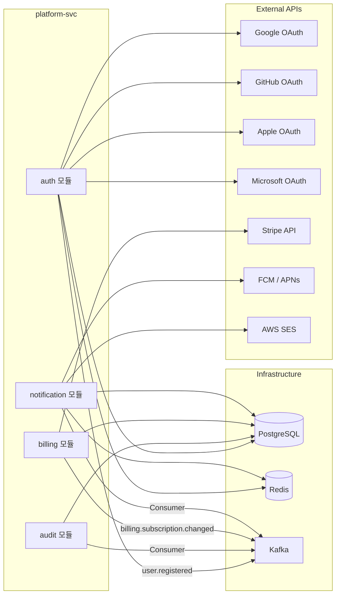

# Platform Service 목킹 정의서

> **프로젝트**: Synapse — 통합 학습-지식 그래프 SaaS
> **서비스**: synapse-platform-svc
> **Owner**: `@platform-owner` (김해준)
> **모듈**: auth, audit, billing, notification
> **작성일**: 2026-05-14

---

## 1. 서비스 의존성 맵



---

## 2. auth 모듈

### 2.1 목킹 인터페이스 목록

| # | 목킹 대상 | 통신 방식 | 방향 | 도구 |
|---|-----------|----------|------|------|
| 1 | Google OAuth (token + userinfo) | REST | Outbound | WireMock |
| 2 | GitHub OAuth (token + userinfo) | REST | Outbound | WireMock |
| 3 | Apple OAuth (token + id_token) | REST | Outbound | WireMock |
| 4 | Microsoft OAuth (token + userinfo) | REST | Outbound | WireMock |
| 5 | Redis (refresh token 저장/조회/삭제) | Redis Protocol | Outbound | Testcontainers |
| 6 | PostgreSQL (users, tenants) | SQL | Outbound | Testcontainers |
| 7 | Kafka Producer (`user.registered`) | Kafka | Outbound | EmbeddedKafka |

### 2.2 OAuth Provider Mock

> 전체 WireMock 매핑은 `07-external-api-mocking.md` §2 참조.

**application-test.yml (auth 섹션):**

```yaml
oauth:
  google:
    client-id: google_test_client_id
    client-secret: google_test_client_secret
    token-url: http://localhost:${wiremock.server.port}/google/token
    userinfo-url: http://localhost:${wiremock.server.port}/google/userinfo
    redirect-uri: http://localhost:8080/auth/oauth/google/callback
  github:
    client-id: github_test_client_id
    client-secret: github_test_client_secret
    token-url: http://localhost:${wiremock.server.port}/github/token
    userinfo-url: http://localhost:${wiremock.server.port}/github/userinfo
    redirect-uri: http://localhost:8080/auth/oauth/github/callback
  apple:
    client-id: com.synapse.app
    team-id: TEAM_MOCK
    key-id: KEY_MOCK
    token-url: http://localhost:${wiremock.server.port}/apple/token
    redirect-uri: http://localhost:8080/auth/oauth/apple/callback
  microsoft:
    client-id: ms_test_client_id
    client-secret: ms_test_client_secret
    token-url: http://localhost:${wiremock.server.port}/microsoft/token
    userinfo-url: http://localhost:${wiremock.server.port}/microsoft/userinfo
    redirect-uri: http://localhost:8080/auth/oauth/microsoft/callback
```

### 2.3 JWT 테스트 유틸

```java
public class JwtTestFactory {

    private static final String SECRET = "test-jwt-secret-key-must-be-at-least-256-bits-long-for-hs256";

    public static String createAccessToken(String userId, String tenantId) {
        return createAccessToken(userId, tenantId, "user", Duration.ofMinutes(15));
    }

    public static String createAccessToken(
            String userId, String tenantId, String role, Duration expiry) {
        Instant now = Instant.parse("2026-01-15T10:00:00Z");
        return Jwts.builder()
            .subject(userId)
            .claim("tenantId", tenantId)
            .claim("role", role)
            .claim("email", "user1@example.com")
            .issuedAt(Date.from(now))
            .expiration(Date.from(now.plus(expiry)))
            .signWith(Keys.hmacShaKeyFor(SECRET.getBytes()))
            .compact();
    }

    public static String createExpiredToken(String userId, String tenantId) {
        Instant past = Instant.parse("2026-01-14T10:00:00Z");
        return Jwts.builder()
            .subject(userId)
            .claim("tenantId", tenantId)
            .issuedAt(Date.from(past))
            .expiration(Date.from(past.plus(Duration.ofMinutes(15))))
            .signWith(Keys.hmacShaKeyFor(SECRET.getBytes()))
            .compact();
    }

    // 기본 사용자 토큰
    public static final String USER1_TOKEN = createAccessToken(
        "user-00000000-0000-0000-0000-000000000001",
        "tenant-00000000-0000-0000-0000-000000000001"
    );

    // Admin 토큰
    public static final String ADMIN_TOKEN = createAccessToken(
        "user-00000000-0000-0000-0000-000000000005",
        "tenant-00000000-0000-0000-0000-000000000001",
        "admin",
        Duration.ofMinutes(15)
    );
}
```

### 2.4 MFA TOTP Mock

```java
public class TotpTestHelper {

    // 고정 TOTP secret (테스트용)
    public static final String TEST_TOTP_SECRET = "JBSWY3DPEHPK3PXP";

    /**
     * 고정 시각(2026-01-15T10:00:00Z) 기준 TOTP 코드 생성
     */
    public static String generateCode() {
        long timeStep = Instant.parse("2026-01-15T10:00:00Z").getEpochSecond() / 30;
        return TOTPGenerator.generateTOTP(TEST_TOTP_SECRET, timeStep, 6);
    }

    /**
     * 만료된 TOTP 코드 (1분 전 시간 기준)
     */
    public static String generateExpiredCode() {
        long timeStep = Instant.parse("2026-01-15T09:59:00Z").getEpochSecond() / 30;
        return TOTPGenerator.generateTOTP(TEST_TOTP_SECRET, timeStep, 6);
    }
}
```

### 2.5 Redis Testcontainers (Refresh Token)

```java
@Container
static GenericContainer<?> redis = new GenericContainer<>(
    DockerImageName.parse("redis:7-alpine")
).withExposedPorts(6379);

// Refresh Token 저장 검증
@Test
void login_shouldStoreRefreshTokenInRedis() {
    // given
    String requestBody = """
        {"email": "user1@example.com", "password": "SecureP@ss1!"}
        """;

    // when
    mockMvc.perform(post("/auth/login")
            .contentType(MediaType.APPLICATION_JSON)
            .content(requestBody))
        .andExpect(status().isOk())
        .andExpect(cookie().exists("refresh_token"));

    // then — Redis에 refresh token이 저장되었는지 확인
    Set<String> keys = redisTemplate.keys("refresh_token:user-*");
    assertThat(keys).hasSize(1);
}
```

### 2.6 Kafka Producer 검증 (`user.registered`)

```java
@Test
void signup_shouldPublishUserRegisteredEvent() {
    // given
    String requestBody = """
        {
            "email": "newuser@example.com",
            "password": "SecureP@ss1!",
            "displayName": "신규사용자",
            "locale": "ko"
        }
        """;

    // when
    mockMvc.perform(post("/auth/signup")
            .contentType(MediaType.APPLICATION_JSON)
            .content(requestBody))
        .andExpect(status().isCreated());

    // then — Kafka에 user.registered 이벤트 발행 검증
    List<ConsumerRecord<String, Object>> records =
        kafkaTestHelper.consumeMessages("user.registered", 1, Duration.ofSeconds(5));

    assertThat(records).hasSize(1);
    // CloudEvents 포맷 검증
    Object event = records.get(0).value();
    assertThat(event).hasFieldOrProperty("data");
}
```

### 2.7 PostgreSQL 시드 데이터

```sql
-- platform_auth_seed.sql

-- Tenants
INSERT INTO tenants (id, name, plan, status, created_at) VALUES
('tenant-00000000-0000-0000-0000-000000000001', 'Test Workspace', 'free', 'active', '2026-01-15T10:00:00Z'),
('tenant-00000000-0000-0000-0000-000000000002', 'Team Workspace', 'team', 'active', '2026-01-15T10:00:00Z');

-- Users
INSERT INTO users (id, tenant_id, email, password_hash, display_name, role, status, created_at) VALUES
('user-00000000-0000-0000-0000-000000000001', 'tenant-00000000-0000-0000-0000-000000000001', 'user1@example.com', '$2a$10$mockHashForTesting', '홍길동', 'owner', 'active', '2026-01-15T10:00:00Z'),
('user-00000000-0000-0000-0000-000000000002', 'tenant-00000000-0000-0000-0000-000000000001', 'user2@gmail.com', NULL, '김영희', 'member', 'active', '2026-01-15T10:00:00Z'),
('user-00000000-0000-0000-0000-000000000005', 'tenant-00000000-0000-0000-0000-000000000001', 'admin@example.com', '$2a$10$mockHashForTesting', '관리자', 'admin', 'active', '2026-01-15T10:00:00Z');

-- OAuth Accounts
INSERT INTO oauth_accounts (user_id, provider, provider_user_id, email, created_at) VALUES
('user-00000000-0000-0000-0000-000000000002', 'google', 'google_user_001', 'user2@gmail.com', '2026-01-15T10:00:00Z');
```

---

## 3. audit 모듈

### 3.1 목킹 인터페이스 목록

| # | 목킹 대상 | 통신 방식 | 방향 | 도구 |
|---|-----------|----------|------|------|
| 1 | Kafka Consumer (7개 토픽) | Kafka | Inbound | EmbeddedKafka |
| 2 | PostgreSQL (audit_logs, processed_events) | SQL | Outbound | Testcontainers |

### 3.2 Consumer 소비 토픽 목록

| # | 토픽 | fixture 참조 |
|---|------|-------------|
| 1 | `user.registered` | `06-kafka-event-mocking.md` §2.5 |
| 2 | `billing.subscription.changed` | `06-kafka-event-mocking.md` §2.6 |
| 3 | `audit.event` | `06-kafka-event-mocking.md` §2.7 |
| 4 | `community.deck.shared` | `06-kafka-event-mocking.md` §2.8 |
| 5 | `community.group.created` | `06-kafka-event-mocking.md` §2.10 |
| 6 | `community.group.joined` | `06-kafka-event-mocking.md` §2.11 |
| 7 | `community.report.created` | `06-kafka-event-mocking.md` §2.12 |

### 3.3 Idempotency 검증 테스트

```java
@Test
void consumeAuditEvent_duplicateId_shouldSkipSecondInsert() {
    // given — 동일 이벤트 2회 발행
    String fixture = kafkaTestHelper.loadFixture("fixtures/kafka/audit_event_success.avro.json");

    kafkaTestHelper.publishAndWait("audit.event", "key-1", fixture, Duration.ofSeconds(5));
    kafkaTestHelper.publishAndWait("audit.event", "key-1", fixture, Duration.ofSeconds(5));

    // then — audit_logs에 1건만 존재
    Long count = jdbcTemplate.queryForObject(
        "SELECT COUNT(*) FROM audit_logs WHERE event_id = ?",
        Long.class,
        "evt-00000000-0000-0000-0000-000000000701"
    );
    assertThat(count).isEqualTo(1);

    // processed_events에도 1건
    Long processedCount = jdbcTemplate.queryForObject(
        "SELECT COUNT(*) FROM processed_events WHERE event_id = ?",
        Long.class,
        "evt-00000000-0000-0000-0000-000000000701"
    );
    assertThat(processedCount).isEqualTo(1);
}
```

### 3.4 PostgreSQL 시드 데이터

```sql
-- platform_audit_seed.sql

CREATE TABLE IF NOT EXISTS audit_logs (
    id UUID PRIMARY KEY DEFAULT gen_random_uuid(),
    tenant_id UUID NOT NULL,
    event_id VARCHAR(255) UNIQUE NOT NULL,
    action VARCHAR(100) NOT NULL,
    user_id UUID,
    resource_type VARCHAR(50),
    resource_id UUID,
    ip_address VARCHAR(45),
    user_agent TEXT,
    metadata JSONB,
    created_at TIMESTAMPTZ NOT NULL DEFAULT NOW()
);

CREATE TABLE IF NOT EXISTS processed_events (
    event_id VARCHAR(255) PRIMARY KEY,
    processed_at TIMESTAMPTZ NOT NULL DEFAULT NOW()
);

-- 기존 감사 로그 (조회 테스트용)
INSERT INTO audit_logs (id, tenant_id, event_id, action, user_id, resource_type, resource_id, ip_address, created_at) VALUES
('al-00000000-0000-0000-0000-000000000001', 'tenant-00000000-0000-0000-0000-000000000001', 'evt-seed-001', 'note.create', 'user-00000000-0000-0000-0000-000000000001', 'note', 'note-00000000-0000-0000-0000-000000000001', '192.168.1.100', '2026-01-15T09:00:00Z');

INSERT INTO processed_events (event_id, processed_at) VALUES
('evt-seed-001', '2026-01-15T09:00:01Z');
```

---

## 4. billing 모듈

### 4.1 목킹 인터페이스 목록

| # | 목킹 대상 | 통신 방식 | 방향 | 도구 |
|---|-----------|----------|------|------|
| 1 | Stripe Checkout Session | REST | Outbound | WireMock |
| 2 | Stripe Customer Portal | REST | Outbound | WireMock |
| 3 | Stripe Invoices | REST | Outbound | WireMock |
| 4 | Stripe Webhooks (3종) | REST | Inbound | WireMock + 수동 호출 |
| 5 | PostgreSQL (subscriptions, usage_counters) | SQL | Outbound | Testcontainers |
| 6 | Kafka Producer (`billing.subscription.changed`) | Kafka | Outbound | EmbeddedKafka |

### 4.2 Stripe Mock 설정

> 전체 WireMock 매핑은 `07-external-api-mocking.md` §3 참조.

**application-test.yml (billing 섹션):**

```yaml
stripe:
  api-key: sk_test_mock_key
  webhook-secret: whsec_test_mock_secret
  api-base-url: http://localhost:${wiremock.server.port}/stripe
  prices:
    pro-monthly: price_pro_monthly
    pro-yearly: price_pro_yearly
    team-monthly: price_team_monthly
    team-yearly: price_team_yearly
```

### 4.3 Webhook 처리 테스트

```java
@Test
void handleCheckoutCompleted_shouldActivateSubscription() {
    // given — Stripe webhook payload
    String payload = kafkaTestHelper.loadFixture(
        "fixtures/stripe/checkout_session_completed_webhook.json");
    long timestamp = Instant.parse("2026-01-15T10:00:00Z").getEpochSecond();
    String signature = StripeWebhookTestHelper.generateSignature(payload, timestamp);

    // when
    mockMvc.perform(post("/billing/webhooks")
            .header("Stripe-Signature", signature)
            .contentType(MediaType.APPLICATION_JSON)
            .content(payload))
        .andExpect(status().isOk());

    // then — 구독 활성화 확인
    Optional<Subscription> sub = subscriptionRepository.findByTenantId(
        UUID.fromString("tenant-00000000-0000-0000-0000-000000000001"));
    assertThat(sub).isPresent();
    assertThat(sub.get().getPlan()).isEqualTo("pro");
    assertThat(sub.get().getStatus()).isEqualTo("active");

    // Kafka 이벤트 발행 확인
    List<ConsumerRecord<String, Object>> records =
        kafkaTestHelper.consumeMessages("billing.subscription.changed", 1, Duration.ofSeconds(5));
    assertThat(records).hasSize(1);
}
```

### 4.4 Usage Counter 테스트 데이터

```sql
-- platform_billing_seed.sql

-- Subscriptions
INSERT INTO subscriptions (id, tenant_id, plan, status, stripe_subscription_id, current_period_start, current_period_end, created_at) VALUES
('sub-00000000-0000-0000-0000-000000000001', 'tenant-00000000-0000-0000-0000-000000000001', 'free', 'active', NULL, '2026-01-01', '2026-02-01', '2026-01-15T10:00:00Z'),
('sub-00000000-0000-0000-0000-000000000002', 'tenant-00000000-0000-0000-0000-000000000002', 'team', 'active', 'sub_mock_002', '2026-01-01', '2026-02-01', '2026-01-15T10:00:00Z');

-- Usage Counters
INSERT INTO usage_counters (tenant_id, counter_type, used, max_allowed, period_start, period_end) VALUES
('tenant-00000000-0000-0000-0000-000000000001', 'api_calls', 50, 100, '2026-01-15T00:00:00Z', '2026-01-15T23:59:59Z'),
('tenant-00000000-0000-0000-0000-000000000001', 'ai_generations', 8, 10, '2026-01-15T00:00:00Z', '2026-01-15T23:59:59Z'),
-- 할당량 초과 시나리오 (Free 플랜 AI 일일 한도 도달)
('tenant-00000000-0000-0000-0000-000000000001', 'ai_generations_exceeded', 10, 10, '2026-01-15T00:00:00Z', '2026-01-15T23:59:59Z');

-- Plan Definitions
INSERT INTO plan_definitions (code, name, price, currency, interval_type, features) VALUES
('free', 'Free', 0, 'USD', 'month', '{"notes": -1, "ai_per_day": 10, "storage_gb": 1}'),
('pro', 'Pro', 9.99, 'USD', 'month', '{"notes": -1, "ai_per_month": 500, "storage_gb": 10}'),
('team', 'Team', 19.99, 'USD', 'month', '{"notes": -1, "ai_per_month": 1000, "storage_gb": 50, "members": 20}');
```

---

## 5. notification 모듈

### 5.1 목킹 인터페이스 목록

| # | 목킹 대상 | 통신 방식 | 방향 | 도구 |
|---|-----------|----------|------|------|
| 1 | Kafka Consumer (8개 토픽) | Kafka | Inbound | EmbeddedKafka |
| 2 | FCM API | REST | Outbound | WireMock |
| 3 | AWS SES | REST | Outbound | WireMock |
| 4 | Redis (미읽음 카운트) | Redis Protocol | Outbound | Testcontainers |
| 5 | PostgreSQL (notifications, notification_preferences, device_tokens) | SQL | Outbound | Testcontainers |

### 5.2 Consumer 소비 토픽 목록

| # | 토픽 | 알림 유형 | fixture 참조 |
|---|------|----------|-------------|
| 1 | `gamification.xp.earned` | XP 획득 알림 | `06-kafka-event-mocking.md` §2.13 |
| 2 | `gamification.badge.earned` | 배지 획득 알림 | `06-kafka-event-mocking.md` §2.14 |
| 3 | `gamification.level.up` | 레벨업 알림 | `06-kafka-event-mocking.md` §2.15 |
| 4 | `notification.send` | 범용 알림 발송 | `06-kafka-event-mocking.md` §2.16 |
| 5 | `card.review.due` | 복습 리마인더 | `06-kafka-event-mocking.md` §2.17 |
| 6 | `community.deck.shared` | 덱 공유 알림 | `06-kafka-event-mocking.md` §2.8 |
| 7 | `community.note.shared` | 노트 공유 알림 | `06-kafka-event-mocking.md` §2.9 |
| 8 | `community.group.joined` | 그룹 가입 알림 | `06-kafka-event-mocking.md` §2.11 |

### 5.3 FCM/SES Mock 설정

> 전체 WireMock 매핑은 `07-external-api-mocking.md` §4, §5 참조.

**application-test.yml (notification 섹션):**

```yaml
notification:
  fcm:
    project-id: synapse-mock
    api-url: http://localhost:${wiremock.server.port}/fcm
    credentials-json: classpath:firebase/mock-credentials.json
  ses:
    endpoint-url: http://localhost:${wiremock.server.port}/ses
    region: ap-northeast-2
    from-address: noreply@synapse.app
  quiet-hours:
    default-start: "22:00"
    default-end: "08:00"
    timezone: Asia/Seoul
```

### 5.4 Quiet Hours 테스트

```java
@Test
void notification_duringQuietHours_shouldBeQueued() {
    // given — 시간을 23:00 KST (quiet hours 내)로 설정
    Clock quietClock = Clock.fixed(
        Instant.parse("2026-01-15T14:00:00Z"),  // = 23:00 KST
        ZoneId.of("Asia/Seoul")
    );

    // notification_preferences에 quiet_hours 활성화
    // when — notification.send 이벤트 발행
    String fixture = kafkaTestHelper.loadFixture(
        "fixtures/kafka/notification_send_level_up.avro.json");
    kafkaTestHelper.publishAndWait("notification.send", "key-1", fixture, Duration.ofSeconds(5));

    // then — FCM 호출 없음 (quiet hours), 대신 큐에 저장
    verify(0, postRequestedFor(urlPathEqualTo("/fcm/v1/projects/synapse-mock/messages:send")));

    Long queuedCount = jdbcTemplate.queryForObject(
        "SELECT COUNT(*) FROM notifications WHERE status = 'queued'",
        Long.class
    );
    assertThat(queuedCount).isEqualTo(1);
}
```

### 5.5 PostgreSQL 시드 데이터

```sql
-- platform_notification_seed.sql

-- Device Tokens
INSERT INTO device_tokens (id, user_id, token, platform, created_at) VALUES
('dt-00000000-0000-0000-0000-000000000001', 'user-00000000-0000-0000-0000-000000000001', 'device_token_mock_001', 'android', '2026-01-15T10:00:00Z'),
('dt-00000000-0000-0000-0000-000000000002', 'user-00000000-0000-0000-0000-000000000001', 'device_token_mock_002', 'web', '2026-01-15T10:00:00Z'),
('dt-00000000-0000-0000-0000-000000000003', 'user-00000000-0000-0000-0000-000000000002', 'device_token_mock_003', 'ios', '2026-01-15T10:00:00Z');

-- Notification Preferences
INSERT INTO notification_preferences (user_id, category, push_enabled, email_enabled, quiet_hours_enabled, quiet_start, quiet_end) VALUES
('user-00000000-0000-0000-0000-000000000001', 'gamification', true, false, true, '22:00', '08:00'),
('user-00000000-0000-0000-0000-000000000001', 'community', true, true, true, '22:00', '08:00'),
('user-00000000-0000-0000-0000-000000000001', 'review_reminder', true, true, false, NULL, NULL),
('user-00000000-0000-0000-0000-000000000002', 'gamification', true, true, false, NULL, NULL),
('user-00000000-0000-0000-0000-000000000002', 'community', false, true, false, NULL, NULL);

-- 기존 알림 (목록 조회 테스트용)
INSERT INTO notifications (id, user_id, tenant_id, template_code, category, title, body, status, channel, created_at) VALUES
('notif-00000000-0000-0000-0000-000000000001', 'user-00000000-0000-0000-0000-000000000001', 'tenant-00000000-0000-0000-0000-000000000001', 'BADGE_EARNED', 'gamification', '배지 획득!', '7일 전사 배지를 획득했습니다.', 'sent', 'push', '2026-01-15T09:00:00Z'),
('notif-00000000-0000-0000-0000-000000000002', 'user-00000000-0000-0000-0000-000000000001', 'tenant-00000000-0000-0000-0000-000000000001', 'REVIEW_DUE', 'review_reminder', '복습 시간!', '25장의 카드가 대기 중입니다.', 'read', 'push', '2026-01-14T07:00:00Z');
```

### 5.6 Redis 미읽음 카운트 테스트

```java
@Test
void notification_afterInsert_shouldIncrementUnreadCount() {
    // given
    String fixture = kafkaTestHelper.loadFixture(
        "fixtures/kafka/gamification_badge_earned_success.avro.json");

    // when
    kafkaTestHelper.publishAndWait("gamification.badge.earned", "key-1", fixture, Duration.ofSeconds(5));

    // then — Redis 미읽음 카운트 증가 확인
    String unreadCount = redisTemplate.opsForValue().get(
        "unread:user-00000000-0000-0000-0000-000000000001"
    );
    assertThat(Integer.parseInt(unreadCount)).isGreaterThanOrEqualTo(1);
}
```

---

## 6. Testcontainers 공통 설정

```java
@Testcontainers
@SpringBootTest
@ActiveProfiles("test")
public abstract class AbstractPlatformIntegrationTest {

    @Container
    static PostgreSQLContainer<?> postgres = new PostgreSQLContainer<>(
        DockerImageName.parse("pgvector/pgvector:pg16")
    )
        .withDatabaseName("synapse_platform_test")
        .withUsername("synapse")
        .withPassword("test_password")
        .withInitScript("db/platform_init.sql");

    @Container
    static GenericContainer<?> redis = new GenericContainer<>(
        DockerImageName.parse("redis:7-alpine")
    ).withExposedPorts(6379);

    @DynamicPropertySource
    static void configureProperties(DynamicPropertyRegistry registry) {
        registry.add("spring.datasource.url", postgres::getJdbcUrl);
        registry.add("spring.datasource.username", postgres::getUsername);
        registry.add("spring.datasource.password", postgres::getPassword);
        registry.add("spring.data.redis.host", redis::getHost);
        registry.add("spring.data.redis.port", () -> redis.getMappedPort(6379));
    }
}
```

---

## 7. application-test.yml (전체)

```yaml
spring:
  profiles:
    active: test
  datasource:
    url: ${SPRING_DATASOURCE_URL}
    username: ${SPRING_DATASOURCE_USERNAME}
    password: ${SPRING_DATASOURCE_PASSWORD}
  jpa:
    hibernate:
      ddl-auto: create-drop
    show-sql: true
  data:
    redis:
      host: ${SPRING_DATA_REDIS_HOST}
      port: ${SPRING_DATA_REDIS_PORT}
  kafka:
    bootstrap-servers: ${spring.embedded.kafka.brokers}
    consumer:
      auto-offset-reset: earliest
      group-id: platform-test-group
    properties:
      schema.registry.url: mock://test-schema-registry

jwt:
  secret: test-jwt-secret-key-must-be-at-least-256-bits-long-for-hs256
  access-token-expiry: 900
  refresh-token-expiry: 604800

oauth:
  google:
    client-id: google_test_client_id
    client-secret: google_test_client_secret
    token-url: http://localhost:${wiremock.server.port}/google/token
    userinfo-url: http://localhost:${wiremock.server.port}/google/userinfo
  github:
    client-id: github_test_client_id
    client-secret: github_test_client_secret
    token-url: http://localhost:${wiremock.server.port}/github/token
    userinfo-url: http://localhost:${wiremock.server.port}/github/userinfo
  apple:
    client-id: com.synapse.app
    token-url: http://localhost:${wiremock.server.port}/apple/token
  microsoft:
    client-id: ms_test_client_id
    client-secret: ms_test_client_secret
    token-url: http://localhost:${wiremock.server.port}/microsoft/token
    userinfo-url: http://localhost:${wiremock.server.port}/microsoft/userinfo

stripe:
  api-key: sk_test_mock_key
  webhook-secret: whsec_test_mock_secret
  api-base-url: http://localhost:${wiremock.server.port}/stripe

notification:
  fcm:
    project-id: synapse-mock
    api-url: http://localhost:${wiremock.server.port}/fcm
  ses:
    endpoint-url: http://localhost:${wiremock.server.port}/ses
    from-address: noreply@synapse.app
```
