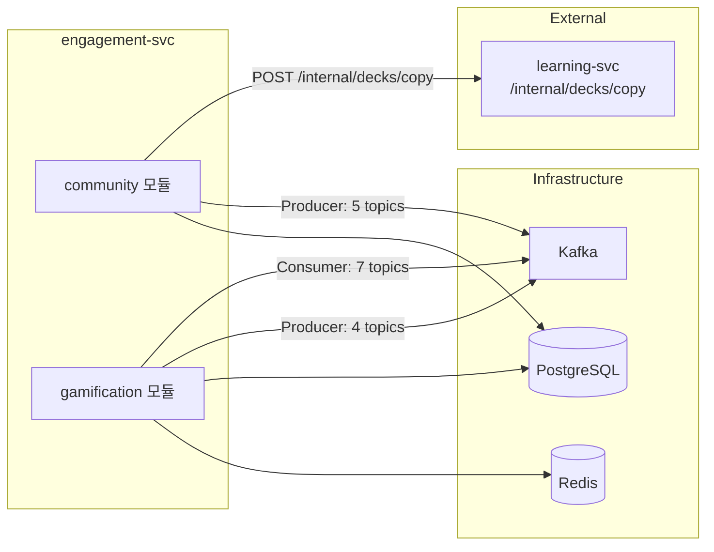

# Engagement Service 목킹 정의서

> **프로젝트**: Synapse — 통합 학습-지식 그래프 SaaS
> **서비스**: synapse-engagement-svc
> **Owner**: `@engagement-owner` (한승완)
> **모듈**: community, gamification
> **작성일**: 2026-05-14

---

## 1. 서비스 의존성 맵



---

## 2. community 모듈

### 2.1 목킹 인터페이스 목록

| # | 목킹 대상 | 통신 방식 | 방향 | 도구 |
|---|-----------|----------|------|------|
| 1 | `/internal/decks/copy` (learning-svc) | REST | Outbound | WireMock |
| 2 | Kafka Producer (5개 토픽) | Kafka | Outbound | EmbeddedKafka |
| 3 | PostgreSQL (study_groups, group_members, shared_decks, shared_notes, reports) | SQL | Outbound | Testcontainers |

### 2.2 Internal API — `/internal/decks/copy` WireMock

#### Success (201)

```json
{
  "request": {
    "method": "POST",
    "urlPath": "/internal/decks/copy",
    "headers": {
      "Content-Type": { "equalTo": "application/json" }
    },
    "bodyPatterns": [
      { "matchesJsonPath": "$.sourceDeckId" },
      { "matchesJsonPath": "$.targetUserId" },
      { "matchesJsonPath": "$.targetTenantId" }
    ]
  },
  "response": {
    "status": 201,
    "headers": {
      "Content-Type": "application/json"
    },
    "jsonBody": {
      "copiedDeckId": "deck-00000000-0000-0000-0000-000000000099",
      "cardCount": 42
    }
  }
}
```

#### 요청 fixture

```json
{
  "sourceDeckId": "deck-00000000-0000-0000-0000-000000000002",
  "targetUserId": "user-00000000-0000-0000-0000-000000000002",
  "targetTenantId": "tenant-00000000-0000-0000-0000-000000000001",
  "newDeckName": "복사된 프로그래밍 기초 덱"
}
```

#### Error — Source Deck Not Found (404)

```json
{
  "request": {
    "method": "POST",
    "urlPath": "/internal/decks/copy",
    "bodyPatterns": [
      { "matchesJsonPath": "$.sourceDeckId",
        "equalTo": "deck-00000000-0000-0000-0000-nonexistent00" }
    ]
  },
  "response": {
    "status": 404,
    "jsonBody": {
      "success": false,
      "error": {
        "code": "DECK_NOT_FOUND",
        "message": "Source deck not found"
      }
    }
  }
}
```

**application-test.yml:**

```yaml
internal:
  learning-svc:
    base-url: http://localhost:${wiremock.server.port}
```

### 2.3 Spring Cloud Contract (Consumer Side)

engagement-svc는 `/internal/decks/copy`의 **Consumer** 이므로, learning-svc가 제공하는 contract stub을 사용하여 계약 테스트를 실행한다.

```yaml
# application-contract-test.yml
stubrunner:
  ids:
    - com.synapse:learning-card:+:stubs:8091
  stubs-mode: LOCAL
```

```java
@AutoConfigureStubRunner(
    ids = "com.synapse:learning-card:+:stubs:8091",
    stubsMode = StubRunnerProperties.StubsMode.LOCAL
)
@SpringBootTest
class CommunityDeckCopyContractTest {

    @Autowired
    private DeckCopyClient deckCopyClient;

    @Test
    void copyDeck_shouldFollowContract() {
        DeckCopyRequest request = new DeckCopyRequest(
            UUID.fromString("deck-00000000-0000-0000-0000-000000000002"),
            UUID.fromString("user-00000000-0000-0000-0000-000000000002"),
            UUID.fromString("tenant-00000000-0000-0000-0000-000000000001"),
            null
        );

        DeckCopyResponse response = deckCopyClient.copyDeck(request);

        assertThat(response.copiedDeckId()).isNotNull();
        assertThat(response.cardCount()).isPositive();
    }
}
```

### 2.4 Kafka Producer 검증 (5개 토픽)

```java
@Test
void shareDeck_shouldPublishDeckSharedEvent() {
    // given
    String requestBody = """
        {
            "deckId": "deck-00000000-0000-0000-0000-000000000001",
            "shareType": "group",
            "targetGroupId": "group-00000000-0000-0000-0000-000000000001"
        }
        """;

    // when
    mockMvc.perform(post("/community/groups/group-00000000-0000-0000-0000-000000000001/share/deck")
            .header("Authorization", "Bearer " + JwtTestFactory.USER1_TOKEN)
            .contentType(MediaType.APPLICATION_JSON)
            .content(requestBody))
        .andExpect(status().isCreated());

    // then
    List<ConsumerRecord<String, Object>> records =
        kafkaTestHelper.consumeMessages("community.deck.shared", 1, Duration.ofSeconds(5));
    assertThat(records).hasSize(1);
}

@Test
void createGroup_shouldPublishGroupCreatedEvent() {
    String requestBody = """
        {
            "name": "ML 스터디",
            "description": "머신러닝을 함께 공부하는 그룹",
            "maxMembers": 20,
            "joinType": "approval"
        }
        """;

    mockMvc.perform(post("/community/groups")
            .header("Authorization", "Bearer " + JwtTestFactory.USER1_TOKEN)
            .contentType(MediaType.APPLICATION_JSON)
            .content(requestBody))
        .andExpect(status().isCreated());

    List<ConsumerRecord<String, Object>> records =
        kafkaTestHelper.consumeMessages("community.group.created", 1, Duration.ofSeconds(5));
    assertThat(records).hasSize(1);
}
```

### 2.5 PostgreSQL 시드 데이터

```sql
-- engagement_community_seed.sql

-- Study Groups
INSERT INTO study_groups (id, tenant_id, name, description, max_members, join_type, status, owner_user_id, member_count, created_at) VALUES
('group-00000000-0000-0000-0000-000000000001', 'tenant-00000000-0000-0000-0000-000000000001', 'ML 스터디', '머신러닝을 함께 공부하는 그룹', 20, 'approval', 'active', 'user-00000000-0000-0000-0000-000000000001', 3, '2026-01-15T09:00:00Z'),
('group-00000000-0000-0000-0000-000000000002', 'tenant-00000000-0000-0000-0000-000000000001', '비공개 스터디', '초대 전용 그룹', 10, 'invite_only', 'active', 'user-00000000-0000-0000-0000-000000000002', 1, '2026-01-15T09:00:00Z');

-- Group Members
INSERT INTO group_members (id, group_id, user_id, role, status, joined_at) VALUES
('gm-00000000-0000-0000-0000-000000000001', 'group-00000000-0000-0000-0000-000000000001', 'user-00000000-0000-0000-0000-000000000001', 'owner', 'active', '2026-01-15T09:00:00Z'),
('gm-00000000-0000-0000-0000-000000000002', 'group-00000000-0000-0000-0000-000000000001', 'user-00000000-0000-0000-0000-000000000002', 'member', 'active', '2026-01-15T09:30:00Z'),
('gm-00000000-0000-0000-0000-000000000003', 'group-00000000-0000-0000-0000-000000000001', 'user-00000000-0000-0000-0000-000000000004', 'admin', 'active', '2026-01-15T09:35:00Z');

-- Shared Decks
INSERT INTO shared_decks (id, tenant_id, deck_id, shared_by_user_id, share_type, target_group_id, deck_title, share_token, copy_count, status, created_at) VALUES
('sdeck-00000000-0000-0000-0000-000000000001', 'tenant-00000000-0000-0000-0000-000000000001', 'deck-00000000-0000-0000-0000-000000000001', 'user-00000000-0000-0000-0000-000000000001', 'group', 'group-00000000-0000-0000-0000-000000000001', '프로그래밍 기초 덱', 'share_tok_001', 5, 'active', '2026-01-15T11:00:00Z');

-- Shared Notes
INSERT INTO shared_notes (id, tenant_id, note_id, shared_by_user_id, share_type, target_group_id, note_title, share_token, status, created_at) VALUES
('snote-00000000-0000-0000-0000-000000000001', 'tenant-00000000-0000-0000-0000-000000000001', 'note-00000000-0000-0000-0000-000000000001', 'user-00000000-0000-0000-0000-000000000001', 'group', 'group-00000000-0000-0000-0000-000000000001', '머신러닝 기초 정리', 'share_tok_002', 'active', '2026-01-15T11:10:00Z');

-- Reports
INSERT INTO reports (id, tenant_id, reporter_user_id, target_type, target_id, reason, description, status, created_at) VALUES
('report-00000000-0000-0000-0000-000000000001', 'tenant-00000000-0000-0000-0000-000000000001', 'user-00000000-0000-0000-0000-000000000002', 'shared_deck', 'sdeck-00000000-0000-0000-0000-000000000001', 'inappropriate', '부적절한 내용 포함', 'pending', '2026-01-15T14:00:00Z');
```

---

## 3. gamification 모듈

### 3.1 목킹 인터페이스 목록

| # | 목킹 대상 | 통신 방식 | 방향 | 도구 |
|---|-----------|----------|------|------|
| 1 | Kafka Consumer (7개 토픽) | Kafka | Inbound | EmbeddedKafka |
| 2 | Kafka Producer (4개 토픽) | Kafka | Outbound | EmbeddedKafka |
| 3 | Redis (리더보드 Sorted Set) | Redis Protocol | Outbound | Testcontainers |
| 4 | PostgreSQL (xp_events, level_definitions, badge_definitions, user_badges, leaderboards) | SQL | Outbound | Testcontainers |

### 3.2 Consumer 소비 토픽 목록

| # | 토픽 | XP 처리 | fixture 참조 |
|---|------|---------|-------------|
| 1 | `card.reviewed` | review_complete: +10 XP | `06-kafka-event-mocking.md` §2.4 |
| 2 | `note.created` | note_create: +20 XP | `06-kafka-event-mocking.md` §2.1 |
| 3 | `community.deck.shared` | deck_share: +30 XP | `06-kafka-event-mocking.md` §2.8 |
| 4 | `community.note.shared` | note_share: +30 XP | `06-kafka-event-mocking.md` §2.9 |
| 5 | `community.group.created` | group_activity: +15 XP | `06-kafka-event-mocking.md` §2.10 |
| 6 | `community.group.joined` | group_activity: +15 XP | `06-kafka-event-mocking.md` §2.11 |
| 7 | `community.report.created` | (처리 없음, 로깅만) | `06-kafka-event-mocking.md` §2.12 |

### 3.3 Producer 발행 토픽 목록

| # | 토픽 | 발행 조건 |
|---|------|----------|
| 1 | `gamification.xp.earned` | XP 적립 시 |
| 2 | `gamification.badge.earned` | 배지 조건 충족 시 |
| 3 | `gamification.level.up` | 레벨 상승 시 |
| 4 | `notification.send` | 알림 발송 요청 |

### 3.4 XP 적립 → 레벨업 → 배지 수여 통합 테스트

```java
@Test
void cardReviewed_shouldAwardXpAndCheckLevelUp() {
    // given — user1은 현재 레벨 3 (XP: 490, 레벨4 필요 XP: 500)
    String fixture = kafkaTestHelper.loadFixture(
        "fixtures/kafka/card_reviewed_success.avro.json");

    // when — card.reviewed 이벤트 발행 (10 XP)
    kafkaTestHelper.publishAndWait("card.reviewed", "key-1", fixture, Duration.ofSeconds(5));

    // then — XP 500 도달 → 레벨 4로 승격
    // 1. xp_events에 INSERT
    Long xpCount = jdbcTemplate.queryForObject(
        "SELECT COUNT(*) FROM xp_events WHERE user_id = ? AND event_type = 'review_complete'",
        Long.class,
        "user-00000000-0000-0000-0000-000000000001"
    );
    assertThat(xpCount).isGreaterThanOrEqualTo(1);

    // 2. gamification.xp.earned 발행 확인
    List<ConsumerRecord<String, Object>> xpRecords =
        kafkaTestHelper.consumeMessages("gamification.xp.earned", 1, Duration.ofSeconds(5));
    assertThat(xpRecords).hasSize(1);

    // 3. gamification.level.up 발행 확인
    List<ConsumerRecord<String, Object>> levelRecords =
        kafkaTestHelper.consumeMessages("gamification.level.up", 1, Duration.ofSeconds(5));
    assertThat(levelRecords).hasSize(1);
}
```

### 3.5 Redis 리더보드 테스트

```java
@Test
void leaderboard_shouldUseRedisSortedSet() {
    // given — Redis에 리더보드 시드 데이터 적재
    String weeklyKey = "leaderboard:weekly:2026-W03";
    redisTemplate.opsForZSet().add(weeklyKey, "user-00000000-0000-0000-0000-000000000001", 500);
    redisTemplate.opsForZSet().add(weeklyKey, "user-00000000-0000-0000-0000-000000000002", 350);
    redisTemplate.opsForZSet().add(weeklyKey, "user-00000000-0000-0000-0000-000000000004", 200);

    // when — 리더보드 조회
    mockMvc.perform(get("/gamification/leaderboard?period=weekly")
            .header("Authorization", "Bearer " + JwtTestFactory.USER1_TOKEN))
        .andExpect(status().isOk())
        .andExpect(jsonPath("$.data[0].userId").value("user-00000000-0000-0000-0000-000000000001"))
        .andExpect(jsonPath("$.data[0].totalXp").value(500))
        .andExpect(jsonPath("$.data[1].totalXp").value(350));
}
```

### 3.6 스트릭 리셋 Cron Job 테스트

```java
@Test
void streakResetJob_shouldResetInactiveUsers() {
    // given — user1: 어제 마지막 복습, user2: 오늘 복습
    jdbcTemplate.update(
        "INSERT INTO user_streaks (user_id, current_streak, last_activity_date) VALUES (?, ?, ?)",
        "user-00000000-0000-0000-0000-000000000001", 7, LocalDate.parse("2026-01-14")
    );
    jdbcTemplate.update(
        "INSERT INTO user_streaks (user_id, current_streak, last_activity_date) VALUES (?, ?, ?)",
        "user-00000000-0000-0000-0000-000000000002", 3, LocalDate.parse("2026-01-15")
    );

    // when — 스트릭 리셋 Job 실행 (기준일: 2026-01-15)
    streakResetJob.execute();

    // then — user1 스트릭 0으로 리셋, user2 유지
    Integer user1Streak = jdbcTemplate.queryForObject(
        "SELECT current_streak FROM user_streaks WHERE user_id = ?",
        Integer.class, "user-00000000-0000-0000-0000-000000000001"
    );
    assertThat(user1Streak).isEqualTo(0);

    Integer user2Streak = jdbcTemplate.queryForObject(
        "SELECT current_streak FROM user_streaks WHERE user_id = ?",
        Integer.class, "user-00000000-0000-0000-0000-000000000002"
    );
    assertThat(user2Streak).isEqualTo(3);
}
```

### 3.7 PostgreSQL 시드 데이터

```sql
-- engagement_gamification_seed.sql

-- Level Definitions
INSERT INTO level_definitions (level_number, required_xp, title, rewards_json) VALUES
(1, 0, '새싹', NULL),
(2, 100, '탐험가', NULL),
(3, 300, '학습자', NULL),
(4, 500, '학자', NULL),
(5, 1000, '전문가', NULL),
(6, 2000, '마스터', NULL);

-- Badge Definitions
INSERT INTO badge_definitions (id, code, name, description, icon_url, category, criteria_json, xp_reward) VALUES
('badge-00000000-0000-0000-0000-000000000001', 'STREAK_7', '7일 전사', '7일 연속 복습 달성', 'https://cdn.synapse.app/badges/streak7.png', 'streak', '{"type":"streak","field":"current_streak","value":7,"period":"all"}', 100),
('badge-00000000-0000-0000-0000-000000000002', 'STREAK_30', '30일 전사', '30일 연속 복습 달성', 'https://cdn.synapse.app/badges/streak30.png', 'streak', '{"type":"streak","field":"current_streak","value":30,"period":"all"}', 500),
('badge-00000000-0000-0000-0000-000000000003', 'FIRST_REVIEW', '첫 복습', '첫 번째 카드 복습 완료', 'https://cdn.synapse.app/badges/first-review.png', 'milestone', '{"type":"count","field":"total_reviews","value":1,"period":"all"}', 100),
('badge-00000000-0000-0000-0000-000000000004', 'NOTE_100', '노트 100개', '노트 100개 작성', 'https://cdn.synapse.app/badges/note100.png', 'milestone', '{"type":"count","field":"total_notes","value":100,"period":"all"}', 200);

-- XP Events (기존 데이터)
INSERT INTO xp_events (id, tenant_id, user_id, event_type, xp_amount, source_id, source_type, created_at) VALUES
('xp-00000000-0000-0000-0000-000000000001', 'tenant-00000000-0000-0000-0000-000000000001', 'user-00000000-0000-0000-0000-000000000001', 'review_complete', 10, 'card-00000000-0000-0000-0000-000000000001', 'card', '2026-01-14T10:00:00Z'),
('xp-00000000-0000-0000-0000-000000000002', 'tenant-00000000-0000-0000-0000-000000000001', 'user-00000000-0000-0000-0000-000000000001', 'note_create', 20, 'note-00000000-0000-0000-0000-000000000001', 'note', '2026-01-14T11:00:00Z');

-- User XP Summary
INSERT INTO user_xp_summary (user_id, tenant_id, total_xp, current_level, current_streak, last_activity_date) VALUES
('user-00000000-0000-0000-0000-000000000001', 'tenant-00000000-0000-0000-0000-000000000001', 490, 3, 7, '2026-01-14'),
('user-00000000-0000-0000-0000-000000000002', 'tenant-00000000-0000-0000-0000-000000000001', 150, 2, 3, '2026-01-15');

-- User Badges
INSERT INTO user_badges (id, user_id, badge_id, earned_at) VALUES
('ub-00000000-0000-0000-0000-000000000001', 'user-00000000-0000-0000-0000-000000000001', 'badge-00000000-0000-0000-0000-000000000003', '2026-01-10T10:00:00Z');

-- XP Config
INSERT INTO xp_config (event_type, xp_amount) VALUES
('review_complete', 10),
('note_create', 20),
('card_create', 5),
('streak_bonus', 50),
('group_activity', 15),
('deck_share', 30),
('first_review', 100),
('perfect_session', 50);
```

---

## 4. application-test.yml (전체)

```yaml
spring:
  profiles:
    active: test
  datasource:
    url: ${SPRING_DATASOURCE_URL}
    username: ${SPRING_DATASOURCE_USERNAME}
    password: ${SPRING_DATASOURCE_PASSWORD}
  jpa:
    hibernate:
      ddl-auto: create-drop
    show-sql: true
  data:
    redis:
      host: ${SPRING_DATA_REDIS_HOST}
      port: ${SPRING_DATA_REDIS_PORT}
  kafka:
    bootstrap-servers: ${spring.embedded.kafka.brokers}
    consumer:
      auto-offset-reset: earliest
      group-id: engagement-test-group
    properties:
      schema.registry.url: mock://test-schema-registry

internal:
  learning-svc:
    base-url: http://localhost:${wiremock.server.port}

jwt:
  secret: test-jwt-secret-key-must-be-at-least-256-bits-long-for-hs256

gamification:
  streak:
    reset-cron: "0 0 0 * * *"
  leaderboard:
    weekly-cron: "0 0 1 * * MON"
    monthly-cron: "0 0 1 1 * *"
```
