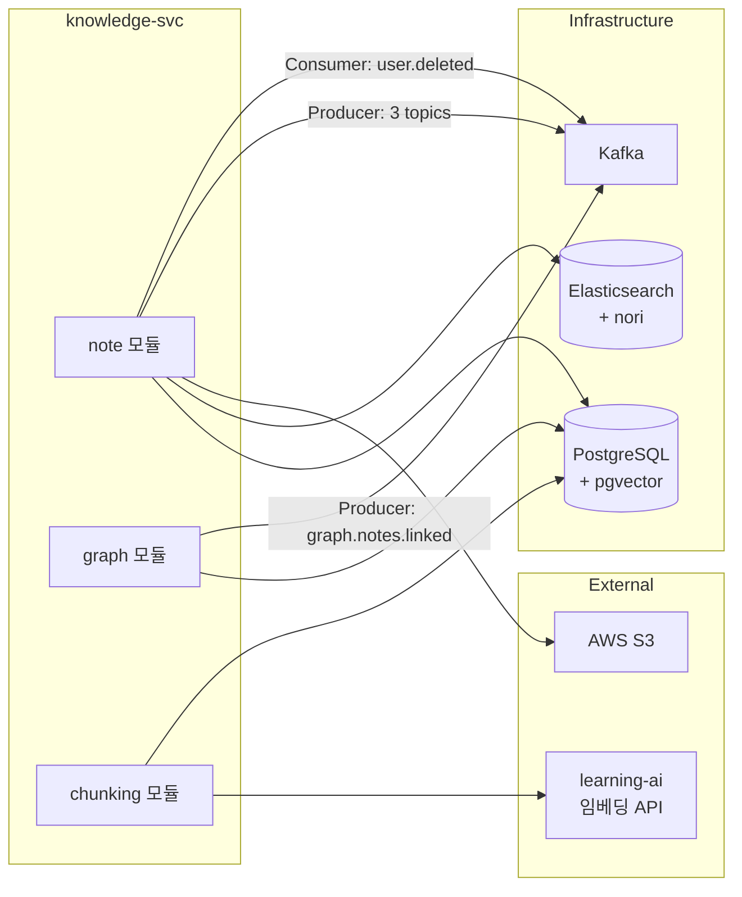

# Knowledge Service 목킹 정의서

> **프로젝트**: Synapse — 통합 학습-지식 그래프 SaaS
> **서비스**: synapse-knowledge-svc
> **Owner**: `@knowledge-owner-1` (김현지), `@knowledge-owner-2` (박은서)
> **모듈**: note, graph, chunking
> **작성일**: 2026-05-14

---

## 1. 서비스 의존성 맵



---

## 2. note 모듈

### 2.1 목킹 인터페이스 목록

| # | 목킹 대상 | 통신 방식 | 방향 | 도구 |
|---|-----------|----------|------|------|
| 1 | Elasticsearch (인덱싱 + 검색) | REST | Outbound | Testcontainers |
| 2 | AWS S3 (Presigned URL) | REST | Outbound | WireMock |
| 3 | Kafka Producer (3개 토픽) | Kafka | Outbound | EmbeddedKafka |
| 4 | Kafka Consumer (`user.deleted`) | Kafka | Inbound | EmbeddedKafka |
| 5 | PostgreSQL (notes, note_versions, note_links, note_tags) | SQL | Outbound | Testcontainers |

### 2.2 Elasticsearch Testcontainers

```java
@Container
static ElasticsearchContainer elasticsearch = new ElasticsearchContainer(
    DockerImageName.parse("docker.elastic.co/elasticsearch/elasticsearch:8.13.0")
)
    .withEnv("discovery.type", "single-node")
    .withEnv("xpack.security.enabled", "false")
    .withEnv("ES_JAVA_OPTS", "-Xms512m -Xmx512m");
```

**인덱스 매핑 (nori analyzer):**

```json
{
  "settings": {
    "analysis": {
      "analyzer": {
        "korean": {
          "type": "custom",
          "tokenizer": "nori_tokenizer",
          "filter": ["nori_readingform", "lowercase"]
        }
      }
    }
  },
  "mappings": {
    "properties": {
      "noteId": { "type": "keyword" },
      "tenantId": { "type": "keyword" },
      "userId": { "type": "keyword" },
      "title": {
        "type": "text",
        "analyzer": "korean",
        "fields": { "keyword": { "type": "keyword" } }
      },
      "content": { "type": "text", "analyzer": "korean" },
      "tags": { "type": "keyword" },
      "createdAt": { "type": "date" },
      "updatedAt": { "type": "date" }
    }
  }
}
```

**검색 테스트:**

```java
@Test
void searchNotes_withKoreanQuery_shouldReturnResults() {
    // given — ES에 노트 인덱싱
    indexNote("note-00000000-0000-0000-0000-000000000001",
        "머신러닝 기초 정리", "머신러닝은 인공지능의 한 분야로...", List.of("머신러닝", "AI"));

    // when
    mockMvc.perform(get("/notes/search")
            .param("q", "머신러닝")
            .param("sort", "relevance")
            .header("Authorization", "Bearer " + JwtTestFactory.USER1_TOKEN))
        .andExpect(status().isOk())
        .andExpect(jsonPath("$.data").isArray())
        .andExpect(jsonPath("$.data[0].title").value("머신러닝 기초 정리"));
}
```

### 2.3 AWS S3 Mock (Presigned URL)

#### WireMock 매핑 — Presigned URL 생성

```json
{
  "request": {
    "method": "PUT",
    "urlPathPattern": "/s3-mock/synapse-attachments/.*"
  },
  "response": {
    "status": 200,
    "headers": {
      "ETag": "\"mock-etag-001\""
    }
  }
}
```

**Presigned URL 응답 fixture:**

```json
{
  "data": {
    "uploadUrl": "http://localhost:${wiremock.server.port}/s3-mock/synapse-attachments/tenant-00000000-0000-0000-0000-000000000001/note-00000000-0000-0000-0000-000000000001/attachment-001.png?X-Amz-Algorithm=AWS4-HMAC-SHA256&X-Amz-Expires=3600",
    "fileKey": "tenant-00000000-0000-0000-0000-000000000001/note-00000000-0000-0000-0000-000000000001/attachment-001.png",
    "expiresIn": 3600
  }
}
```

**application-test.yml (S3 섹션):**

```yaml
aws:
  s3:
    endpoint-url: http://localhost:${wiremock.server.port}/s3-mock
    bucket-name: synapse-attachments
    region: ap-northeast-2
    access-key: mock_access_key
    secret-key: mock_secret_key
    presigned-url-expiry: 3600
```

### 2.4 Kafka Producer 검증

```java
@Test
void createNote_shouldPublishNoteCreatedEvent() {
    String requestBody = """
        {
            "title": "새로운 노트",
            "content": "# 내용\\n\\n[[다른노트]] 참조",
            "tags": ["테스트"]
        }
        """;

    mockMvc.perform(post("/notes")
            .header("Authorization", "Bearer " + JwtTestFactory.USER1_TOKEN)
            .contentType(MediaType.APPLICATION_JSON)
            .content(requestBody))
        .andExpect(status().isCreated());

    List<ConsumerRecord<String, Object>> records =
        kafkaTestHelper.consumeMessages("note.created", 1, Duration.ofSeconds(5));
    assertThat(records).hasSize(1);
}

@Test
void updateNote_shouldPublishNoteUpdatedEvent() {
    String requestBody = """
        {"title": "수정된 제목", "content": "수정된 내용"}
        """;

    mockMvc.perform(patch("/notes/note-00000000-0000-0000-0000-000000000001")
            .header("Authorization", "Bearer " + JwtTestFactory.USER1_TOKEN)
            .contentType(MediaType.APPLICATION_JSON)
            .content(requestBody))
        .andExpect(status().isOk());

    List<ConsumerRecord<String, Object>> records =
        kafkaTestHelper.consumeMessages("note.updated", 1, Duration.ofSeconds(5));
    assertThat(records).hasSize(1);
}

@Test
void deleteNote_shouldPublishNoteDeletedEvent() {
    mockMvc.perform(delete("/notes/note-00000000-0000-0000-0000-000000000001")
            .header("Authorization", "Bearer " + JwtTestFactory.USER1_TOKEN))
        .andExpect(status().isNoContent());

    List<ConsumerRecord<String, Object>> records =
        kafkaTestHelper.consumeMessages("note.deleted", 1, Duration.ofSeconds(5));
    assertThat(records).hasSize(1);
}
```

### 2.5 위키링크 파싱 테스트 데이터

```java
// 테스트 입력 → 기대 결과
record WikilinkTestCase(String input, List<String> expectedLinks) {}

static List<WikilinkTestCase> wikilinkTestCases() {
    return List.of(
        // 기본 위키링크
        new WikilinkTestCase(
            "이것은 [[다른노트]] 입니다",
            List.of("다른노트")
        ),
        // 복수 위키링크
        new WikilinkTestCase(
            "[[노트A]]와 [[노트B]]를 참조",
            List.of("노트A", "노트B")
        ),
        // 중첩 불가 (가장 안쪽만)
        new WikilinkTestCase(
            "[[외부[[내부]]]]",
            List.of("내부")
        ),
        // 빈 위키링크 무시
        new WikilinkTestCase(
            "[[]] 빈 링크",
            List.of()
        ),
        // 코드 블록 내 위키링크 무시
        new WikilinkTestCase(
            "```\n[[코드내링크]]\n```\n[[실제링크]]",
            List.of("실제링크")
        )
    );
}
```

### 2.6 Kafka Consumer — `user.deleted` 처리

```java
@Test
void userDeleted_shouldSoftDeleteAllUserNotes() {
    // given — user1의 노트가 DB에 존재
    String fixture = """
        {
            "specversion": "1.0",
            "type": "user.deleted",
            "data": {
                "userId": "user-00000000-0000-0000-0000-000000000001",
                "tenantId": "tenant-00000000-0000-0000-0000-000000000001"
            }
        }
        """;

    // when
    kafkaTestHelper.publishAndWait("user.deleted", "key-1", fixture, Duration.ofSeconds(5));

    // then — 해당 사용자 노트가 soft delete
    Long activeCount = jdbcTemplate.queryForObject(
        "SELECT COUNT(*) FROM notes WHERE user_id = ? AND deleted_at IS NULL",
        Long.class, "user-00000000-0000-0000-0000-000000000001"
    );
    assertThat(activeCount).isEqualTo(0);
}
```

### 2.7 PostgreSQL 시드 데이터

```sql
-- knowledge_note_seed.sql

-- Notes
INSERT INTO notes (id, tenant_id, user_id, title, content, word_count, deleted_at, created_at, updated_at) VALUES
('note-00000000-0000-0000-0000-000000000001', 'tenant-00000000-0000-0000-0000-000000000001', 'user-00000000-0000-0000-0000-000000000001', '머신러닝 기초 정리', '# 머신러닝\n\n[[딥러닝 기초]] 참조\n\n머신러닝은 인공지능의 한 분야로, 데이터에서 패턴을 학습하는 기술이다.', 25, NULL, '2026-01-15T10:00:00Z', '2026-01-15T10:00:00Z'),
('note-00000000-0000-0000-0000-000000000002', 'tenant-00000000-0000-0000-0000-000000000001', 'user-00000000-0000-0000-0000-000000000001', '딥러닝 기초', '# 딥러닝\n\n[[머신러닝 기초 정리]] 의 하위 분야이다.', 15, NULL, '2026-01-15T10:01:00Z', '2026-01-15T10:01:00Z'),
('note-00000000-0000-0000-0000-000000000003', 'tenant-00000000-0000-0000-0000-000000000001', 'user-00000000-0000-0000-0000-000000000001', '딥러닝 완전 정복 가이드', '매우 긴 노트 내용...', 10000, NULL, '2026-01-15T10:02:00Z', '2026-01-15T10:02:00Z');

-- Note Links (위키링크 관계)
INSERT INTO note_links (id, source_note_id, target_note_id, tenant_id, created_at) VALUES
('nl-00000000-0000-0000-0000-000000000001', 'note-00000000-0000-0000-0000-000000000001', 'note-00000000-0000-0000-0000-000000000002', 'tenant-00000000-0000-0000-0000-000000000001', '2026-01-15T10:00:00Z'),
('nl-00000000-0000-0000-0000-000000000002', 'note-00000000-0000-0000-0000-000000000002', 'note-00000000-0000-0000-0000-000000000001', 'tenant-00000000-0000-0000-0000-000000000001', '2026-01-15T10:01:00Z');

-- Note Versions
INSERT INTO note_versions (id, note_id, version_number, title, content, created_at) VALUES
('nv-00000000-0000-0000-0000-000000000001', 'note-00000000-0000-0000-0000-000000000001', 1, '머신러닝 기초 정리', '# 머신러닝\n\n초기 내용', '2026-01-15T10:00:00Z');

-- Note Tags
INSERT INTO note_tags (note_id, tag) VALUES
('note-00000000-0000-0000-0000-000000000001', '머신러닝'),
('note-00000000-0000-0000-0000-000000000001', 'AI'),
('note-00000000-0000-0000-0000-000000000002', '딥러닝');
```

---

## 3. graph 모듈

### 3.1 목킹 인터페이스 목록

| # | 목킹 대상 | 통신 방식 | 방향 | 도구 |
|---|-----------|----------|------|------|
| 1 | PostgreSQL (그래프 쿼리) | SQL | Outbound | Testcontainers |
| 2 | Kafka Producer (`graph.notes.linked`) | Kafka | Outbound | EmbeddedKafka |

### 3.2 D3 시각화 데이터 응답 fixture

```json
{
  "success": true,
  "data": {
    "nodes": [
      {
        "id": "note-00000000-0000-0000-0000-000000000001",
        "title": "머신러닝 기초 정리",
        "linkCount": 2,
        "pageRank": 0.85,
        "tags": ["머신러닝", "AI"]
      },
      {
        "id": "note-00000000-0000-0000-0000-000000000002",
        "title": "딥러닝 기초",
        "linkCount": 1,
        "pageRank": 0.65,
        "tags": ["딥러닝"]
      },
      {
        "id": "note-00000000-0000-0000-0000-000000000003",
        "title": "딥러닝 완전 정복 가이드",
        "linkCount": 0,
        "pageRank": 0.15,
        "tags": []
      }
    ],
    "edges": [
      {
        "source": "note-00000000-0000-0000-0000-000000000001",
        "target": "note-00000000-0000-0000-0000-000000000002",
        "type": "wikilink"
      },
      {
        "source": "note-00000000-0000-0000-0000-000000000002",
        "target": "note-00000000-0000-0000-0000-000000000001",
        "type": "wikilink"
      }
    ]
  },
  "meta": {
    "timestamp": "2026-01-15T10:00:00Z",
    "requestId": "req-00000000-0000-0000-0000-000000000001"
  }
}
```

### 3.3 N-hop 이웃 테스트

```java
@Test
void getNeighbors_2hop_shouldReturnTransitiveLinks() {
    // given — A→B→C 링크 체인
    // when
    mockMvc.perform(get("/graph/neighbors/note-00000000-0000-0000-0000-000000000001")
            .param("hops", "2")
            .header("Authorization", "Bearer " + JwtTestFactory.USER1_TOKEN))
        .andExpect(status().isOk())
        .andExpect(jsonPath("$.data.nodes").isArray())
        .andExpect(jsonPath("$.data.nodes.length()").value(2));  // B, C
}
```

---

## 4. chunking 모듈

### 4.1 목킹 인터페이스 목록

| # | 목킹 대상 | 통신 방식 | 방향 | 도구 |
|---|-----------|----------|------|------|
| 1 | learning-ai 임베딩 API | REST | Outbound | WireMock |
| 2 | PostgreSQL + pgvector (벡터 저장) | SQL | Outbound | Testcontainers |

### 4.2 learning-ai 임베딩 API WireMock

```json
{
  "request": {
    "method": "POST",
    "urlPath": "/internal/embeddings",
    "headers": {
      "Content-Type": { "equalTo": "application/json" }
    }
  },
  "response": {
    "status": 200,
    "jsonBody": {
      "embeddings": [
        [0.0023, -0.0121, 0.0156, 0.0087, -0.0203, 0.0312, -0.0045, 0.0189, 0.0267, -0.0134, 0.0098, 0.0211, -0.0176, 0.0043, 0.0289, -0.0067]
      ],
      "model": "text-embedding-3-small",
      "usage": { "totalTokens": 45 }
    }
  }
}
```

**요청 fixture:**

```json
{
  "texts": [
    "머신러닝은 인공지능의 한 분야로, 데이터에서 패턴을 학습하는 기술이다.",
    "과적합을 방지하기 위해 정규화, 드롭아웃, 교차 검증 등의 기법을 사용한다."
  ],
  "model": "text-embedding-3-small"
}
```

**application-test.yml:**

```yaml
internal:
  learning-ai:
    base-url: http://localhost:${wiremock.server.port}
    embedding-endpoint: /internal/embeddings
```

### 4.3 pgvector Testcontainers

```java
@Container
static PostgreSQLContainer<?> postgres = new PostgreSQLContainer<>(
    DockerImageName.parse("pgvector/pgvector:pg16")
)
    .withDatabaseName("synapse_knowledge_test")
    .withUsername("synapse")
    .withPassword("test_password")
    .withInitScript("db/knowledge_init.sql");
```

**pgvector 초기화 SQL:**

```sql
-- knowledge_init.sql
CREATE EXTENSION IF NOT EXISTS vector;

CREATE TABLE IF NOT EXISTS note_chunks (
    id UUID PRIMARY KEY DEFAULT gen_random_uuid(),
    tenant_id UUID NOT NULL,
    note_id UUID NOT NULL,
    chunk_index INTEGER NOT NULL,
    chunk_text TEXT NOT NULL,
    embedding vector(1536),
    token_count INTEGER,
    created_at TIMESTAMPTZ NOT NULL DEFAULT NOW()
);

CREATE INDEX IF NOT EXISTS idx_note_chunks_embedding
    ON note_chunks USING ivfflat (embedding vector_cosine_ops)
    WITH (lists = 100);
```

### 4.4 비동기 청크 분할 테스트

```java
@Test
void chunkNote_longContent_shouldSplitIntoMultipleChunks() {
    // given — 50,000자 노트
    String longContent = "머신러닝 ".repeat(10000);

    // when — 청킹 실행
    List<Chunk> chunks = chunkingService.splitIntoChunks(longContent, 500);

    // then
    assertThat(chunks).hasSizeGreaterThan(1);
    chunks.forEach(chunk -> {
        assertThat(chunk.tokenCount()).isLessThanOrEqualTo(500);
        assertThat(chunk.text()).isNotBlank();
    });
}

@Test
void chunkNote_shouldGenerateEmbeddingsAndStore() {
    // given — WireMock으로 임베딩 API 목킹 설정 완료
    stubFor(post(urlPathEqualTo("/internal/embeddings"))
        .willReturn(okJson(loadFixture("fixtures/embedding_response.json"))));

    // when
    chunkingService.processNote("note-00000000-0000-0000-0000-000000000003");

    // then — pgvector에 청크 + 벡터 저장 확인
    Long chunkCount = jdbcTemplate.queryForObject(
        "SELECT COUNT(*) FROM note_chunks WHERE note_id = ?",
        Long.class, "note-00000000-0000-0000-0000-000000000003"
    );
    assertThat(chunkCount).isGreaterThan(0);
}
```

---

## 5. application-test.yml (전체)

```yaml
spring:
  profiles:
    active: test
  datasource:
    url: ${SPRING_DATASOURCE_URL}
    username: ${SPRING_DATASOURCE_USERNAME}
    password: ${SPRING_DATASOURCE_PASSWORD}
  jpa:
    hibernate:
      ddl-auto: create-drop
    show-sql: true
  elasticsearch:
    uris: ${ELASTICSEARCH_URL}
  kafka:
    bootstrap-servers: ${spring.embedded.kafka.brokers}
    consumer:
      auto-offset-reset: earliest
      group-id: knowledge-test-group
    properties:
      schema.registry.url: mock://test-schema-registry

aws:
  s3:
    endpoint-url: http://localhost:${wiremock.server.port}/s3-mock
    bucket-name: synapse-attachments
    region: ap-northeast-2
    access-key: mock_access_key
    secret-key: mock_secret_key

internal:
  learning-ai:
    base-url: http://localhost:${wiremock.server.port}
    embedding-endpoint: /internal/embeddings

jwt:
  secret: test-jwt-secret-key-must-be-at-least-256-bits-long-for-hs256
```
