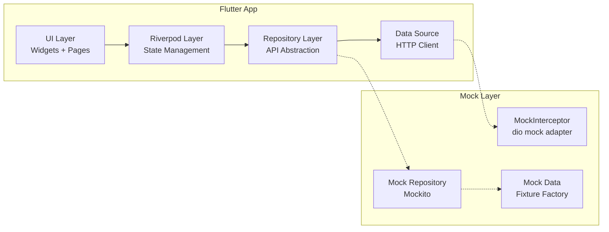

# Frontend 목킹 정의서

> **프로젝트**: Synapse — 통합 학습-지식 그래프 SaaS
> **앱**: synapse-frontend (Flutter 3.x)
> **Owner**: 전체 팀원
> **작성일**: 2026-05-14

---

## 1. 아키텍처 개요



**Mock 적용 레벨:**
- **Unit 테스트**: Mockito로 Repository mock → Provider 테스트
- **Widget 테스트**: MockInterceptor로 HTTP 호출 가로채기 → 화면 테스트
- **Golden 테스트**: 고정 데이터로 스냅샷 비교

---

## 2. dio MockInterceptor 설정

### 2.1 MockHttpClientAdapter

```dart
// test/helpers/mock_dio_adapter.dart

import 'dart:convert';
import 'package:dio/dio.dart';

class MockDioAdapter implements HttpClientAdapter {
  final Map<String, MockResponse> _mappings = {};

  void onGet(String path, MockResponse response) {
    _mappings['GET:$path'] = response;
  }

  void onPost(String path, MockResponse response) {
    _mappings['POST:$path'] = response;
  }

  void onPatch(String path, MockResponse response) {
    _mappings['PATCH:$path'] = response;
  }

  void onDelete(String path, MockResponse response) {
    _mappings['DELETE:$path'] = response;
  }

  void onPut(String path, MockResponse response) {
    _mappings['PUT:$path'] = response;
  }

  @override
  Future<ResponseBody> fetch(
    RequestOptions options,
    Stream<List<int>>? requestStream,
    Future<void>? cancelFuture,
  ) async {
    final key = '${options.method}:${options.path}';

    // 정확한 매칭 먼저, 없으면 패턴 매칭
    final response = _mappings[key] ?? _findPatternMatch(options);

    if (response == null) {
      throw DioException(
        requestOptions: options,
        error: 'No mock mapping for $key',
        type: DioExceptionType.unknown,
      );
    }

    // 네트워크 지연 시뮬레이션
    if (response.delay != null) {
      await Future.delayed(response.delay!);
    }

    return ResponseBody.fromString(
      jsonEncode(response.data),
      response.statusCode,
      headers: {
        'content-type': ['application/json'],
      },
    );
  }

  MockResponse? _findPatternMatch(RequestOptions options) {
    for (final entry in _mappings.entries) {
      final pattern = entry.key.split(':');
      if (pattern[0] == options.method &&
          RegExp(pattern[1]).hasMatch(options.path)) {
        return entry.value;
      }
    }
    return null;
  }

  @override
  void close({bool force = false}) {}
}

class MockResponse {
  final int statusCode;
  final Map<String, dynamic> data;
  final Duration? delay;

  MockResponse({
    required this.statusCode,
    required this.data,
    this.delay,
  });
}
```

### 2.2 환경별 전환

```dart
// lib/core/network/dio_client.dart

Dio createDioClient({bool useMock = false}) {
  final dio = Dio(BaseOptions(
    baseUrl: 'https://api.synapse.app/api/v1',
    connectTimeout: const Duration(seconds: 10),
    receiveTimeout: const Duration(seconds: 10),
  ));

  if (useMock) {
    dio.httpClientAdapter = MockDioAdapter();
  }

  return dio;
}
```

---

## 3. Platform 서비스 Mock Responses (12개)

### 3.1 Auth

```dart
// test/fixtures/responses/mock_platform_auth_responses.dart

const mockSignupSuccess = {
  'success': true,
  'data': {
    'userId': 'user-00000000-0000-0000-0000-000000000001',
    'tenantId': 'tenant-00000000-0000-0000-0000-000000000001',
    'email': 'user1@example.com',
    'displayName': '홍길동',
  },
  'meta': {'timestamp': '2026-01-15T10:00:00Z', 'requestId': 'req-mock-001'},
};

const mockLoginSuccess = {
  'success': true,
  'data': {
    'accessToken': 'mock_jwt_access_token_for_testing',
    'expiresIn': 900,
    'user': {
      'id': 'user-00000000-0000-0000-0000-000000000001',
      'email': 'user1@example.com',
      'displayName': '홍길동',
    },
  },
  'meta': {'timestamp': '2026-01-15T10:00:00Z', 'requestId': 'req-mock-002'},
};

const mockRefreshSuccess = {
  'success': true,
  'data': {
    'accessToken': 'mock_jwt_refreshed_token',
    'expiresIn': 900,
  },
  'meta': {'timestamp': '2026-01-15T10:15:00Z', 'requestId': 'req-mock-003'},
};

const mockLogoutSuccess = {
  'success': true,
  'data': null,
  'meta': {'timestamp': '2026-01-15T10:30:00Z', 'requestId': 'req-mock-004'},
};

const mockOAuthRedirect = {
  'success': true,
  'data': {
    'redirectUrl': 'https://accounts.google.com/o/oauth2/auth?client_id=mock',
  },
  'meta': {'timestamp': '2026-01-15T10:00:00Z', 'requestId': 'req-mock-005'},
};

const mockMfaSetup = {
  'success': true,
  'data': {
    'secret': 'JBSWY3DPEHPK3PXP',
    'qrCodeUrl': 'otpauth://totp/Synapse:user1@example.com?secret=JBSWY3DPEHPK3PXP',
    'qrCodeImage': 'data:image/png;base64,mockBase64Data',
  },
  'meta': {'timestamp': '2026-01-15T10:00:00Z', 'requestId': 'req-mock-006'},
};
```

### 3.2 Billing

```dart
// test/fixtures/responses/mock_platform_billing_responses.dart

const mockPlansListSuccess = {
  'success': true,
  'data': [
    {
      'code': 'free',
      'name': 'Free',
      'price': 0,
      'currency': 'USD',
      'interval': 'month',
      'features': ['unlimited_notes', '10_ai_day', '1gb_storage'],
    },
    {
      'code': 'pro',
      'name': 'Pro',
      'price': 9.99,
      'currency': 'USD',
      'interval': 'month',
      'features': ['unlimited_notes', '500_ai_month', '10gb_storage'],
    },
    {
      'code': 'team',
      'name': 'Team',
      'price': 19.99,
      'currency': 'USD',
      'interval': 'month',
      'features': ['unlimited_notes', '1000_ai_month', '50gb_storage', '20_members'],
    },
  ],
  'meta': {'timestamp': '2026-01-15T10:00:00Z', 'requestId': 'req-mock-010'},
};

const mockCheckoutUrlSuccess = {
  'success': true,
  'data': {
    'checkoutUrl': 'https://checkout.stripe.com/c/pay/cs_test_mock_001',
  },
  'meta': {'timestamp': '2026-01-15T10:00:00Z', 'requestId': 'req-mock-011'},
};

const mockSubscriptionSuccess = {
  'success': true,
  'data': {
    'plan': 'pro',
    'status': 'active',
    'currentPeriodEnd': '2026-02-15',
    'cancelAtPeriodEnd': false,
  },
  'meta': {'timestamp': '2026-01-15T10:00:00Z', 'requestId': 'req-mock-012'},
};

const mockPortalUrlSuccess = {
  'success': true,
  'data': {
    'portalUrl': 'https://billing.stripe.com/p/session/mock_001',
  },
  'meta': {'timestamp': '2026-01-15T10:00:00Z', 'requestId': 'req-mock-013'},
};
```

### 3.3 Tenant

```dart
// test/fixtures/responses/mock_platform_tenant_responses.dart

const mockTenantContext = {
  'success': true,
  'data': {
    'tenantId': 'tenant-00000000-0000-0000-0000-000000000001',
    'name': 'My Workspace',
    'plan': 'pro',
    'role': 'owner',
    'quotas': {
      'notes': {'used': 45, 'max': -1},
      'aiGenerations': {'used': 120, 'max': 500},
    },
  },
  'meta': {'timestamp': '2026-01-15T10:00:00Z', 'requestId': 'req-mock-014'},
};

const mockTenantUsage = {
  'success': true,
  'data': {
    'storage': {'usedBytes': 524288000, 'maxBytes': 10737418240},
    'aiGenerations': {'used': 120, 'max': 500, 'resetDate': '2026-02-01'},
    'apiCalls': {'used': 5000, 'max': -1},
  },
  'meta': {'timestamp': '2026-01-15T10:00:00Z', 'requestId': 'req-mock-015'},
};
```

---

## 4. Engagement 서비스 Mock Responses (15개)

### 4.1 Community

```dart
// test/fixtures/responses/mock_engagement_community_responses.dart

const mockGroupsListSuccess = {
  'success': true,
  'data': [
    {
      'id': 'group-00000000-0000-0000-0000-000000000001',
      'name': 'ML 스터디',
      'memberCount': 12,
      'myRole': 'owner',
      'status': 'active',
      'updatedAt': '2026-01-15T10:00:00Z',
    },
    {
      'id': 'group-00000000-0000-0000-0000-000000000002',
      'name': '비공개 스터디',
      'memberCount': 5,
      'myRole': 'member',
      'status': 'active',
      'updatedAt': '2026-01-14T10:00:00Z',
    },
  ],
  'pagination': {'cursor': null, 'hasMore': false},
  'meta': {'timestamp': '2026-01-15T10:00:00Z', 'requestId': 'req-mock-020'},
};

const mockGroupDetailSuccess = {
  'success': true,
  'data': {
    'id': 'group-00000000-0000-0000-0000-000000000001',
    'name': 'ML 스터디',
    'description': '머신러닝을 함께 공부하는 그룹',
    'maxMembers': 20,
    'joinType': 'approval',
    'status': 'active',
    'avatarUrl': 'https://cdn.synapse.app/avatars/ml-study.png',
    'memberCount': 12,
    'myRole': 'owner',
    'createdAt': '2026-01-15T09:00:00Z',
  },
  'meta': {'timestamp': '2026-01-15T10:00:00Z', 'requestId': 'req-mock-021'},
};

const mockGroupCreateSuccess = {
  'success': true,
  'data': {
    'id': 'group-00000000-0000-0000-0000-000000000003',
    'name': '새 스터디',
    'memberCount': 1,
    'myRole': 'owner',
    'status': 'active',
    'createdAt': '2026-01-15T10:00:00Z',
  },
  'meta': {'timestamp': '2026-01-15T10:00:00Z', 'requestId': 'req-mock-022'},
};

const mockGroupJoinSuccess = {
  'success': true,
  'data': {'status': 'pending', 'message': '가입 신청이 접수되었습니다.'},
  'meta': {'timestamp': '2026-01-15T10:00:00Z', 'requestId': 'req-mock-023'},
};

const mockGroupMembersSuccess = {
  'success': true,
  'data': [
    {'userId': 'user-00000000-0000-0000-0000-000000000001', 'displayName': '홍길동', 'role': 'owner', 'joinedAt': '2026-01-15T09:00:00Z'},
    {'userId': 'user-00000000-0000-0000-0000-000000000002', 'displayName': '김영희', 'role': 'member', 'joinedAt': '2026-01-15T09:30:00Z'},
  ],
  'meta': {'timestamp': '2026-01-15T10:00:00Z', 'requestId': 'req-mock-024'},
};

const mockSharedDecksListSuccess = {
  'success': true,
  'data': [
    {'id': 'sdeck-001', 'deckTitle': '프로그래밍 기초 덱', 'sharedByName': '홍길동', 'copyCount': 5, 'createdAt': '2026-01-15T11:00:00Z'},
  ],
  'meta': {'timestamp': '2026-01-15T10:00:00Z', 'requestId': 'req-mock-025'},
};

const mockShareDeckSuccess = {
  'success': true,
  'data': {'sharedDeckId': 'sdeck-002', 'shareToken': 'share_tok_003'},
  'meta': {'timestamp': '2026-01-15T10:00:00Z', 'requestId': 'req-mock-026'},
};

const mockShareNoteSuccess = {
  'success': true,
  'data': {'sharedNoteId': 'snote-002', 'shareToken': 'share_tok_004'},
  'meta': {'timestamp': '2026-01-15T10:00:00Z', 'requestId': 'req-mock-027'},
};

const mockReportCreateSuccess = {
  'success': true,
  'data': {'reportId': 'report-002', 'status': 'pending'},
  'meta': {'timestamp': '2026-01-15T10:00:00Z', 'requestId': 'req-mock-028'},
};
```

### 4.2 Gamification

```dart
// test/fixtures/responses/mock_engagement_gamification_responses.dart

const mockXpSummarySuccess = {
  'success': true,
  'data': {
    'totalXp': 490,
    'currentLevel': 3,
    'levelTitle': '학습자',
    'nextLevelXp': 500,
    'xpToNextLevel': 10,
  },
  'meta': {'timestamp': '2026-01-15T10:00:00Z', 'requestId': 'req-mock-030'},
};

const mockBadgesListSuccess = {
  'success': true,
  'data': [
    {'code': 'STREAK_7', 'name': '7일 전사', 'iconUrl': 'https://cdn.synapse.app/badges/streak7.png', 'earned': true, 'earnedAt': '2026-01-14T10:00:00Z'},
    {'code': 'FIRST_REVIEW', 'name': '첫 복습', 'iconUrl': 'https://cdn.synapse.app/badges/first-review.png', 'earned': true, 'earnedAt': '2026-01-10T10:00:00Z'},
    {'code': 'STREAK_30', 'name': '30일 전사', 'iconUrl': 'https://cdn.synapse.app/badges/streak30.png', 'earned': false, 'earnedAt': null},
    {'code': 'NOTE_100', 'name': '노트 100개', 'iconUrl': 'https://cdn.synapse.app/badges/note100.png', 'earned': false, 'earnedAt': null},
  ],
  'meta': {'timestamp': '2026-01-15T10:00:00Z', 'requestId': 'req-mock-031'},
};

const mockMyBadgesSuccess = {
  'success': true,
  'data': [
    {'code': 'STREAK_7', 'name': '7일 전사', 'earnedAt': '2026-01-14T10:00:00Z'},
    {'code': 'FIRST_REVIEW', 'name': '첫 복습', 'earnedAt': '2026-01-10T10:00:00Z'},
  ],
  'meta': {'timestamp': '2026-01-15T10:00:00Z', 'requestId': 'req-mock-032'},
};

const mockLeaderboardSuccess = {
  'success': true,
  'data': [
    {'rank': 1, 'userId': 'user-001', 'displayName': '홍길동', 'totalXp': 500, 'level': 4},
    {'rank': 2, 'userId': 'user-002', 'displayName': '김영희', 'totalXp': 350, 'level': 3},
    {'rank': 3, 'userId': 'user-004', 'displayName': '이수진', 'totalXp': 200, 'level': 2},
  ],
  'meta': {'timestamp': '2026-01-15T10:00:00Z', 'requestId': 'req-mock-033'},
};

const mockLevelInfoSuccess = {
  'success': true,
  'data': {
    'currentLevel': 3,
    'title': '학습자',
    'requiredXp': 300,
    'nextLevel': 4,
    'nextTitle': '학자',
    'nextRequiredXp': 500,
  },
  'meta': {'timestamp': '2026-01-15T10:00:00Z', 'requestId': 'req-mock-034'},
};

const mockStreakSuccess = {
  'success': true,
  'data': {
    'currentStreak': 7,
    'longestStreak': 14,
    'lastActivityDate': '2026-01-15',
  },
  'meta': {'timestamp': '2026-01-15T10:00:00Z', 'requestId': 'req-mock-035'},
};
```

---

## 5. Knowledge 서비스 Mock Responses (10개)

```dart
// test/fixtures/responses/mock_knowledge_responses.dart

const mockNotesListSuccess = {
  'success': true,
  'data': [
    {'id': 'note-001', 'title': '머신러닝 기초 정리', 'wordCount': 25, 'tags': ['머신러닝', 'AI'], 'updatedAt': '2026-01-15T10:00:00Z'},
    {'id': 'note-002', 'title': '딥러닝 기초', 'wordCount': 15, 'tags': ['딥러닝'], 'updatedAt': '2026-01-15T10:01:00Z'},
  ],
  'pagination': {'cursor': null, 'hasMore': false, 'totalCount': 2},
  'meta': {'timestamp': '2026-01-15T10:00:00Z', 'requestId': 'req-mock-040'},
};

const mockNoteDetailSuccess = {
  'success': true,
  'data': {
    'id': 'note-001',
    'title': '머신러닝 기초 정리',
    'content': '# 머신러닝\n\n[[딥러닝 기초]] 참조\n\n머신러닝은 인공지능의 한 분야로...',
    'tags': ['머신러닝', 'AI'],
    'wordCount': 25,
    'links': [{'targetTitle': '딥러닝 기초', 'targetId': 'note-002'}],
    'createdAt': '2026-01-15T10:00:00Z',
    'updatedAt': '2026-01-15T10:00:00Z',
  },
  'meta': {'timestamp': '2026-01-15T10:00:00Z', 'requestId': 'req-mock-041'},
};

const mockNoteCreateSuccess = {
  'success': true,
  'data': {
    'id': 'note-003',
    'title': '새 노트',
    'content': '# 새 노트 내용',
    'tags': [],
    'wordCount': 3,
    'links': [],
    'createdAt': '2026-01-15T10:05:00Z',
  },
  'meta': {'timestamp': '2026-01-15T10:05:00Z', 'requestId': 'req-mock-042'},
};

const mockNoteUpdateSuccess = {
  'success': true,
  'data': {
    'id': 'note-001',
    'title': '머신러닝 기초 정리 (수정)',
    'version': 2,
    'updatedAt': '2026-01-15T10:10:00Z',
  },
  'meta': {'timestamp': '2026-01-15T10:10:00Z', 'requestId': 'req-mock-043'},
};

const mockNoteDeleteSuccess = {
  'success': true,
  'data': null,
  'meta': {'timestamp': '2026-01-15T10:15:00Z', 'requestId': 'req-mock-044'},
};

const mockNoteSearchSuccess = {
  'success': true,
  'data': [
    {'id': 'note-001', 'title': '머신러닝 기초 정리', 'snippet': '...머신러닝은 인공지능의 한 분야로...', 'score': 0.95},
  ],
  'meta': {'timestamp': '2026-01-15T10:00:00Z', 'requestId': 'req-mock-045'},
};

const mockBacklinksSuccess = {
  'success': true,
  'data': [
    {'noteId': 'note-002', 'title': '딥러닝 기초', 'contextSnippet': '...[[머신러닝 기초 정리]] 의 하위 분야...'},
  ],
  'meta': {'timestamp': '2026-01-15T10:00:00Z', 'requestId': 'req-mock-046'},
};

const mockVersionsSuccess = {
  'success': true,
  'data': [
    {'version': 2, 'title': '머신러닝 기초 정리 (수정)', 'createdAt': '2026-01-15T10:10:00Z'},
    {'version': 1, 'title': '머신러닝 기초 정리', 'createdAt': '2026-01-15T10:00:00Z'},
  ],
  'meta': {'timestamp': '2026-01-15T10:00:00Z', 'requestId': 'req-mock-047'},
};

const mockGraphDataSuccess = {
  'success': true,
  'data': {
    'nodes': [
      {'id': 'note-001', 'title': '머신러닝 기초 정리', 'linkCount': 2, 'pageRank': 0.85},
      {'id': 'note-002', 'title': '딥러닝 기초', 'linkCount': 1, 'pageRank': 0.65},
    ],
    'edges': [
      {'source': 'note-001', 'target': 'note-002', 'type': 'wikilink'},
      {'source': 'note-002', 'target': 'note-001', 'type': 'wikilink'},
    ],
  },
  'meta': {'timestamp': '2026-01-15T10:00:00Z', 'requestId': 'req-mock-048'},
};

const mockGraphNeighborsSuccess = {
  'success': true,
  'data': {
    'nodes': [
      {'id': 'note-002', 'title': '딥러닝 기초', 'linkCount': 1},
    ],
    'edges': [
      {'source': 'note-001', 'target': 'note-002', 'type': 'wikilink'},
    ],
  },
  'meta': {'timestamp': '2026-01-15T10:00:00Z', 'requestId': 'req-mock-049'},
};
```

---

## 6. Learning 서비스 Mock Responses (12개)

```dart
// test/fixtures/responses/mock_learning_responses.dart

// --- Cards/Decks ---

const mockDeckListSuccess = {
  'success': true,
  'data': [
    {'id': 'deck-001', 'name': '프로그래밍 기초 덱', 'cardCount': 42, 'dueCount': 10, 'updatedAt': '2026-01-15T10:00:00Z'},
    {'id': 'deck-002', 'name': '알고리즘 마스터 덱', 'cardCount': 0, 'dueCount': 0, 'updatedAt': '2026-01-15T10:00:00Z'},
  ],
  'meta': {'timestamp': '2026-01-15T10:00:00Z', 'requestId': 'req-mock-050'},
};

const mockDeckCreateSuccess = {
  'success': true,
  'data': {'id': 'deck-003', 'name': '새 덱', 'cardCount': 0, 'createdAt': '2026-01-15T10:00:00Z'},
  'meta': {'timestamp': '2026-01-15T10:00:00Z', 'requestId': 'req-mock-051'},
};

const mockCardsListSuccess = {
  'success': true,
  'data': [
    {'id': 'card-001', 'cardType': 'basic', 'frontContent': 'TCP와 UDP의 차이점은?', 'backContent': 'TCP는 연결 지향적...', 'dueDate': '2026-01-15'},
    {'id': 'card-002', 'cardType': 'cloze', 'frontContent': '{{c1::정규화}}는 과적합을 방지하는 기법이다.', 'backContent': '', 'dueDate': '2026-01-15'},
  ],
  'meta': {'timestamp': '2026-01-15T10:00:00Z', 'requestId': 'req-mock-052'},
};

const mockCardCreateSuccess = {
  'success': true,
  'data': {'id': 'card-004', 'cardType': 'basic', 'frontContent': '새 질문', 'backContent': '새 답변', 'createdAt': '2026-01-15T10:00:00Z'},
  'meta': {'timestamp': '2026-01-15T10:00:00Z', 'requestId': 'req-mock-053'},
};

const mockBatchCreateSuccess = {
  'success': true,
  'data': {'createdCount': 5, 'cards': [{'id': 'card-005'}, {'id': 'card-006'}, {'id': 'card-007'}, {'id': 'card-008'}, {'id': 'card-009'}]},
  'meta': {'timestamp': '2026-01-15T10:00:00Z', 'requestId': 'req-mock-054'},
};

// --- SRS/Reviews ---

const mockReviewQueueSuccess = {
  'success': true,
  'data': {
    'totalDue': 25,
    'newCards': 5,
    'reviewCards': 15,
    'learningCards': 5,
    'cards': [
      {'cardId': 'card-001', 'cardType': 'basic', 'frontContent': 'TCP와 UDP의 차이점은?', 'deckName': '프로그래밍 기초', 'status': 'review'},
      {'cardId': 'card-002', 'cardType': 'cloze', 'frontContent': '{{c1::정규화}}는...', 'deckName': '프로그래밍 기초', 'status': 'learning'},
    ],
  },
  'meta': {'timestamp': '2026-01-15T10:00:00Z', 'requestId': 'req-mock-055'},
};

const mockSessionStartSuccess = {
  'success': true,
  'data': {
    'sessionId': 'session-001',
    'totalCards': 25,
    'startedAt': '2026-01-15T10:00:00Z',
  },
  'meta': {'timestamp': '2026-01-15T10:00:00Z', 'requestId': 'req-mock-056'},
};

const mockSubmitRatingSuccess = {
  'success': true,
  'data': {
    'nextInterval': 7,
    'newEF': 2.6,
    'nextDueDate': '2026-01-22',
    'sessionProgress': {'completed': 1, 'total': 25},
  },
  'meta': {'timestamp': '2026-01-15T10:01:00Z', 'requestId': 'req-mock-057'},
};

const mockSessionCompleteSuccess = {
  'success': true,
  'data': {
    'sessionId': 'session-001',
    'totalReviewed': 25,
    'correctRate': 0.8,
    'duration': 1200,
    'xpEarned': 250,
  },
  'meta': {'timestamp': '2026-01-15T10:20:00Z', 'requestId': 'req-mock-058'},
};

// --- AI ---

const mockAiGenerateCardsSuccess = {
  'success': true,
  'data': {
    'cards': [
      {'frontContent': '머신러닝에서 과적합이란?', 'backContent': '훈련 데이터에 과도하게 맞춰져...', 'confidence': 0.95},
      {'frontContent': '과적합 방지 기법 3가지는?', 'backContent': '정규화, 드롭아웃, 교차 검증', 'confidence': 0.92},
    ],
    'usage': {'inputTokens': 500, 'outputTokens': 300},
  },
  'meta': {'timestamp': '2026-01-15T10:00:00Z', 'requestId': 'req-mock-059'},
};

const mockSemanticSearchSuccess = {
  'success': true,
  'data': {
    'results': [
      {'noteId': 'note-001', 'title': '정규화 기법', 'chunkText': '과적합을 방지하기 위해...', 'score': 0.89},
    ],
  },
  'meta': {'timestamp': '2026-01-15T10:00:00Z', 'requestId': 'req-mock-060'},
};

const mockQaStreamSuccess = {
  'success': true,
  'data': {
    'answer': '노트에 따르면 정규화 기법은 모델의 복잡도를 제한하여 과적합을 방지하는 기술입니다.',
    'sources': [{'noteId': 'note-001', 'title': '머신러닝 기초 정리'}],
    'usage': {'inputTokens': 800, 'outputTokens': 200},
  },
  'meta': {'timestamp': '2026-01-15T10:00:00Z', 'requestId': 'req-mock-061'},
};
```

---

## 7. 에러 응답 Mock (공통)

```dart
// test/fixtures/responses/mock_error_responses.dart

const mockError400Validation = {
  'success': false,
  'error': {
    'code': 'VALIDATION_ERROR',
    'message': '입력값이 유효하지 않습니다.',
    'details': [
      {'field': 'email', 'message': '올바른 이메일 형식이 아닙니다.'},
    ],
  },
  'meta': {'timestamp': '2026-01-15T10:00:00Z', 'requestId': 'req-mock-err-001'},
};

const mockError401Unauthorized = {
  'success': false,
  'error': {'code': 'UNAUTHORIZED', 'message': '인증이 필요합니다.', 'details': []},
  'meta': {'timestamp': '2026-01-15T10:00:00Z', 'requestId': 'req-mock-err-002'},
};

const mockError403Forbidden = {
  'success': false,
  'error': {'code': 'FORBIDDEN', 'message': '권한이 없습니다.', 'details': []},
  'meta': {'timestamp': '2026-01-15T10:00:00Z', 'requestId': 'req-mock-err-003'},
};

const mockError404NotFound = {
  'success': false,
  'error': {'code': 'NOT_FOUND', 'message': '요청한 리소스를 찾을 수 없습니다.', 'details': []},
  'meta': {'timestamp': '2026-01-15T10:00:00Z', 'requestId': 'req-mock-err-004'},
};

const mockError429RateLimit = {
  'success': false,
  'error': {'code': 'RATE_LIMIT_EXCEEDED', 'message': '요청 한도를 초과했습니다.', 'details': []},
  'meta': {'timestamp': '2026-01-15T10:00:00Z', 'requestId': 'req-mock-err-005'},
};

const mockError500ServerError = {
  'success': false,
  'error': {'code': 'INTERNAL_ERROR', 'message': '서버 내부 오류가 발생했습니다.', 'details': []},
  'meta': {'timestamp': '2026-01-15T10:00:00Z', 'requestId': 'req-mock-err-006'},
};
```

---

## 8. Dart Mockito 패턴

### 8.1 Repository Mock

```dart
// test/mocks/mock_repositories.dart

import 'package:mockito/annotations.dart';
import 'package:synapse/services/platform/auth_repository.dart';
import 'package:synapse/services/knowledge/note_repository.dart';
import 'package:synapse/services/learning/card_repository.dart';
import 'package:synapse/services/engagement/community_repository.dart';

@GenerateMocks([
  AuthRepository,
  NoteRepository,
  CardRepository,
  CommunityRepository,
])
void main() {}
```

```bash
# Mock 생성
dart run build_runner build --delete-conflicting-outputs
```

### 8.2 Riverpod Provider Mock

```dart
// test/helpers/provider_overrides.dart

import 'package:flutter_riverpod/flutter_riverpod.dart';
import 'package:mockito/mockito.dart';

List<Override> createMockOverrides({
  MockAuthRepository? authRepo,
  MockNoteRepository? noteRepo,
  MockCardRepository? cardRepo,
}) {
  return [
    if (authRepo != null)
      authRepositoryProvider.overrideWithValue(authRepo),
    if (noteRepo != null)
      noteRepositoryProvider.overrideWithValue(noteRepo),
    if (cardRepo != null)
      cardRepositoryProvider.overrideWithValue(cardRepo),
  ];
}
```

### 8.3 Widget 테스트 예시

```dart
// test/widgets/review_screen_test.dart

import 'package:flutter_test/flutter_test.dart';
import 'package:flutter_riverpod/flutter_riverpod.dart';
import 'package:mockito/mockito.dart';

void main() {
  late MockCardRepository mockCardRepo;

  setUp(() {
    mockCardRepo = MockCardRepository();
  });

  testWidgets('ReviewScreen shows card count', (tester) async {
    when(mockCardRepo.getReviewQueue()).thenAnswer(
      (_) async => ReviewQueue.fromJson(mockReviewQueueSuccess['data']),
    );

    await tester.pumpWidget(
      ProviderScope(
        overrides: createMockOverrides(cardRepo: mockCardRepo),
        child: const MaterialApp(home: ReviewScreen()),
      ),
    );

    await tester.pumpAndSettle();

    expect(find.text('25'), findsOneWidget);  // totalDue
    expect(find.text('프로그래밍 기초'), findsOneWidget);  // deckName
  });
}
```

---

## 9. Golden Test 데이터셋

```dart
// test/fixtures/golden_data.dart

/// 고정 사용자 프로필 (Golden test용)
const goldenUser = {
  'id': 'user-00000000-0000-0000-0000-000000000001',
  'email': 'user1@example.com',
  'displayName': '홍길동',
  'avatarUrl': null,
  'plan': 'pro',
  'level': 3,
  'levelTitle': '학습자',
  'totalXp': 490,
  'currentStreak': 7,
};

/// 고정 노트 목록 (Golden test용)
const goldenNotes = [
  {'id': 'note-001', 'title': '머신러닝 기초 정리', 'wordCount': 25, 'tags': ['머신러닝', 'AI']},
  {'id': 'note-002', 'title': '딥러닝 기초', 'wordCount': 15, 'tags': ['딥러닝']},
  {'id': 'note-003', 'title': '딥러닝 완전 정복 가이드', 'wordCount': 10000, 'tags': []},
];

/// 고정 덱 목록 (Golden test용)
const goldenDecks = [
  {'id': 'deck-001', 'name': '프로그래밍 기초 덱', 'cardCount': 42, 'dueCount': 25},
  {'id': 'deck-002', 'name': '알고리즘 마스터 덱', 'cardCount': 0, 'dueCount': 0},
];
```
