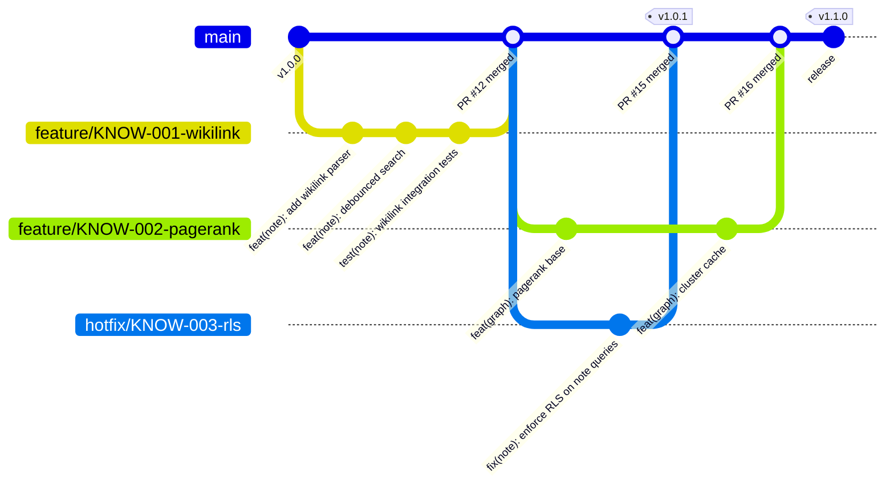

# 09 Git 규칙 정의서 v2.0 전면 개편 Implementation Plan

> **For agentic workers:** REQUIRED SUB-SKILL: Use superpowers:subagent-driven-development (recommended) or superpowers:executing-plans to implement this plan task-by-task. Steps use checkbox (`- [ ]`) syntax for tracking.

**Goal:** 현재 모노레포 가정의 `syn.wiki/09_Git_규칙_정의서.md` v1.1을 4-서비스 폴리레포(+ 미러 + GitOps + Schema Registry) 전제의 v2.0으로 in-place 전면 재작성한다.

**Architecture:** spec `2026-05-09-git-rules-revamp-design.md` §6 절별 작성 명세를 따라 19개 task로 점진 작성. Task 0에서 메타데이터·주의문·모든 절의 placeholder 골격을 한 번에 깔고, Task 1~18에서 각 placeholder를 실제 본문으로 Edit 교체한 뒤 grep 패턴 매칭으로 검증한다. spec의 §8 검증 기준을 task 18에서 일괄 통과시켜 완료.

**Tech Stack:** Markdown / GitHub-flavored Markdown(표·코드블록·Mermaid) / ripgrep (Grep 도구).

**Repository constraints:**
- `syn` (D:\workspace\final-project-syn\syn): git 레포. spec·plan은 여기에 commit.
- `syn.wiki` (D:\workspace\final-project-syn\syn.wiki): **git 레포가 아님**. 매 task별 09 본문 commit은 불가능 → 검증 통과를 "task complete" 시그널로 사용. 위키 push/sync는 작업 종료 후 사용자가 별도 처리.
- "Frequent commits"는 **syn 레포 쪽 plan 진척과 spec 변경**에 적용 (각 Part 종료 시점에 plan 체크박스를 갱신하고 syn 레포에 commit).

**Source references:**
- spec: `D:\workspace\final-project-syn\syn\docs\superpowers\specs\2026-05-09-git-rules-revamp-design.md`
- source 1: `D:\workspace\final-project-syn\syn\docs\SYNAPSE_Git_Rules_Polyrepo_Supplement.md`
- source 2: `D:\workspace\final-project-syn\syn\docs\SYNAPSE_Service_Consolidation.md`
- v1.1 원본: `D:\workspace\final-project-syn\syn.wiki\09_Git_규칙_정의서.md` (이 파일이 in-place 갱신 대상)

---

## File Structure

| 파일 | 역할 | 액션 |
|---|---|---|
| `syn.wiki/09_Git_규칙_정의서.md` | 09 v2.0 본문 (전면 재작성 대상) | Write 1회(Task 0 골격) → Edit N회(Task 1~18 본문 채움) |
| `syn/docs/superpowers/plans/2026-05-09-09-git-rules-revamp.md` | 본 plan (체크박스 진척 추적) | 본 파일. Part 종료마다 syn 레포 commit |
| `syn/docs/superpowers/specs/2026-05-09-git-rules-revamp-design.md` | 설계 spec (이미 작성·commit 완료) | 변경 발생 시 새 commit |

09 본문 1개 파일에 모든 결과물이 모이므로 파일 분할 결정 없음. 절 단위(0/A1~A6/B1~B6/C1~C4/Appendix A~C/변경 이력)로 task 분할.

---

## Task 0: 09 v2.0 본문 골격 작성 (메타데이터 + 주의문 + 모든 절 placeholder)

**Files:**
- Write: `D:\workspace\final-project-syn\syn.wiki\09_Git_규칙_정의서.md` (전체 덮어쓰기)

**Why this task exists:** v1.1을 in-place 재작성한다. 골격 단계에서 모든 절 헤더를 깔고 각 절 자리에 task 번호 placeholder를 두면, 이후 task들은 unique한 placeholder 문자열을 Edit로 매칭해 본문을 채울 수 있다.

- [ ] **Step 1: v1.1 원본 백업 (안전망)**

```bash
cp 'D:\workspace\final-project-syn\syn.wiki\09_Git_규칙_정의서.md' \
   'D:\workspace\final-project-syn\syn.wiki\09_Git_규칙_정의서.v1.1.bak.md'
```

검증: `ls 'D:\workspace\final-project-syn\syn.wiki\09_Git_규칙_정의서.v1.1.bak.md'` 가 존재.

- [ ] **Step 2: 09 v2.0 골격을 Write로 덮어쓰기**

`Write` 도구로 다음 정확한 내용을 09 파일에 기록한다.

```markdown
# 9. Git 규칙 정의서

> **프로젝트명**: Synapse — 통합 학습-지식 그래프 SaaS
> **버전**: v2.0
> **작성일**: 2026-05-07
> **수정일**: 2026-05-09
> **기술 스택**: Spring Boot 4, Flutter 3.x, FastAPI, PostgreSQL 16, Redis, Elasticsearch, Kafka, K8s

> ⚠️ **v2.0 전면 개편 안내**
>
> 본 문서는 v1.x의 모노레포 가정에서 **4-서비스 폴리레포(+ 미러 + GitOps + Schema Registry)** 전제로 전면 재작성되었다. 근거: ADR-001 (10→4 서비스 통합) / ADR-002 (AI Service 통합) — 채택일 2026-05-09 (Appendix A·B).
>
> 본 개편의 전제와 일시적으로 어긋나는 위키 문서:
>  - `03_프로젝트_아키텍처_정의서` (여전히 10개 서비스 그림)
>  - `14_배포_가이드` (GitOps / ArgoCD ApplicationSet 미반영)
>  - `17_스케줄` (4주 일정 / 트랙 분배가 §0.3 매핑과 다름)
>  - `18_기술_스택_정의서` (Schema Registry / Spring Modulith 미반영)
>  - `10_환경_설정_템플릿` (10-서비스 docker-compose 가정)
>
> 위 문서들은 본 09 v2.0 채택 직후 후속 작업으로 갱신된다. 신규 팀원은 충돌 시 09 v2.0을 우선한다.

---

## 0. 전제

<!-- TASK-1-PLACEHOLDER -->

---

## Part A — 한 레포 안의 규칙

### A1. 브랜치 전략

<!-- TASK-2-PLACEHOLDER -->

### A2. 커밋 메시지

<!-- TASK-3-PLACEHOLDER -->

### A3. Pull Request 규칙

<!-- TASK-4-PLACEHOLDER -->

### A4. CODEOWNERS

<!-- TASK-5-PLACEHOLDER -->

### A5. 릴리즈 / 태깅 (서비스별 SemVer)

<!-- TASK-6-PLACEHOLDER -->

### A6. .gitignore / Git Hooks

<!-- TASK-7-PLACEHOLDER -->

---

## Part B — 레포 간의 규칙

### B1. 레포 구조 3-Tier

<!-- TASK-8-PLACEHOLDER -->

### B2. 미러링 자동화 (synapse-mirror)

<!-- TASK-9-PLACEHOLDER -->

### B3. GitOps 갱신 (synapse-gitops)

<!-- TASK-10-PLACEHOLDER -->

### B4. Schema Registry (synapse-shared)

<!-- TASK-11-PLACEHOLDER -->

### B5. 통합 배포 태그 (synapse-gitops/v{날짜})

<!-- TASK-12-PLACEHOLDER -->

### B6. PAT (Personal Access Token) 정책

<!-- TASK-13-PLACEHOLDER -->

---

## Part C — 운영

### C1. Day 1 셋업 체크리스트

<!-- TASK-14-PLACEHOLDER -->

### C2. 흔한 트랩 10가지

<!-- TASK-15-PLACEHOLDER -->

### C3. FAQ

<!-- TASK-16-FAQ-PLACEHOLDER -->

### C4. 시리즈·위키 문서 매핑

<!-- TASK-16-MAPPING-PLACEHOLDER -->

---

## 부록

### Appendix A. ADR-001 — 10개 서비스를 4개로 통합

<!-- TASK-17-ADR-A-PLACEHOLDER -->

### Appendix B. ADR-002 — AI Service를 learning-svc에 통합

<!-- TASK-17-ADR-B-PLACEHOLDER -->

### Appendix C. v1.x → v2.0 절 매핑표

<!-- TASK-17-MAPPING-PLACEHOLDER -->

---

## 변경 이력

<!-- TASK-18-PLACEHOLDER -->
```

- [ ] **Step 3: 골격 검증 — 18개 placeholder 모두 존재 확인**

Run (Grep): pattern `TASK-\d+(-[A-Z]+)?-PLACEHOLDER`, output_mode `count`, path 09 파일.
Expected: 19 matches (TASK-1 ~ TASK-15, TASK-16-FAQ, TASK-16-MAPPING, TASK-17-ADR-A, TASK-17-ADR-B, TASK-17-MAPPING, TASK-18 = 18 placeholder + 1 (TASK-16/17 분할)). 정확히는 19개.

실제 매칭 카운트는 다음 19개여야 한다:
TASK-1, TASK-2, TASK-3, TASK-4, TASK-5, TASK-6, TASK-7, TASK-8, TASK-9, TASK-10, TASK-11, TASK-12, TASK-13, TASK-14, TASK-15, TASK-16-FAQ, TASK-16-MAPPING, TASK-17-ADR-A, TASK-17-ADR-B, TASK-17-MAPPING, TASK-18 → 21개.

(주의: 위 카운트는 분할된 TASK-16/17 세부까지 포함. Step 검증 시 21개로 통과.)

- [ ] **Step 4: 골격 검증 — 후속 갱신 안내 5개 문서 모두 명시**

Run (Grep): pattern `03_프로젝트_아키텍처|14_배포_가이드|17_스케줄|18_기술_스택|10_환경_설정`, path 09 파일.
Expected: 5 lines, 5 distinct 문서 이름이 모두 등장.

---

## Task 1: §0 전제 (ADR 요지 / Phase 요지 / 매핑표 / 위치 안내)

**Files:**
- Modify: `D:\workspace\final-project-syn\syn.wiki\09_Git_규칙_정의서.md` (`<!-- TASK-1-PLACEHOLDER -->` 교체)

**Reference:** spec §6 "0. 전제" + §5 매핑표 + source Service_Consolidation §1·§2·§5

- [ ] **Step 1: 매핑표 영문 handle 재확인**

Run (Read with offset): spec §5 표를 읽어 7행(팀장/A/B/C/D/협업/단독관리)을 그대로 사용한다.

- [ ] **Step 2: `<!-- TASK-1-PLACEHOLDER -->`를 다음 본문으로 Edit 교체**

```markdown
### 0.1 ADR 요지

본 09 v2.0은 두 결정을 전제로 한다 — **ADR-001**: 원안의 10개 마이크로서비스를 4개의 굵은 서비스(synapse-platform-svc / synapse-engagement-svc / synapse-knowledge-svc / synapse-learning-svc)로 통합하고 각 서비스 내부는 Spring Modulith 모듈로 분리한다. **ADR-002**: AI Service(Python/FastAPI)는 learning-svc 안의 별도 컨테이너로 운영한다. 채택일 2026-05-09. ADR 전문은 Appendix A·B 참조.

### 0.2 Phase 요지

진화 단계는 4개로 계획되어 있다 — **Phase 1 MVP** (Auth + Note CRUD + Card CRUD + 기본 XP) → **Phase 2 핵심 기능** (FCM 알림 + 청킹/임베딩 + AI 카드 생성 + 리더보드) → **Phase 3 고도화** (MFA + PageRank + RAG + 신고 시스템) → **Phase 4 분리 검토** (트래픽·소유 기준 모듈→서비스 추출). 단계별 범위·일정 상세는 `SYNAPSE_Service_Consolidation.md` §5 및 위키 17 참조.

### 0.3 트랙 ↔ 레포 ↔ Owner 매핑

본 표는 09 v2.0 본문 전반의 CODEOWNERS·승인 규칙·자동화·체크리스트에서 참조하는 **유일한** 영문 placeholder 정의 위치다. 실제 GitHub handle 또는 Team mention(`@team-project-final/<team-name>`)은 Day 1 셋업 시 본 표만 일괄 치환하면 본문 전반에 적용된다.

| 트랙 | 인원 | 담당 레포 | 통합 원본 도메인 | 영문 handle |
|---|:---:|---|---|---|
| 팀장 | 1 | (전 영역 cross-review + 인프라/공통) | — | `@team-lead` |
| 트랙 A | 1 | synapse-platform-svc | Auth + Audit + Billing + Notification | `@platform-owner` |
| 트랙 B | 1 | synapse-engagement-svc | Community + Gamification | `@engagement-owner` |
| 트랙 C | 2 | synapse-knowledge-svc | Note + Graph + Chunking | `@knowledge-owner-1`, `@knowledge-owner-2` |
| 트랙 D | 2 | synapse-learning-svc (Java + Python) | Card + SRS + AI | `@learning-card-owner` (Java), `@learning-ai-owner` (Python) |
| 협업 | 전체 | synapse-frontend (Flutter) | UI | `@team-lead` + 모든 owner |
| 단독 관리 | 팀장 | synapse-shared, synapse-gitops, synapse-mirror | Avro / K8s manifest / 미러 | `@team-lead` |

### 0.4 이 문서의 위치 안내

본 문서는 세 개의 파트로 구성된다. **Part A — 한 레포 안의 규칙**은 어느 한 Tier 1 레포 안에서 작업할 때 따르는 규칙(브랜치/커밋/PR/CODEOWNERS/릴리즈/Hooks)을 다룬다. **Part B — 레포 간의 규칙**은 여러 레포가 함께 운영되는 협업 규칙(레포 구조/미러링/GitOps/Schema Registry/통합 배포 태그/PAT)을 다룬다. **Part C — 운영**은 Day 1 셋업·트랩·FAQ·문서 매핑을 다룬다. 부록에는 ADR 전문(A·B)과 v1.x → v2.0 절 매핑표(C)가 들어 있다.
```

- [ ] **Step 3: 매핑표 7행 검증**

Run (Grep): pattern `@team-lead|@platform-owner|@engagement-owner|@knowledge-owner-1|@knowledge-owner-2|@learning-card-owner|@learning-ai-owner`, output_mode `count`, path 09 파일.
Expected: count ≥ 8 (매핑표에 7개 handle + Day 1 안내 등 추가 등장 가능).

- [ ] **Step 4: 한국어 placeholder 미사용 검증**

Run (Grep): pattern `@팀장|@트랙[A-D]-멤버|@트랙[A-D]-멤버[12]`, path 09 파일.
Expected: 0 matches.

---

## Task 2: §A1 브랜치 전략

**Files:**
- Modify: `<!-- TASK-2-PLACEHOLDER -->` 교체

**Reference:** spec §6 A1 + v1.1 §1.1~1.4 + source Polyrepo §2

- [ ] **Step 1: `<!-- TASK-2-PLACEHOLDER -->`를 다음 본문으로 Edit 교체**

```markdown
각 Tier 1 레포는 독립적으로 GitHub Flow를 따른다. 모든 작업은 그 레포의 `main`에서 분기하여 PR로 병합한다.

#### 서비스별 main 도식

```
synapse-platform-svc:
  main
  ├── feature/PLAT-001-oauth-google
  ├── feature/PLAT-002-stripe-webhook
  └── fix/PLAT-003-jwt-expiry

synapse-knowledge-svc:
  main
  ├── feature/KNOW-001-wikilink-parser
  ├── feature/KNOW-002-pagerank
  └── ...

synapse-learning-svc:
  main
  ├── feature/LEARN-CARD-001-srs           (Java)
  ├── feature/LEARN-AI-001-rag             (Python)
  └── ...
```

#### 브랜치 명명 (8종 prefix)

| 접두사 | 용도 | 예시 |
|--------|------|------|
| `feature/PLAT-NNN-` | Platform 서비스 | `feature/PLAT-001-oauth-google` |
| `feature/ENG-NNN-` | Engagement 서비스 | `feature/ENG-001-xp-system` |
| `feature/KNOW-NNN-` | Knowledge 서비스 | `feature/KNOW-001-wikilink` |
| `feature/LEARN-CARD-NNN-` | Learning Card (Java) | `feature/LEARN-CARD-001-srs` |
| `feature/LEARN-AI-NNN-` | Learning AI (Python) | `feature/LEARN-AI-001-rag` |
| `feature/SHARED-NNN-` | Shared 라이브러리 | `feature/SHARED-001-avro-schema` |
| `feature/FE-NNN-` | Frontend (Flutter) | `feature/FE-001-note-editor` |
| `feature/INFRA-NNN-` | GitOps/인프라 | `feature/INFRA-001-argocd-app` |

`fix/`, `hotfix/`, `docs/`, `chore/`, `refactor/`, `test/` 도 동일한 prefix(PLAT/ENG/KNOW/...) 규칙을 따른다 — 예: `fix/KNOW-007-pagerank-overflow`, `hotfix/PLAT-012-jwt-leak`.

#### 브랜치 규칙 (각 레포 공통)

- `main`은 항상 배포 가능한 상태 유지
- 모든 작업은 `main`에서 분기 → PR로 병합
- 브랜치 수명: 최대 5일 (초과 시 분할 권장)
- 머지 후 원격 브랜치 자동 삭제
- Force push 금지 (main 브랜치 보호 규칙 적용)

#### Mermaid Git Graph (단일 서비스 예시 — synapse-knowledge-svc)


```

- [ ] **Step 2: 8종 prefix 검증**

Run (Grep): pattern `PLAT-NNN-|ENG-NNN-|KNOW-NNN-|LEARN-CARD-NNN-|LEARN-AI-NNN-|SHARED-NNN-|FE-NNN-|INFRA-NNN-`, output_mode `count`, path 09 파일.
Expected: count ≥ 8 (각 prefix가 표에 1번씩 등장).

- [ ] **Step 3: v1.1 prefix 잔재 없음 검증**

Run (Grep): pattern `feature/AUTH-|feature/NOTE-|feature/CARD-|feature/SRS-|feature/COMM-|feature/GAME-|feature/NOTI-|feature/SEC-`, path 09 파일.
Expected: 0 matches.

---

## Task 3: §A2 커밋 메시지

**Files:**
- Modify: `<!-- TASK-3-PLACEHOLDER -->` 교체

**Reference:** spec §6 A2 + v1.1 §2

- [ ] **Step 1: `<!-- TASK-3-PLACEHOLDER -->`를 다음 본문으로 Edit 교체**

```markdown
#### 형식 (Conventional Commits)

```
<type>(<scope>): <subject>

[body]

[footer]
```

#### Type 정의

| Type | 설명 | SemVer 영향 |
|------|------|-------------|
| `feat` | 새로운 기능 추가 | MINOR |
| `fix` | 버그 수정 | PATCH |
| `docs` | 문서 수정 | - |
| `style` | 코드 포맷팅 (로직 변경 없음) | - |
| `refactor` | 리팩토링 (기능/버그 아님) | - |
| `test` | 테스트 추가/수정 | - |
| `chore` | 빌드/설정/의존성 변경 | - |
| `perf` | 성능 개선 | PATCH |
| `ci` | CI/CD 설정 변경 | - |
| `revert` | 이전 커밋 되돌리기 | - |

#### Scope (4-서비스 × 내부 모듈 매트릭스)

| 서비스 / 영역 | scope 값 |
|---|---|
| platform-svc 내부 모듈 | `auth`, `audit`, `billing`, `notification` |
| engagement-svc 내부 모듈 | `community`, `gamification` |
| knowledge-svc 내부 모듈 | `note`, `graph`, `chunking` |
| learning-svc 내부 모듈 | `card`, `srs`, `ai` |
| Cross-cutting | `shared`, `infra`, `ui`, `api` |

> Scope는 **모듈** 단위로 선택한다. 한 PR이 여러 모듈을 건드리면 잘 나뉘는 단위로 PR을 분할하거나, scope를 가장 큰 변경 모듈로 둔다.

#### 도메인별 커밋 예시

| Scope | 예시 |
|---|---|
| `feat(auth)` | `feat(auth): add OAuth provider config` |
| `feat(note)` | `feat(note): add wikilink auto-completion` |
| `fix(srs)` | `fix(srs): correct SM-2 ease factor calculation` |
| `feat(community)` | `feat(community): add study group CRUD` |
| `feat(gamification)` | `feat(gamification): implement XP system` |
| `feat(notification)` | `feat(notification): add FCM push` |
| `feat(ai)` | `feat(ai): semantic cache hit ratio` |
| `chore(shared)` | `chore(shared): bump avro plugin to 1.11.3` |
| `feat(infra)` | `feat(infra): add ArgoCD ApplicationSet for staging` |

#### 커밋 메시지 예시

```
feat(note): add wikilink auto-completion

- Implement [[...]] syntax detection in editor
- Add debounced search for existing note titles
- Show dropdown with matching notes

Closes #42
```

```
fix(srs): correct SM-2 ease factor calculation

EaseFactor was not clamped to minimum 1.3 when
quality < 3, causing intervals to shrink indefinitely.

Fixes #78
```

```
feat(auth)!: migrate to OAuth 2.1 with PKCE

BREAKING CHANGE: Legacy OAuth 2.0 implicit flow
tokens are no longer accepted. All clients must
use authorization code flow with PKCE.
```

#### 커밋 규칙

- 제목(subject): 50자 이내, 영문 소문자 시작, 마침표 없음
- 본문(body): 72자 줄바꿈, "무엇"보다 "왜" 설명
- Breaking Change: `!` 접미사 + footer에 `BREAKING CHANGE:` 명시
- Issue 연결: `Closes #N`, `Fixes #N`, `Refs #N`
- 하나의 커밋 = 하나의 논리적 변경
```

- [ ] **Step 2: 4-서비스 매트릭스 검증**

Run (Grep): pattern `platform-svc 내부 모듈|engagement-svc 내부 모듈|knowledge-svc 내부 모듈|learning-svc 내부 모듈`, output_mode `count`, path 09 파일.
Expected: count = 4.

- [ ] **Step 3: scope 13종 검증**

Run (Grep): pattern `auth|audit|billing|notification|community|gamification|note|graph|chunking|card|srs|ai|shared|infra|ui|api`, output_mode `count`, path 09 파일 §A2 범위.
Expected: 16 scopes 모두 §A2 안에 등장.

---

## Task 4: §A3 PR 규칙

**Files:**
- Modify: `<!-- TASK-4-PLACEHOLDER -->` 교체

**Reference:** spec §6 A3 + v1.1 §3 + source Polyrepo §4

- [ ] **Step 1: `<!-- TASK-4-PLACEHOLDER -->`를 다음 본문으로 Edit 교체**

```markdown
#### PR 제목 형식

```
<type>(<scope>): <간결한 설명> (#이슈번호)
```

예시: `feat(note): implement wikilink navigation (#42)`

#### PR 본문 템플릿

```markdown
## 변경 사항
<!-- 이 PR에서 변경한 내용을 요약합니다 -->

-
-

## 변경 유형
- [ ] 새 기능 (feat)
- [ ] 버그 수정 (fix)
- [ ] 리팩토링 (refactor)
- [ ] 문서 (docs)
- [ ] 테스트 (test)
- [ ] 기타 (chore)

## 관련 이슈
<!-- Closes #이슈번호 -->

## 테스트 방법
<!-- 리뷰어가 변경사항을 검증할 수 있는 방법 -->

1.
2.
3.

## 스크린샷 (UI 변경 시)
<!-- Before/After 스크린샷 첨부 -->

## 체크리스트
- [ ] 코드 셀프 리뷰 완료
- [ ] 테스트 추가/수정 완료
- [ ] 문서 업데이트 (필요 시)
- [ ] 멀티테넌트 격리 확인 (DB 쿼리 변경 시)
- [ ] Breaking change 여부 확인

## 영향 받는 다른 서비스
<!-- 이 변경이 다른 서비스에 영향이 있나? -->
- [ ] platform-svc
- [ ] engagement-svc
- [ ] knowledge-svc
- [ ] learning-svc (card / ai)
- [ ] shared
- [ ] frontend
- [ ] (영향 없음)

## 이벤트/스키마 변경 여부
- [ ] 새 Kafka 토픽 추가
- [ ] 기존 토픽 스키마 변경 (호환성 모드 명시: BACKWARD/FORWARD/FULL)
- [ ] 새 Internal REST API 추가
- [ ] (변경 없음)

## 호환성 검증
- [ ] Schema Registry 호환성 검증 통과 (BACKWARD)
- [ ] (해당 없음)

## 미러링/GitOps 영향
- [ ] 자동 미러링 정상 (services/{name}/ 갱신 확인)
- [ ] GitOps image tag 자동 업데이트 정상
- [ ] (해당 없음)
```

#### 승인 정책

| 변경 종류 | 최소 승인 | 비고 |
|---|---|---|
| 일반 feature/fix | `@team-lead` + 트랙 owner 1명 | 기존 1명 → 2명으로 강화 |
| Auth/보안 변경 | `@team-lead` + `@platform-owner` | 보안 이중 승인 |
| Shared 라이브러리 | `@team-lead` 단독 | 영향 범위 큼 |
| Avro 스키마 변경 | `@team-lead` + 영향 받는 트랙 owner | 호환성 검증 필수 |
| GitOps 변경 | `@team-lead` 단독 | 운영 직결 |
| Hotfix | `@team-lead` 단독 | 긴급성 |
| Frontend (UI) | `@team-lead` + 트랙 owner | 평소대로 |

#### PR 규칙 (공통)

| 항목 | 규칙 |
|------|------|
| CI 통과 | 모든 CI 파이프라인 성공 필수 |
| 충돌 해결 | 머지 전 충돌 없음 확인 |
| 크기 제한 | 변경 파일 400줄 이하 권장 (초과 시 분할) |
| 리뷰 응답 | 24시간 이내 첫 리뷰 |
| 머지 방식 | Squash and Merge (feature), Merge Commit (hotfix) |
| 라벨 | `size/S`, `size/M`, `size/L`, `priority/high` 등 |

#### 자동화 (GitHub Actions, PR 생성 시 자동 실행)

기존 자동화:
- Lint (ESLint, ktlint, dartanalyzer)
- 단위 테스트
- 통합 테스트 (Testcontainers)
- 빌드 검증
- 코드 커버리지 리포트
- SonarQube 분석
- Snyk 보안 스캔

폴리레포 신규 자동화:
- **ArchUnit + Spring Modulith** — 모듈 경계 위반 차단 (Java 서비스)
- **Schema Registry 호환성** — Avro 스키마 변경 PR 시 BACKWARD 호환성 검증
- **미러링** — main push 시 `synapse-mirror`로 자동 동기화 (Part B2)
- **GitOps 갱신** — image build 후 `synapse-gitops`의 image tag 자동 update (Part B3)
```

- [ ] **Step 2: PR 본문 신규 4개 항목 검증**

Run (Grep): pattern `영향 받는 다른 서비스|이벤트/스키마 변경 여부|호환성 검증|미러링/GitOps 영향`, output_mode `count`, path 09 파일.
Expected: count = 4.

- [ ] **Step 3: 승인 정책 7행 검증**

Run (Grep): pattern `일반 feature/fix|Auth/보안 변경|Shared 라이브러리|Avro 스키마 변경|GitOps 변경|^\| Hotfix|Frontend \(UI\)`, output_mode `count`, path 09 파일.
Expected: count ≥ 7.

- [ ] **Step 4: CI 신규 4종 검증**

Run (Grep): pattern `ArchUnit \+ Spring Modulith|Schema Registry 호환성|미러링 — main push|GitOps 갱신 — image build`, output_mode `count`, path 09 파일.
Expected: count = 4.

---

## Task 5: §A4 CODEOWNERS

**Files:**
- Modify: `<!-- TASK-5-PLACEHOLDER -->` 교체

**Reference:** spec §6 A4 + source Polyrepo §3

- [ ] **Step 1: `<!-- TASK-5-PLACEHOLDER -->`를 다음 본문으로 Edit 교체**

```markdown
각 레포는 자신의 `.github/CODEOWNERS`에 명시적 owner를 둔다. `@team-lead` cross-review로 도메인 사일로화를 막고, 보안 민감 영역은 이중 승인을 강제한다. 영문 placeholder는 §0.3 매핑표 정의를 따른다.

#### synapse-platform-svc

```
*                  @team-lead @platform-owner
/auth/             @team-lead @platform-owner   ← 보안 도메인은 팀장 cross-review 필수
/billing/          @platform-owner @team-lead
/audit/            @platform-owner
/notification/     @platform-owner
```

#### synapse-engagement-svc

```
*                  @team-lead @engagement-owner
/community/        @engagement-owner
/gamification/     @engagement-owner
```

#### synapse-knowledge-svc

```
*                  @team-lead @knowledge-owner-1 @knowledge-owner-2
/note/             @knowledge-owner-1 @knowledge-owner-2
/graph/            @knowledge-owner-2 @knowledge-owner-1
/chunking/         @knowledge-owner-2 @team-lead
```

#### synapse-learning-svc

```
*                  @team-lead @learning-card-owner @learning-ai-owner
/learning-card/    @learning-card-owner @learning-ai-owner   ← Java
/learning-ai/      @learning-ai-owner @learning-card-owner   ← Python
```

#### synapse-shared

```
*                  @team-lead     ← shared는 팀장 단독 승인 (안정성)
```

#### synapse-gitops

```
*                  @team-lead     ← 운영 직결 (단독 승인)
/apps/platform/    @team-lead @platform-owner
/apps/engagement/  @team-lead @engagement-owner
/apps/knowledge/   @team-lead @knowledge-owner-1 @knowledge-owner-2
/apps/learning/    @team-lead @learning-card-owner @learning-ai-owner
```

#### synapse-mirror

```
*                  @team-lead     ← 직접 commit 금지 (Action만 write 권한, branch protection)
```

#### synapse-frontend

```
*                  @team-lead @platform-owner @engagement-owner @knowledge-owner-1 @knowledge-owner-2 @learning-card-owner @learning-ai-owner   ← 전 트랙 협업
```

#### ⚠️ 핵심 변경

```
원안: * @synapse-team
변경: 각 서비스에 명시적 owner + @team-lead cross-review

이유:
- 7명 풀스택이 도메인 사일로화 방지
- 모든 PR을 팀장이 검토 (아키텍처 일관성)
- 보안 민감 영역(Auth)은 이중 승인 강제
- 서비스 간 결합도 변경(shared) 시 팀장만 승인
```

> Day 1 운영 전환 시 위 영문 placeholder를 실제 GitHub handle 또는 Team mention(`@team-project-final/<team-name>`)으로 일괄 치환한다.
```

- [ ] **Step 2: 8개 레포 CODEOWNERS 코드블록 검증**

Run (Grep): pattern `^#### synapse-platform-svc$|^#### synapse-engagement-svc$|^#### synapse-knowledge-svc$|^#### synapse-learning-svc$|^#### synapse-shared$|^#### synapse-gitops$|^#### synapse-mirror$|^#### synapse-frontend$`, output_mode `count`, path 09 파일.
Expected: count = 8.

- [ ] **Step 3: v1.1 CODEOWNERS 잔재 없음 검증**

Run (Grep): pattern `\* @synapse-team`, path 09 파일.
Expected: 0 matches (단, 위 코드블록 안 "원안: * @synapse-team" 인용은 ⚠️ 박스 안에 있으므로 1회 등장 — count = 1 OK).

실제 검증: `\* @synapse-team` count ≤ 1. 만약 ≥ 2면 잔재 있음.

---

## Task 6: §A5 릴리즈 / 태깅

**Files:**
- Modify: `<!-- TASK-6-PLACEHOLDER -->` 교체

**Reference:** spec §6 A5 + v1.1 §4 + source Polyrepo §7

- [ ] **Step 1: `<!-- TASK-6-PLACEHOLDER -->`를 다음 본문으로 Edit 교체**

```markdown
각 Tier 1 레포는 **독립적으로** SemVer 태그를 단다. 운영 시점을 식별하는 통합 배포 태그는 `synapse-gitops`에 별도로 두며, 그 규칙은 Part B5에서 다룬다.

#### SemVer 형식

```
v{MAJOR}.{MINOR}.{PATCH}[-{pre-release}]
```

| 구분 | 변경 시점 | 예시 |
|------|-----------|------|
| MAJOR | 호환되지 않는 API 변경 | v2.0.0 |
| MINOR | 하위 호환 기능 추가 | v1.1.0 |
| PATCH | 하위 호환 버그 수정 | v1.0.1 |
| Pre-release | 사전 릴리즈 | v1.1.0-beta.1 |

#### 서비스별 SemVer (예시)

```
synapse-platform-svc:    v1.2.3
synapse-engagement-svc:  v0.8.1
synapse-knowledge-svc:   v2.1.0
synapse-learning-svc:    v1.5.7
synapse-shared:          v0.4.2
```

#### 릴리즈 프로세스 (서비스별)

```
1. 각 서비스 main에서 릴리즈 준비 (CHANGELOG.md 갱신)
2. 서비스 SemVer 태그 (예: git tag -a v1.2.3 -m "Release v1.2.3")
3. CI가 ECR 이미지 빌드 + 푸시 (sha + SemVer 태그)
4. CI가 synapse-gitops의 dev overlay kustomization.yaml에서 newTag bump
5. ArgoCD가 dev 자동 동기화 / staging·prod는 수동 승인
```

#### CHANGELOG

각 Tier 1 레포에 `CHANGELOG.md` 파일을 둔다. 통합 배포 시점 묶음 기록은 `synapse-gitops/RELEASE_NOTES.md`에 모은다 (Part B5 참조).

```markdown
## [1.1.0] - 2026-06-15

### Added
- 위키링크 자동완성 기능 (#42)
- AI 카드 생성 스트리밍 응답 (#55)

### Fixed
- SM-2 EaseFactor 최솟값 미적용 버그 (#78)

### Changed
- 검색 API 응답 구조 변경 (#61)
```

> 통합 배포 태그(예: `synapse-gitops/v2026.05.10`) 규칙은 Part B5 참조.
```

- [ ] **Step 2: 5종 SemVer 예시 검증**

Run (Grep): pattern `synapse-platform-svc:\s+v|synapse-engagement-svc:\s+v|synapse-knowledge-svc:\s+v|synapse-learning-svc:\s+v|synapse-shared:\s+v`, output_mode `count`, path 09 파일.
Expected: count = 5.

- [ ] **Step 3: 5단계 릴리즈 프로세스 검증**

Run (Grep): pattern `1\. 각 서비스 main에서|2\. 서비스 SemVer 태그|3\. CI가 ECR|4\. CI가 synapse-gitops|5\. ArgoCD가 dev`, output_mode `count`, path 09 파일.
Expected: count = 5.

---

## Task 7: §A6 .gitignore + Hooks

**Files:**
- Modify: `<!-- TASK-7-PLACEHOLDER -->` 교체

**Reference:** spec §6 A6 + v1.1 §5.1·5.2 + source Polyrepo §10

- [ ] **Step 1: `<!-- TASK-7-PLACEHOLDER -->`를 다음 본문으로 Edit 교체**

```markdown
#### .gitignore 필수 항목

```gitignore
# IDE
.idea/
.vscode/
*.iml
.cursor/
.claude/
.idea/sonarlint/

# Build
build/
target/
.dart_tool/
.gradle/

# Environment
.env
.env.local
.env.*
*.key
*.pem

# OS
.DS_Store
Thumbs.db

# Dependencies
node_modules/
.pub-cache/

# Python (learning-ai)
__pycache__/
*.pyc
.venv/
venv/
.pytest_cache/
.mypy_cache/

# Avro generated
src/main/generated-sources/
build/generated-main-avro-java/

# K8s secrets (절대 commit X)
*.kubeconfig
secrets/
*.sops.yaml      # SOPS 암호화 안 한 것

# Spring Boot
HELP.md

# AWS
.aws/credentials
```

#### Git Hooks (Husky / pre-commit)

| Hook | 동작 |
|------|------|
| `pre-commit` | lint-staged 실행 (포맷팅 + 린트) |
| `commit-msg` | Conventional Commits 형식 검증 |
| `pre-push` | 단위 테스트 실행 |
```

- [ ] **Step 2: 신규 .gitignore 항목 검증**

Run (Grep): pattern `\.venv/|__pycache__/|\.pytest_cache/|\.mypy_cache/|generated-sources/|\*\.kubeconfig|\*\.sops\.yaml|\.cursor/|\.claude/|\.aws/credentials`, output_mode `count`, path 09 파일.
Expected: count ≥ 10.

- [ ] **Step 3: Hooks 3종 검증**

Run (Grep): pattern `pre-commit.*lint-staged|commit-msg.*Conventional Commits|pre-push.*단위 테스트`, output_mode `count`, path 09 파일.
Expected: count = 3.

- [ ] **Step 4: Part A 종료 — plan 체크박스 갱신 + syn 레포 commit**

```bash
git -C 'D:\workspace\final-project-syn\syn' add docs/superpowers/plans/2026-05-09-09-git-rules-revamp.md
git -C 'D:\workspace\final-project-syn\syn' commit -m "$(cat <<'EOF'
docs(plan): 09 v2.0 Part A 작성 완료 — A1~A6 검증 통과

브랜치/커밋/PR/CODEOWNERS/릴리즈/.gitignore-Hooks 6개 절을 폴리레포 전제로 갱신.

Co-Authored-By: Claude Opus 4.7 (1M context) <noreply@anthropic.com>
EOF
)"
```

---

## Task 8: §B1 레포 구조 3-Tier

**Files:**
- Modify: `<!-- TASK-8-PLACEHOLDER -->` 교체

**Reference:** spec §6 B1 + source Polyrepo §1

- [ ] **Step 1: `<!-- TASK-8-PLACEHOLDER -->`를 다음 본문으로 Edit 교체**

```markdown
모든 레포 owner는 GitHub org `team-project-final`을 가정한다. 트랙↔레포 매핑은 §0.3에 1회 정의되며 본 절에서는 레포 측 책임만 다룬다.

#### 레포 인벤토리

```
[Tier 1: 서비스 레포 — 6개]
  team-project-final/synapse-platform-svc      (1명 owner — 트랙 A)
  team-project-final/synapse-engagement-svc    (1명 owner — 트랙 B)
  team-project-final/synapse-knowledge-svc     (2명 owner — 트랙 C)
  team-project-final/synapse-learning-svc      (2명 owner — 트랙 D, Java + Python)
  team-project-final/synapse-frontend          (Flutter, 트랙 협업)
  team-project-final/synapse-shared            (Avro 스키마, 공통 타입, 팀장 단독 관리)

[Tier 2: 미러 레포 — 1개]
  team-project-final/synapse-mirror            (자동 동기화, 검색·AI·백업)

[Tier 3: GitOps 레포 — 1개]
  team-project-final/synapse-gitops            (K8s manifest, ArgoCD ApplicationSet)

[기존 유지]
  team-project-final/documents                 (위키, 18개 설계 문서)
```

#### 레포 책임

| 레포 | 권한 | 직접 commit | 자동 동기화 |
|---|---|:---:|:---:|
| Tier 1 (각 서비스) | 트랙 + `@team-lead` | ✅ | — |
| Tier 2 미러 | `@team-lead` read, Action만 write | ❌ | 모든 Tier 1로부터 |
| Tier 3 GitOps | `@team-lead` + DevOps | ✅ (image tag) | 각 서비스 CI 자동 업데이트 |
| documents | `@team-lead` + 위키 작성자 | ✅ | — |

#### 레포 명명 규칙

```
Tier 1: synapse-{도메인}-svc
   ✅ synapse-platform-svc
   ✅ synapse-knowledge-svc

Tier 2: synapse-{용도}
   ✅ synapse-mirror

Tier 3: synapse-{용도}
   ✅ synapse-gitops

공유: synapse-{이름}
   ✅ synapse-shared
   ✅ synapse-frontend
```
```

- [ ] **Step 2: 8개 운영 레포 인벤토리 검증**

Run (Grep): pattern `team-project-final/synapse-platform-svc|team-project-final/synapse-engagement-svc|team-project-final/synapse-knowledge-svc|team-project-final/synapse-learning-svc|team-project-final/synapse-frontend|team-project-final/synapse-shared|team-project-final/synapse-mirror|team-project-final/synapse-gitops`, output_mode `count`, path 09 파일.
Expected: count ≥ 8.

---

## Task 9: §B2 미러링 자동화

**Files:**
- Modify: `<!-- TASK-9-PLACEHOLDER -->` 교체

**Reference:** spec §6 B2 + source Polyrepo §5.2

- [ ] **Step 1: `<!-- TASK-9-PLACEHOLDER -->`를 다음 본문으로 Edit 교체**

```markdown
#### 목적

`synapse-mirror`는 모든 Tier 1 레포의 main 브랜치를 한 곳에 자동 동기화한 단일 레포다. 다음 4가지 목적을 갖는다:

1. **AI 도구 전체 코드 스캔** — Claude Code 등 AI 도구가 7명 팀의 모든 코드를 한 번에 컨텍스트로 사용
2. **사일로 방지** — 7명이 다른 트랙 코드를 쉽게 학습 (도메인 격리 위험 완화)
3. **백업** — GitHub 사고 시 복구 지점
4. **전체 검색** — ripgrep, grep으로 모든 서비스를 한 번에 검색

#### `mirror.yml` 워크플로 (각 Tier 1 레포의 `.github/workflows/mirror.yml`)

```yaml
name: Mirror to synapse-mirror

on:
  push:
    branches: [main]

jobs:
  mirror:
    runs-on: ubuntu-latest
    steps:
      - uses: actions/checkout@v4

      - name: Checkout mirror repo
        uses: actions/checkout@v4
        with:
          repository: team-project-final/synapse-mirror
          token: ${{ secrets.MIRROR_TOKEN }}
          path: mirror

      - name: Sync
        run: |
          SERVICE_NAME="${{ github.event.repository.name }}"
          rm -rf mirror/services/$SERVICE_NAME
          mkdir -p mirror/services/$SERVICE_NAME
          rsync -av \
            --exclude='.git' \
            --exclude='mirror' \
            --exclude='node_modules' \
            --exclude='build' \
            --exclude='target' \
            --exclude='.gradle' \
            --exclude='__pycache__' \
            --exclude='.venv' \
            --exclude='.env*' \
            --exclude='*.key' \
            --exclude='*.pem' \
            ./ mirror/services/$SERVICE_NAME/

      - name: Commit
        run: |
          cd mirror
          git config user.email "actions@github.com"
          git config user.name "GitHub Actions"
          git add services/
          if git diff --staged --quiet; then
            echo "No changes"
          else
            git commit -m "🔄 Sync ${{ github.event.repository.name }} from ${{ github.sha }}"
            git push
          fi
```

#### rsync exclude 항목

`.git`, `node_modules`, `build`, `target`, `.gradle`, `__pycache__`, `.venv`, `.env*`, `*.key`, `*.pem`. 빌드 산출물·비밀·환경 파일은 절대 미러에 동기화되지 않는다.

#### ⚠️ 직접 commit 금지

`synapse-mirror`에는 사람이 직접 commit하지 않는다. Action만 write 권한을 갖는다. README 상단에 큰 경고를 두고 branch protection으로 강제한다 — 실수로 직접 commit해도 다음 미러링 동기화에서 덮어씌워지므로 작업 분실 위험이 크다.
```

- [ ] **Step 2: mirror.yml 핵심 키워드 검증**

Run (Grep): pattern `actions/checkout@v4|MIRROR_TOKEN|rsync -av|--exclude='\.git'|--exclude='\*.pem'|github\.event\.repository\.name`, output_mode `count`, path 09 파일.
Expected: count ≥ 6.

---

## Task 10: §B3 GitOps 갱신

**Files:**
- Modify: `<!-- TASK-10-PLACEHOLDER -->` 교체

**Reference:** spec §6 B3 + source Polyrepo §5.3·§9

- [ ] **Step 1: `<!-- TASK-10-PLACEHOLDER -->`를 다음 본문으로 Edit 교체**

```markdown
#### `synapse-gitops` 디렉토리 구조

```
synapse-gitops/
├── apps/
│   ├── platform-svc/
│   │   ├── base/
│   │   │   ├── deployment.yaml
│   │   │   ├── service.yaml
│   │   │   ├── istio-virtualservice.yaml
│   │   │   └── kustomization.yaml
│   │   └── overlays/
│   │       ├── dev/
│   │       ├── staging/
│   │       └── prod/
│   ├── engagement-svc/
│   ├── knowledge-svc/
│   ├── learning-card/      ← learning-svc 내 두 컨테이너 분리
│   └── learning-ai/
├── infra/
│   ├── istio/
│   ├── monitoring/         (Prometheus, Grafana, Loki, Jaeger)
│   ├── ingress/            (ALB Ingress)
│   └── external-secrets/   (External Secrets Operator)
├── argocd/
│   ├── applicationset.yaml
│   └── projects.yaml
└── RELEASE_NOTES.md
```

#### `deploy.yml` 의 GitOps 갱신 단계 (각 서비스 레포 CI 마지막)

```yaml
- name: Build and push image to ECR
  run: |
    docker build -t $ECR_REGISTRY/$IMAGE_NAME:${{ github.sha }} .
    docker push $ECR_REGISTRY/$IMAGE_NAME:${{ github.sha }}

- name: Update GitOps repo
  uses: actions/checkout@v4
  with:
    repository: team-project-final/synapse-gitops
    token: ${{ secrets.GITOPS_TOKEN }}
    path: gitops

- name: Bump image tag (dev environment)
  run: |
    cd gitops/apps/${{ github.event.repository.name }}/overlays/dev
    yq -i '.images[0].newTag = "${{ github.sha }}"' kustomization.yaml
    git config user.email "actions@github.com"
    git config user.name "GitHub Actions"
    git add . && git commit -m "Bump ${{ github.event.repository.name }} to ${{ github.sha }}"
    git push
```

→ ArgoCD가 GitOps 레포 변경 감지 → EKS dev 환경 자동 배포
→ staging / prod 는 수동 승인 또는 별도 워크플로

#### ApplicationSet 정책 (요약)

- **dev**: `autoSync: true` — main push → image build → GitOps 갱신 → 자동 배포
- **staging**, **prod**: `autoSync: false` — 수동 승인 필요

> ApplicationSet 풀 YAML(matrix 제너레이터 + 5개 서비스 × 3개 환경 매트릭스)은 `SYNAPSE_Git_Rules_Polyrepo_Supplement.md` §9.3 참조.

#### dev/staging/prod overlay 분기

각 환경 overlay에서 `image newTag` / 리소스 한도 / 환경 변수를 분기한다. 풀 예시는 `SYNAPSE_Git_Rules_Polyrepo_Supplement.md` §9.2 참조.
```

- [ ] **Step 2: GitOps 갱신 핵심 키워드 검증**

Run (Grep): pattern `\$ECR_REGISTRY|GITOPS_TOKEN|kustomization\.yaml|newTag|ApplicationSet`, output_mode `count`, path 09 파일.
Expected: count ≥ 5.

---

## Task 11: §B4 Schema Registry

**Files:**
- Modify: `<!-- TASK-11-PLACEHOLDER -->` 교체

**Reference:** spec §6 B4 + source Polyrepo §8

- [ ] **Step 1: `<!-- TASK-11-PLACEHOLDER -->`를 다음 본문으로 Edit 교체**

```markdown
이벤트 기반 4-서비스 아키텍처에서 Schema Registry는 **필수**다. JSON으로 시작했다가 Avro로 전환하는 패턴은 진화 호환성을 깨뜨려 운영 사고로 이어진다.

#### 스키마 위치 (`synapse-shared` 안)

```
synapse-shared/
└── src/main/avro/
    ├── platform/
    │   ├── UserRegistered.avsc
    │   └── BillingSubscriptionChanged.avsc
    ├── knowledge/
    │   ├── NoteCreated.avsc
    │   ├── NoteUpdated.avsc
    │   ├── NoteDeleted.avsc
    │   └── GraphNotesLinked.avsc
    ├── learning/
    │   ├── CardReviewed.avsc
    │   └── CardReviewDue.avsc
    ├── engagement/
    │   ├── CommunityDeckShared.avsc
    │   ├── CommunityNoteShared.avsc
    │   ├── CommunityGroupCreated.avsc
    │   ├── CommunityGroupJoined.avsc
    │   ├── CommunityReportCreated.avsc
    │   ├── GamificationXpEarned.avsc
    │   ├── GamificationBadgeEarned.avsc
    │   ├── GamificationLevelUp.avsc
    │   └── NotificationSend.avsc
    └── shared/
        ├── TenantId.avsc
        ├── UserId.avsc
        └── CloudEventEnvelope.avsc
```

#### 호환성 모드

```yaml
# Schema Registry 글로벌 설정
default_compatibility: BACKWARD

# Subject별 override (필요 시 보다 엄격하게)
subjects:
  Knowledge.events-value:
    compatibility: BACKWARD_TRANSITIVE  # Note는 핵심 도메인이므로 더 엄격
```

#### 스키마 변경 PR 절차

```
1. synapse-shared에 PR 생성 (변경 .avsc)
2. CI가 Schema Registry와 호환성 검증 (BACKWARD)
3. 영향 받는 서비스 트랙 owner 모두 approve
4. @team-lead 최종 승인
5. 머지 시 Schema Registry 자동 등록 (CI/CD)
6. 영향 받는 서비스 PR도 동시 또는 직후 머지
```

#### ⚠️ 절대 금지

```
❌ 호환성 모드 NONE 사용
❌ 필드 이름 변경 (aliases 사용 의무)
❌ default 값 없는 필드 추가
❌ enum 값 제거
❌ 필수 필드 삭제
```

> `schema-check.yml` 워크플로 풀 YAML은 `SYNAPSE_Git_Rules_Polyrepo_Supplement.md` §5.4 참조.
```

- [ ] **Step 2: 17개 .avsc 파일 검증**

Run (Grep): pattern `\.avsc$`, output_mode `count`, path 09 파일 (multiline OFF).
Expected: count ≥ 17.

- [ ] **Step 3: 호환성 모드 + 절대 금지 검증**

Run (Grep): pattern `BACKWARD_TRANSITIVE|default_compatibility: BACKWARD|호환성 모드 NONE 사용|aliases 사용 의무|enum 값 제거`, output_mode `count`, path 09 파일.
Expected: count ≥ 5.

---

## Task 12: §B5 통합 배포 태그

**Files:**
- Modify: `<!-- TASK-12-PLACEHOLDER -->` 교체

**Reference:** spec §6 B5 + source Polyrepo §7.2

- [ ] **Step 1: `<!-- TASK-12-PLACEHOLDER -->`를 다음 본문으로 Edit 교체**

```markdown
#### 2-축 태그 모델

각 서비스의 SemVer는 그 서비스의 변경 추적이다. 통합 배포 태그는 **운영 시점 식별**이다. 두 축은 독립적이며 서로 대체하지 않는다.

#### 통합 태그 형식

`synapse-gitops` 레포에 다음 형식으로 태그를 단다:

```
synapse-gitops/v{YYYY}.{MM}.{DD}     예: synapse-gitops/v2026.05.10
   ↓ 이 시점의 모든 서비스 image tag 묶음:
   - platform-svc:    v1.2.3 (sha: abc123)
   - engagement-svc:  v0.8.1 (sha: def456)
   - knowledge-svc:   v2.1.0 (sha: ghi789)
   - learning-card:   v1.5.7 (sha: jkl012)
   - learning-ai:     v0.9.2 (sha: mno345)
```

→ "어느 시점에 무엇이 배포됐나" 추적
→ 롤백 시 이 태그로 복원

#### 롤백 절차

```
1. 복원 대상 통합 태그 식별 (예: synapse-gitops/v2026.05.03)
2. synapse-gitops 레포에서 해당 태그 checkout
3. 영향 받는 환경 overlay의 kustomization.yaml을 태그 시점 상태로 갱신 (또는 reverting commit)
4. ArgoCD 동기화 → EKS가 이전 image sha로 롤백
5. 롤백 사유와 결과를 RELEASE_NOTES.md에 기록
```

#### `RELEASE_NOTES.md`

`synapse-gitops` 안에 위치한다. 각 통합 태그별로 다음을 기록한다:

- 태그 이름 (예: `v2026.05.10`)
- 배포 일시
- 묶인 서비스별 SemVer + sha
- 주요 변경 묶음 (각 서비스 CHANGELOG의 핵심 항목 요약)
- 롤백 정보 (해당 시)
```

- [ ] **Step 2: 2-축 모델 + 형식 검증**

Run (Grep): pattern `2-축 태그 모델|synapse-gitops/v\{YYYY\}\.\{MM\}\.\{DD\}|synapse-gitops/v2026\.05\.10`, output_mode `count`, path 09 파일.
Expected: count ≥ 3.

- [ ] **Step 3: 롤백 절차 5단계 검증**

Run (Grep): pattern `1\. 복원 대상 통합 태그|2\. synapse-gitops 레포에서 해당 태그|3\. 영향 받는 환경 overlay|4\. ArgoCD 동기화|5\. 롤백 사유와 결과`, output_mode `count`, path 09 파일.
Expected: count = 5.

---

## Task 13: §B6 PAT 정책

**Files:**
- Modify: `<!-- TASK-13-PLACEHOLDER -->` 교체

**Reference:** spec §6 B6 + source Polyrepo §6

- [ ] **Step 1: `<!-- TASK-13-PLACEHOLDER -->`를 다음 본문으로 Edit 교체**

```markdown
#### 토큰 인벤토리

| 토큰 이름 | 권한 | 대상 레포 | 보관 위치 |
|---|---|---|---|
| `MIRROR_TOKEN` | Contents: write | synapse-mirror | 각 서비스 레포 secrets |
| `GITOPS_TOKEN` | Contents: write | synapse-gitops | 각 서비스 레포 secrets |
| `ECR_PUSH` | AWS ECR push | (AWS 권한) | GitHub Actions OIDC |
| `SCHEMA_REGISTRY_*` | Schema Registry 인증 | (외부 인프라) | synapse-shared secrets |

#### ⚠️ 보안 규칙

```
✅ 무조건 fine-grained PAT (Classic 금지)
✅ 최소 권한 (Contents: write만, Repository 한정)
✅ 만료일 90일 이내 (3개월 1회 갱신)
✅ 갱신 알림 자동화 (만료 7일 전)
✅ @team-lead만 발급 권한
❌ Personal account의 토큰을 organization secrets에 저장 X
   → 가능하면 GitHub App 도입 검토 (미래 옵션)
```

#### 토큰 갱신 절차

```
1. 만료 7일 전 알림 (GitHub 자동)
2. @team-lead가 새 토큰 발급 (fine-grained, 동일 권한)
3. 각 서비스 레포 secrets 업데이트
4. 미러링/GitOps 워크플로 1회 수동 트리거 (검증)
5. 옛 토큰 revoke
```
```

- [ ] **Step 2: 4개 토큰 검증**

Run (Grep): pattern `MIRROR_TOKEN|GITOPS_TOKEN|ECR_PUSH|SCHEMA_REGISTRY_\*`, output_mode `count`, path 09 파일.
Expected: count ≥ 4.

- [ ] **Step 3: 보안 규칙 핵심 검증**

Run (Grep): pattern `fine-grained PAT|Classic 금지|90일 이내|만료 7일 전|GitHub App 도입`, output_mode `count`, path 09 파일.
Expected: count ≥ 5.

- [ ] **Step 4: Part B 종료 — plan 갱신 + syn 레포 commit**

```bash
git -C 'D:\workspace\final-project-syn\syn' add docs/superpowers/plans/2026-05-09-09-git-rules-revamp.md
git -C 'D:\workspace\final-project-syn\syn' commit -m "$(cat <<'EOF'
docs(plan): 09 v2.0 Part B 작성 완료 — B1~B6 검증 통과

레포 구조/미러링/GitOps/Schema Registry/통합 배포 태그/PAT 정책 6개 절 신규 작성.

Co-Authored-By: Claude Opus 4.7 (1M context) <noreply@anthropic.com>
EOF
)"
```

---

## Task 14: §C1 Day 1 셋업 체크리스트

**Files:**
- Modify: `<!-- TASK-14-PLACEHOLDER -->` 교체

**Reference:** spec §6 C1 + source Polyrepo §12

- [ ] **Step 1: `<!-- TASK-14-PLACEHOLDER -->`를 다음 본문으로 Edit 교체**

```markdown
#### GitHub 셋업

- [ ] 6개 Tier 1 레포 생성
  - [ ] synapse-platform-svc
  - [ ] synapse-engagement-svc
  - [ ] synapse-knowledge-svc
  - [ ] synapse-learning-svc (모노레포 — Java + Python)
  - [ ] synapse-frontend (Flutter)
  - [ ] synapse-shared
- [ ] synapse-mirror 레포 생성 (private)
- [ ] synapse-gitops 레포 생성 (private)
- [ ] 각 레포에 CODEOWNERS 추가 (§A4 영문 placeholder를 실제 handle로 치환)
- [ ] Branch protection (main: PR 필수, 2 approval)
- [ ] PAT 발급 (`MIRROR_TOKEN`, `GITOPS_TOKEN`)
- [ ] 각 서비스 레포 secrets에 PAT 등록

#### 인프라 셋업

- [ ] AWS EKS 클러스터 (synapse-prod, synapse-staging, synapse-dev)
- [ ] ECR 레포지토리 (서비스별 6개)
- [ ] RDS PostgreSQL (Multi-AZ + pgvector)
- [ ] MSK (Kafka) 또는 Confluent Cloud
- [ ] Confluent Schema Registry
- [ ] ElastiCache Redis Cluster
- [ ] Elasticsearch (OpenSearch on AWS)
- [ ] AWS Secrets Manager + External Secrets Operator
- [ ] ArgoCD 설치 + GitOps 레포 연동
- [ ] Istio 설치 (mTLS)

#### 워크플로 셋업

- [ ] 각 서비스 레포에 `mirror.yml` 추가 (Part B2)
- [ ] 각 서비스 레포에 `ci.yml` + `deploy.yml` (GitOps 갱신, Part B3)
- [ ] synapse-shared에 `schema-check.yml` 추가 (Part B4)
- [ ] synapse-gitops에 ApplicationSet 정의

#### 첫 코드 작성

- [ ] synapse-shared: 첫 Avro 스키마 (`UserRegistered.avsc`)
- [ ] 각 서비스 레포: Spring Boot/FastAPI 골격 + Hello World
- [ ] 첫 미러링 동작 확인 (synapse-mirror에 services/{name}/ 등장)
- [ ] 첫 GitOps 자동 갱신 동작 확인 (synapse-gitops kustomization newTag bump)
```

- [ ] **Step 2: 4개 그룹 헤더 검증**

Run (Grep): pattern `^#### GitHub 셋업$|^#### 인프라 셋업$|^#### 워크플로 셋업$|^#### 첫 코드 작성$`, output_mode `count`, path 09 파일.
Expected: count = 4.

---

## Task 15: §C2 흔한 트랩 10가지

**Files:**
- Modify: `<!-- TASK-15-PLACEHOLDER -->` 교체

**Reference:** spec §6 C2 + source Polyrepo §13

- [ ] **Step 1: `<!-- TASK-15-PLACEHOLDER -->`를 다음 본문으로 Edit 교체**

```markdown
#### 트랩 1: PAT 권한 너무 넓음
- 증상: classic PAT를 secrets에 저장
- 결과: 토큰 유출 시 전 시스템 위험
- 해법: fine-grained PAT, 대상 레포만, Contents: write만

#### 트랩 2: 미러 레포에 직접 commit
- 증상: "여기서도 수정 가능" 하고 직접 변경
- 결과: 다음 미러링 시 덮어씌워짐
- 해법: README에 큰 경고 + branch protection (Action만 write)

#### 트랩 3: Submodule 시도
- 증상: Tier 3에 Submodule 도입
- 결과: K8s 환경에서 시대착오. 학습 부담만 큼
- 해법: 무조건 GitOps 패턴 (Kustomize image tag)

#### 트랩 4: Schema Registry 없이 Kafka 시작
- 증상: JSON 메시지로 시작, 나중에 Avro로 전환 시도
- 결과: 진화 호환성 깨짐, 운영 사고
- 해법: 처음부터 Schema Registry + Avro

#### 트랩 5: 1인 1서비스 안티패턴 부활
- 증상: "트랙 X 멤버가 X 서비스 PR 다 봐도 OK"
- 결과: 사일로화. 휴가 시 마비
- 해법: `@team-lead` cross-review 강제 (CODEOWNERS)

#### 트랩 6: GitOps 레포에 secret 커밋
- 증상: K8s Secret yaml에 평문 비밀번호
- 결과: 보안 사고
- 해법: External Secrets Operator + AWS Secrets Manager. 또는 SOPS 암호화

#### 트랩 7: 너무 많은 레포
- 증상: shared 라이브러리를 5개로 분리
- 결과: 의존성 관리 폭발
- 해법: synapse-shared 1개로 통일. 정말 필요할 때만 분리

#### 트랩 8: 빌드 산출물 미러링
- 증상: target/, build/, node_modules/ 가 mirror에
- 결과: 미러 레포 거대화
- 해법: rsync exclude 명시 (Part B2)

#### 트랩 9: 호환성 모드 NONE 사용
- 증상: "검증 귀찮으니 NONE"
- 결과: 한 달 후 Consumer 폭발
- 해법: 무조건 BACKWARD 이상

#### 트랩 10: 통합 배포 태그 누락
- 증상: 각 서비스 SemVer만 관리, GitOps 태그 없음
- 결과: "어느 시점에 무엇이 배포됐나" 모름. 롤백 어려움
- 해법: synapse-gitops에 v{날짜} 태그 강제 (Part B5)
```

- [ ] **Step 2: 트랩 1~10 모두 검증**

Run (Grep): pattern `^#### 트랩 \d+:`, output_mode `count`, path 09 파일.
Expected: count = 10.

---

## Task 16: §C3 FAQ + §C4 시리즈·위키 매핑

**Files:**
- Modify: `<!-- TASK-16-FAQ-PLACEHOLDER -->` 교체
- Modify: `<!-- TASK-16-MAPPING-PLACEHOLDER -->` 교체

**Reference:** spec §6 C3·C4 + source Polyrepo §15·§14·§11

- [ ] **Step 1: `<!-- TASK-16-FAQ-PLACEHOLDER -->`를 다음 본문으로 Edit 교체**

```markdown
#### Q1. 왜 Submodule 안 쓰나?
> K8s + ArgoCD 환경에선 GitOps가 정석. Submodule은 다음 단점:
> - K8s manifest 관리에 부적합
> - 학습 곡선 높음 (`git clone --recursive` 필수)
> - 7명 팀에 운영 부담
>
> 대신 GitOps 레포에 Kustomize image tag로 버전 핀.

#### Q2. 미러 레포가 정말 필요한가?
> 7명 팀 + 6개 서비스 레포 = 흩어진 코드. 미러는:
> - Claude Code 등 AI 도구가 전체 코드를 한 번에 봄
> - 7명이 다른 트랙 코드를 학습 (사일로 방지)
> - GitHub 사고 시 백업
> - ripgrep, grep으로 전체 검색
>
> 자동 동기화라 운영 부담 0. 매우 권장.

#### Q3. 모든 서비스가 같은 SemVer를 가져야 하나?
> 아니. 서비스별 독립 SemVer. 운영 배포 시점만 GitOps 통합 태그(`synapse-gitops/v{YYYY}.{MM}.{DD}`)로 식별.

#### Q4. Frontend는 왜 별도 레포?
> Flutter 빌드 환경이 다름. 또한 모든 트랙이 협업하는 영역이라 별도 레포가 깔끔.

#### Q5. shared 레포는 안전한가?
> Avro 스키마 변경은 호환성 검증으로 안전. 단, **`@team-lead` 단독 승인** + Schema Registry **BACKWARD** 강제.
```

- [ ] **Step 2: `<!-- TASK-16-MAPPING-PLACEHOLDER -->`를 다음 본문으로 Edit 교체**

```markdown
#### 시리즈 문서 매핑

| 시리즈 문서 | 본 09에서의 적용 |
|---|---|
| #1 SCS | 4개 서비스 = 4개 SCS 폴리레포 (Part B1) |
| #3 Outbox | 각 서비스의 Kafka 발행 (이벤트·스키마는 Part B4) |
| #5 Inbox | 각 서비스의 Kafka 소비 |
| #11 Schema Registry | synapse-shared 안 Avro + 호환성 검증 (Part B4) |
| #12 Hybrid Repo Strategy | 3-Tier 하이브리드의 K8s 변형 (Part B1) |

#### 위키 문서 매핑 (후속 갱신 항목 명시)

| 문서 | 후속 갱신 사항 |
|---|---|
| `03_프로젝트_아키텍처_정의서` | 10개 서비스 그림 → 4개 서비스로 재구성. K8s 리소스 표 갱신 |
| `10_환경_설정_템플릿` | docker-compose 4개 서비스로 재작성 |
| `14_배포_가이드` | GitOps + ArgoCD ApplicationSet 흐름 명시 |
| `17_스케줄` | Phase 1~4 일정과 트랙 분배(§0.3 매핑)와 정합성 정리 |
| `18_기술_스택_정의서` | Schema Registry, Spring Modulith, ArgoCD ApplicationSet 추가 |

> 본 09 v2.0 채택 직후 위 5개 문서를 별도 spec → plan → 구현 사이클로 처리한다.
```

- [ ] **Step 3: FAQ 5개 + 시리즈 5개 + 위키 5개 검증**

Run (Grep): pattern `^#### Q[1-5]\.`, output_mode `count`, path 09 파일.
Expected: count = 5.

Run (Grep): pattern `#1 SCS|#3 Outbox|#5 Inbox|#11 Schema Registry|#12 Hybrid Repo Strategy`, output_mode `count`, path 09 파일.
Expected: count = 5.

Run (Grep): pattern `03_프로젝트_아키텍처_정의서|10_환경_설정_템플릿|14_배포_가이드|17_스케줄|18_기술_스택_정의서`, output_mode `count`, path 09 파일.
Expected: count ≥ 5 (상단 주의문 + 본 매핑 표 합계 ≥ 10).

---

## Task 17: Appendix A·B·C

**Files:**
- Modify: `<!-- TASK-17-ADR-A-PLACEHOLDER -->` 교체
- Modify: `<!-- TASK-17-ADR-B-PLACEHOLDER -->` 교체
- Modify: `<!-- TASK-17-MAPPING-PLACEHOLDER -->` 교체

**Reference:** spec §6 Appendix A·B·C + source Service_Consolidation §8

- [ ] **Step 1: `<!-- TASK-17-ADR-A-PLACEHOLDER -->`를 다음 본문으로 Edit 교체**

```markdown
**상태**: Accepted (채택일 2026-05-09)

**결정**:
- 원안의 10개 마이크로서비스를 4개의 큰 서비스로 통합
- 각 서비스 내부는 Spring Modulith로 모듈 분리

**근거**:
- 7명 팀에 10개 서비스는 운영 부담 과다
- 콘웨이 법칙: 팀 구조 ≈ 시스템 구조
- MSA의 핵심 가치(독립 배포)는 4개에서도 보존
- 분리 옵션은 모듈 경계로 보존

**대안 고려**:
- A. 풀 10개 분리: 7명에 운영 부담 과다 → 거부
- B. Modular Monolith (1개): MSA 결정사항 위배 → 거부
- C. 4개 통합 ← **채택**
- D. 6개 통합: 1+1+2+2 인력 패턴 안 맞음 → 거부

**결과**:
- 운영 비용 30% 절감
- 7명 팀 협업 자연스러움
- 미래 분리 옵션 보존
```

- [ ] **Step 2: `<!-- TASK-17-ADR-B-PLACEHOLDER -->`를 다음 본문으로 Edit 교체**

```markdown
**상태**: Accepted (채택일 2026-05-09) — 논쟁 사항은 아래 위험·완화 절 참조

**결정**:
- AI Service (Python)를 learning-svc 안에 두되, 별도 컨테이너로 운영

**근거**:
- AI의 주 use case가 Card 생성 (Note → Card)
- 7명 팀에 AI Service만 별도 owner 둘 인력 없음
- Java + Python을 한 팀이 다루는 것이 가능 (인터페이스 명확 시)

**위험**:
- 멀티 스택의 학습 부담
- Java ↔ Python 통합 패턴 결정 필요

**완화**:
- 처음부터 Kafka 이벤트 + Internal REST 명확히
- 페어보다 분담 (한 명 Java, 한 명 Python)
```

- [ ] **Step 3: `<!-- TASK-17-MAPPING-PLACEHOLDER -->`를 다음 본문으로 Edit 교체**

````markdown
```
v1.x 절                  → v2.0 위치
1.1 브랜치 구조           → A1 브랜치 전략 (서비스별 main으로 갱신)
1.2 브랜치 명명           → A1 브랜치 전략 (8종 prefix로 재정의)
1.3 브랜치 규칙           → A1 브랜치 전략
1.4 Mermaid Git Graph    → A1 브랜치 전략 (단일 서비스 예시로 재작성)
2.1~2.6 커밋 메시지       → A2 커밋 메시지 (Scope 4-서비스 매트릭스로 재정의)
3.1 PR 제목              → A3 PR
3.2 PR 본문 템플릿        → A3 PR (4개 항목 추가)
3.3 PR 규칙              → A3 PR (승인 정책 7행 표로 재정의)
3.4 자동화 (CI)           → A3 PR (4종 추가)
4.1 SemVer 형식          → A5 릴리즈/태깅
4.2 릴리즈 프로세스       → A5 릴리즈/태깅 (5단계로 재작성)
4.3 CHANGELOG            → A5 릴리즈/태깅 (레포별 분리 + 통합 RELEASE_NOTES는 B5)
5.1 .gitignore           → A6 (.venv·Avro·K8s·AWS 등 추가)
5.2 Git Hooks            → A6 (그대로)
5.3 CODEOWNERS           → A4 (8개 레포 명시 + 영문 handle)
6. 변경 이력              → 변경 이력 (v2.0 추가)

v2.0 신규 절             → 출처
0.1 ADR 요지             → SYNAPSE_Service_Consolidation §1·§2
0.2 Phase 요지           → SYNAPSE_Service_Consolidation §5
0.3 매핑표               → SYNAPSE_Service_Consolidation §3 + Polyrepo §1.1
B1 레포 구조 3-Tier      → SYNAPSE_Git_Rules_Polyrepo_Supplement §1
B2 미러링 자동화         → Polyrepo §5.2
B3 GitOps 갱신           → Polyrepo §5.3·§9
B4 Schema Registry      → Polyrepo §8
B5 통합 배포 태그        → Polyrepo §7.2
B6 PAT 정책              → Polyrepo §6
C1 Day 1 체크리스트      → Polyrepo §12
C2 트랩 10가지           → Polyrepo §13
C3 FAQ                   → Polyrepo §15
C4 시리즈·위키 매핑      → Polyrepo §14·§11
Appendix A·B            → SYNAPSE_Service_Consolidation §8 (Accepted로 상태 갱신)
```
````

- [ ] **Step 4: ADR 상태 검증**

Run (Grep): pattern `Accepted \(채택일 2026-05-09\)`, output_mode `count`, path 09 파일.
Expected: count ≥ 2 (Appendix A + Appendix B 각 1회. 상단 주의문에도 동일 표기 가능 — count ≥ 2면 통과).

- [ ] **Step 5: v1.x → v2.0 매핑 16+ 항목 검증**

Run (Grep): pattern `^[0-9.]+ .+→`, output_mode `count`, path 09 파일.
Expected: count ≥ 30 (v1.x 절 16+ + v2.0 신규 절 14+ = 30+).

---

## Task 18: 변경 이력 + 최종 검증 + plan/spec commit

**Files:**
- Modify: `<!-- TASK-18-PLACEHOLDER -->` 교체
- Verify: 09 본문 전체

**Reference:** spec §7 변경 이력 + spec §8 검증 기준 5영역

- [ ] **Step 1: `<!-- TASK-18-PLACEHOLDER -->`를 다음 본문으로 Edit 교체**

```markdown
| 버전 | 날짜 | 작성자 | 변경 내용 |
|------|------|--------|-----------|
| v1.0 | 2026-05-07 | Synapse Team | 초안 작성 (모노레포 가정) |
| v1.1 | 2026-05-08 | Synapse Team | Community/Gamification/Notification 브랜치 예시 + 도메인 Scope 추가 |
| v2.0 | 2026-05-09 | Synapse Team | 전면 개편 — 4-서비스 폴리레포 + 미러 + GitOps + Schema Registry 전제로 재작성. ADR-001/002 채택(2026-05-09). 두 source 문서(`SYNAPSE_Git_Rules_Polyrepo_Supplement.md` / `SYNAPSE_Service_Consolidation.md`) 본문 흡수. 부록으로 ADR 전문(A·B) 및 v1.x→v2.0 절 매핑표(C) 추가. 03/14/17/18/10 후속 갱신 안내 주의문 상단에 추가. |
```

- [ ] **Step 2: spec §8.1 구조/일관성 일괄 검증**

Run (Grep, 4개 패턴 병렬):

| 패턴 | path | 기대 결과 |
|---|---|---|
| `feature/AUTH-|feature/NOTE-|feature/CARD-|feature/SRS-|feature/COMM-|feature/GAME-|feature/NOTI-|feature/SEC-` | 09 파일 | 0 matches |
| `^\* @synapse-team` | 09 파일 | 0 matches (단, "원안: * @synapse-team" 인용 1회는 §A4 ⚠️ 박스 안에서 허용) |
| `auth-service|note-service|card-service|graph-service` | 09 파일 | 0 matches |
| `synapse-platform-svc|synapse-engagement-svc|synapse-knowledge-svc|synapse-learning-svc` | 09 파일 | count ≥ 20 (전반에 일관 사용) |

- [ ] **Step 3: spec §8.2 매핑/참조 무결성 검증**

| 패턴 | path | 기대 결과 |
|---|---|---|
| `@팀장|@트랙[A-D]-멤버` | 09 파일 | 0 matches |
| `Accepted \(채택일 2026-05-09\)` | 09 파일 | count ≥ 2 |
| `<!-- TASK-\d+(-[A-Z]+)?-PLACEHOLDER -->` | 09 파일 | 0 matches (모든 placeholder 교체됨) |

- [ ] **Step 4: spec §8.3 정합성 안내 검증**

| 패턴 | path | 기대 결과 |
|---|---|---|
| `03_프로젝트_아키텍처\|14_배포_가이드\|17_스케줄\|18_기술_스택\|10_환경_설정` | 09 파일 | count ≥ 5 (상단 주의문 + §C4 매핑 표 합계 ≥ 10) |

- [ ] **Step 5: spec §8.4 콘텐츠 흡수 완전성 검증**

| 패턴 | path | 기대 결과 |
|---|---|---|
| `mirror\.yml\|MIRROR_TOKEN\|rsync` | 09 파일 | count ≥ 3 (B2 인라인 워크플로 핵심) |
| `GITOPS_TOKEN\|kustomization\.yaml\|newTag` | 09 파일 | count ≥ 3 (B3 인라인 deploy 단계 핵심) |
| `schema-check\.yml` | 09 파일 | 본문에 한 번만 (참조만 — 풀 YAML 없음) |
| `applicationset\.yaml\|ApplicationSet:` | 09 파일 | 풀 YAML 없음. ApplicationSet 정책 요약만 |

- [ ] **Step 6: spec §8.5 분량 검증**

Run (Bash):

```bash
wc -l 'D:\workspace\final-project-syn\syn.wiki\09_Git_규칙_정의서.md'
```

Expected: 약 600~800줄 (spec 추정). ±20% (480~960) 범위 통과.

- [ ] **Step 7: 백업 파일 정리**

```bash
# 검증 통과 확인 후 v1.1 백업 제거 (선택)
# 또는 그대로 유지하여 비교용으로 보관
ls 'D:\workspace\final-project-syn\syn.wiki\09_Git_규칙_정의서.v1.1.bak.md'
```

사용자 결정에 따라 유지 또는 제거.

- [ ] **Step 8: 최종 commit (plan 갱신 + spec 변경 발생 시 함께)**

```bash
git -C 'D:\workspace\final-project-syn\syn' add docs/superpowers/plans/2026-05-09-09-git-rules-revamp.md
git -C 'D:\workspace\final-project-syn\syn' commit -m "$(cat <<'EOF'
docs(plan): 09 v2.0 작성 완료 — Part C + 부록 + 변경 이력 + 최종 검증 통과

Day 1 체크리스트 / 트랩 10가지 / FAQ / 시리즈·위키 매핑 / ADR-001 ADR-002
전문 / v1.x→v2.0 절 매핑표 / 변경 이력 작성. spec §8 검증 5영역 일괄 통과.

09 v2.0 본문 (syn.wiki/09_Git_규칙_정의서.md)은 위키 별도 push 정책에 따름.

Co-Authored-By: Claude Opus 4.7 (1M context) <noreply@anthropic.com>
EOF
)"
```

- [ ] **Step 9: 사용자에게 09 v2.0 위키 push 안내**

`syn.wiki`는 git 레포가 아니므로 본 plan으로는 push할 수 없다. 사용자에게 다음을 안내:

> "09 v2.0 본문 작성 + 검증이 끝났습니다. `syn.wiki/09_Git_규칙_정의서.md` 파일은 위키 별도 정책(GitHub Wiki sync, 또는 별도 git push 절차)에 따라 사용자께서 push해주세요. v1.1 백업은 `09_Git_규칙_정의서.v1.1.bak.md`로 남아 있습니다 (제거 원하시면 알려주세요)."

---

## Self-Review (이 plan을 작성한 후 fresh eyes로 점검)

### 1. Spec 커버리지 (spec의 모든 섹션이 plan task로 매핑되는가)

| spec 섹션 | plan task |
|---|---|
| spec §3 메타데이터 / 주의문 | Task 0 |
| spec §6 §0 전제 | Task 1 |
| spec §6 A1 | Task 2 |
| spec §6 A2 | Task 3 |
| spec §6 A3 | Task 4 |
| spec §6 A4 | Task 5 |
| spec §6 A5 | Task 6 |
| spec §6 A6 | Task 7 |
| spec §6 B1 | Task 8 |
| spec §6 B2 | Task 9 |
| spec §6 B3 | Task 10 |
| spec §6 B4 | Task 11 |
| spec §6 B5 | Task 12 |
| spec §6 B6 | Task 13 |
| spec §6 C1 | Task 14 |
| spec §6 C2 | Task 15 |
| spec §6 C3·C4 | Task 16 |
| spec §6 Appendix A·B·C | Task 17 |
| spec §7 변경 이력 | Task 18 Step 1 |
| spec §8 검증 기준 5영역 | Task 18 Step 2~6 |

✅ 모든 spec 섹션이 task로 커버됨.

### 2. Placeholder 스캔

- 모든 task의 step에 구체 코드/명령/grep 패턴 명시. "TBD/TODO/추후" 없음.
- 본문은 source 문서를 그대로 인용하거나 spec 명세 그대로 옮겨 적었음.

### 3. Type 일관성

- 영문 handle은 §0.3 매핑표 기준 7종(`@team-lead`, `@platform-owner`, `@engagement-owner`, `@knowledge-owner-1`, `@knowledge-owner-2`, `@learning-card-owner`, `@learning-ai-owner`)을 모든 task에서 동일하게 사용.
- placeholder 마커는 `TASK-N-PLACEHOLDER` (또는 N의 분할 prefix) 형식으로 통일.
- 4개 서비스명(synapse-platform-svc / synapse-engagement-svc / synapse-knowledge-svc / synapse-learning-svc) 표기 일관.
- 8종 브랜치 prefix 표기 일관.

✅ Self-review 통과.

---

## Execution Handoff

**plan saved to** `D:\workspace\final-project-syn\syn\docs\superpowers\plans\2026-05-09-09-git-rules-revamp.md`

**Two execution options:**

**1. Subagent-Driven (recommended)** — task 단위로 fresh subagent를 dispatch, task 사이에 main에서 검증·승인. 각 task 컨텍스트가 격리되어 깨끗하고, 19개 task 분량의 누적 컨텍스트 부담 없음.

**2. Inline Execution** — 본 세션에서 executing-plans 스킬로 batch 실행. checkpoint마다 사용자에게 보고. 빠르지만 컨텍스트가 길어짐 (19 task × 평균 50줄 본문 작성 = 누적 부담 큼).

**Which approach?**
