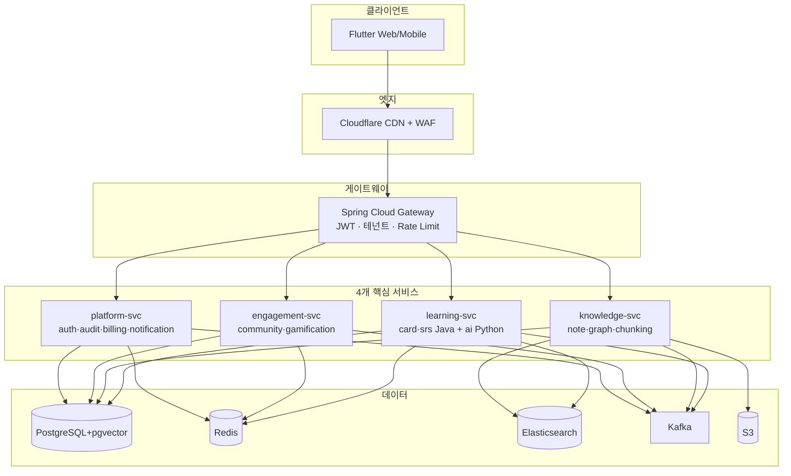
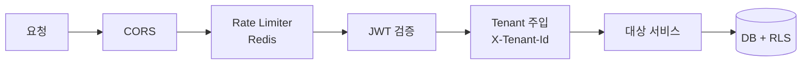
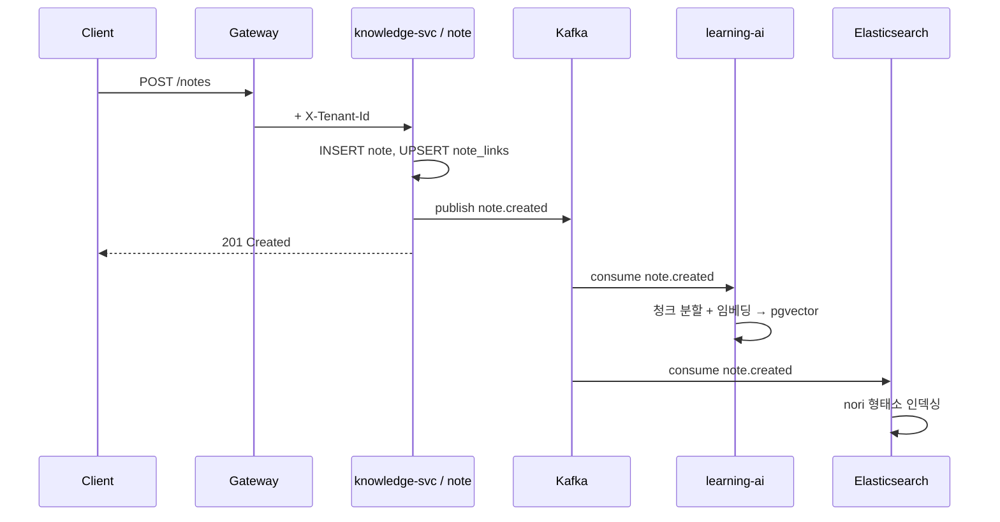

# synapse-onboarding 포털 Implementation Plan

> **For agentic workers:** REQUIRED SUB-SKILL: Use superpowers:subagent-driven-development (recommended) or superpowers:executing-plans to implement this plan task-by-task. Steps use checkbox (`- [ ]`) syntax for tracking.

**Goal:** MSA를 처음 접하는 신입 개발자가 한 번 읽으면 SYNAPSE 전체 흐름·기능을 파악할 수 있는 Flutter Web 온보딩 포털(`synapse-onboarding`)을 신규 레포로 만든다.

**Architecture:** `synapse-gitops/site`의 "Synapse Docs Portal"(Flutter Web + 마크다운→JSON 빌드 + GitHub Pages 배포)을 포크해 gitops 전용 요소를 제거하고, 콘텐츠 소스를 레포 내부 `content/`로 바꾼다. 그 위에 9개 섹션의 신입용 서사 콘텐츠를 작성하고, Mermaid 다이어그램은 클라이언트 렌더링 위젯으로 표시한다.

**Tech Stack:** Flutter 3.x (web), Dart, go_router, flutter_markdown, Node 20 + gray-matter (build script), mermaid.js (CDN, JS interop), GitHub Actions + Pages.

**스펙:** `docs/superpowers/specs/2026-05-27-synapse-onboarding-portal-design.md`

---

## 사전 메모 (실행자 필독)

- 워크스페이스 루트(`C:\workspace\team-project-final`)는 git 레포가 **아니다**. 신규 폴더 `synapse-onboarding/`를 만들고 그 안에서 `git init` 한다. 이후 모든 `git` 명령은 `synapse-onboarding/` 안에서 실행한다.
- 포크 베이스는 `synapse-gitops/site` (형제 폴더). 단순 복사 후 각색한다.
- 콘텐츠 사실의 단일 출처: `documents.wiki/03_프로젝트_아키텍처_정의서.md`(v2.1) 및 `documents.wiki/Home.md`. 각 콘텐츠 섹션 작성 전 해당 원본을 다시 읽어 사실을 확인한다.
- Flutter SDK(≥3.11)·Node 20·Dart가 로컬에 필요하다. `flutter --version` / `node --version` 으로 먼저 확인하고, 없으면 사용자에게 설치를 안내하고 멈춘다.
- Windows PowerShell 환경이다. 환경변수 prefix는 `$env:NO_AI='1'; node build_docs.mjs` 형태로 쓴다.

---

## File Structure

생성·수정할 파일과 책임:

| 파일 | 동작 | 책임 |
|------|------|------|
| `synapse-onboarding/site/**` | Create(복사) | `synapse-gitops/site` 전체 포크 |
| `site/pubspec.yaml` | Modify | 패키지명 `synapse_onboarding`, 설명 변경 |
| `site/lib/**`의 `package:synapse_runbooks/` | Modify | → `package:synapse_onboarding/` 전역 치환 |
| `site/lib/app.dart` | Modify | 라우트/Shell 단순화(dashboard·runbook·onboarding 제거), 앱 클래스명·타이틀 변경 |
| `site/lib/main.dart` | Modify | 앱 클래스명 변경 |
| `site/lib/models/doc.dart` | Modify | `DocCategory`를 overview/flow/practice로 재정의 |
| `site/lib/widgets/sidebar.dart` | Modify | 런북·현황 제거, 카테고리 네비게이션만 |
| `site/lib/pages/home_page.dart` | Modify | 온보딩 인트로로 리브랜딩, dashboard 링크 제거 |
| `site/lib/pages/search_page.dart` | Modify | 힌트 텍스트만 소폭 수정(카테고리 enum은 자동 반영) |
| `site/lib/widgets/markdown_viewer.dart` | Modify | ` ```mermaid ` 블록을 `MermaidView`로 라우팅 |
| `site/lib/widgets/mermaid_view.dart` | Create | 조건부 import 진입점(웹/스텁) |
| `site/lib/widgets/mermaid_view_web.dart` | Create | Flutter Web mermaid 렌더(HtmlElementView + JS interop) |
| `site/lib/widgets/mermaid_view_stub.dart` | Create | 비웹/테스트용 폴백(코드 텍스트 표시) |
| `site/web/index.html` | Modify | mermaid.js CDN + `mermaid.initialize` 추가 |
| `site/scripts/build_docs.mjs` | Modify | `content/`에서 수집, 카테고리=폴더명, AI 요약 제거 |
| `site/scripts/build_docs.test.mjs` | Create | build 산출물 단위 테스트(node:test) |
| `site/lib/pages/dashboard_page.dart` `runbook_page.dart` `onboarding_page.dart` | Delete | gitops 전용 |
| `site/lib/models/runbook.dart` | Delete | gitops 전용 |
| `site/test/runbook_model_test.dart` | Delete | 삭제된 모델 참조 |
| `content/overview/01-what-is-synapse.md` … `content/practice/09-where-to-start.md` | Create | 9개 섹션 콘텐츠 |
| `.github/workflows/deploy-pages.yml` | Modify | sibling/Dart 단계 제거, base-href 변경 |
| `README.md` | Create | 로컬 실행·기여 안내 |

---

## Phase 0 — 레포 부트스트랩

### Task 1: 신규 레포 생성 (포크 + git init)

**Files:**
- Create: `synapse-onboarding/` (전체)

- [ ] **Step 1: Flutter/Node 설치 확인**

Run (PowerShell, 작업 루트 `C:\workspace\team-project-final`):
```powershell
flutter --version; node --version
```
Expected: Flutter ≥ 3.11, Node v20.x 출력. 둘 중 하나라도 없으면 멈추고 사용자에게 설치를 안내한다.

- [ ] **Step 2: site 포크 복사 (build/ 제외)**

Run:
```powershell
New-Item -ItemType Directory -Force C:\workspace\team-project-final\synapse-onboarding | Out-Null
Copy-Item -Recurse -Force C:\workspace\team-project-final\synapse-gitops\site C:\workspace\team-project-final\synapse-onboarding\site
Remove-Item -Recurse -Force C:\workspace\team-project-final\synapse-onboarding\site\build -ErrorAction SilentlyContinue
Remove-Item -Recurse -Force C:\workspace\team-project-final\synapse-onboarding\site\scripts\node_modules -ErrorAction SilentlyContinue
Remove-Item -Force C:\workspace\team-project-final\synapse-onboarding\site\scripts\.summary-cache.json -ErrorAction SilentlyContinue
Remove-Item -Recurse -Force C:\workspace\team-project-final\synapse-onboarding\site\assets\docs -ErrorAction SilentlyContinue
Remove-Item -Recurse -Force C:\workspace\team-project-final\synapse-onboarding\site\assets\runbooks -ErrorAction SilentlyContinue
```

- [ ] **Step 3: .gitignore 작성**

Create `synapse-onboarding/.gitignore`:
```
site/build/
site/.dart_tool/
site/scripts/node_modules/
site/scripts/.summary-cache.json
site/assets/docs/
**/*.iml
.DS_Store
```
(빌드 산출물 `assets/docs/`는 빌드시 생성되므로 무시. 단, 배포 워크플로는 빌드 단계를 포함하므로 문제 없음.)

- [ ] **Step 4: git init + 최초 커밋**

Run (이후 모든 git 명령은 `synapse-onboarding/`에서 실행):
```powershell
cd C:\workspace\team-project-final\synapse-onboarding
git init -b main
git add -A
git commit -m "chore: fork synapse-gitops/site as onboarding portal base"
```
Expected: 커밋 성공.

---

## Phase 1 — 빌드 파이프라인 각색

### Task 2: build_docs.mjs를 content/ 기반으로 각색

**Files:**
- Modify: `synapse-onboarding/site/scripts/build_docs.mjs`
- Create: `synapse-onboarding/content/overview/01-what-is-synapse.md` (테스트용 최소 파일)

- [ ] **Step 1: 최소 콘텐츠 파일 작성 (테스트 픽스처 역할)**

Create `synapse-onboarding/content/overview/01-what-is-synapse.md`:
```markdown
---
title: SYNAPSE란?
---

# SYNAPSE란?

## 한 줄 정의

통합 학습-지식 그래프 SaaS. Obsidian + Anki + RAG 융합.

## 핵심 기능 5축

- 노트·지식그래프
```

- [ ] **Step 2: build_docs.mjs 각색 (content/ 수집 + 폴더=카테고리 + AI 요약 제거)**

`build_docs.mjs`의 상단 상수와 수집 로직을 아래로 교체한다. 변경 핵심: ① `WORKSPACE`/sibling 제거, ② `CONTENT_DIR = ../../content`, ③ 카테고리 = 1단계 하위 폴더명, ④ `source='synapse-onboarding'`, ⑤ `generateSummary` 호출 제거(빈 문자열).

Replace lines 1–18 (imports + 경로 상수 + CATEGORY_MAP) with:
```javascript
import fs from 'fs';
import path from 'path';
import matter from 'gray-matter';

// site/scripts 기준 → ../../content
const CONTENT_DIR = path.resolve('../../content');
const OUTPUT_DIR = path.resolve('../assets/docs');

const CATEGORIES = ['overview', 'flow', 'practice'];
```

Replace `collectMarkdownFiles()` (orig lines 30–53) with:
```javascript
function collectMarkdownFiles() {
  const files = [];
  for (const cat of CATEGORIES) {
    const dir = path.join(CONTENT_DIR, cat);
    if (!fs.existsSync(dir)) continue;
    for (const f of fs.readdirSync(dir).sort()) {
      if (f.endsWith('.md')) {
        files.push({ absPath: path.join(dir, f), category: cat });
      }
    }
  }
  return files;
}
```

Delete `categorize()` (orig lines 55–60) — 카테고리는 폴더에서 직접 온다.

In `main()`: the loop destructures `{ absPath, relKey }` and computes `slug`, `category`, `source`. Replace with `{ absPath, category }`, set `const slug = slugify(absPath);` `const source = 'synapse-onboarding';`, and **remove the AI summary block** (orig lines 222–231) replacing with `const summary = '';`. Update `slugify` to accept a file path:
```javascript
function slugify(absPath) {
  return path.basename(absPath, '.md')
    .toLowerCase()
    .replace(/[^a-z0-9가-힣_-]/g, '-')
    .replace(/-+/g, '-')
    .replace(/^-|-$/g, '');
}
```

Also delete cache helpers (`loadCache`/`saveCache`/`hashContent`/`generateSummary` and their calls) and the `import { createHash }` line — no longer used. Keep `extractToc`, `extractTags`, `extractCompletionRate`, `getLastModified`, `buildSearchIndex` unchanged. In `main()`, remove `const cache = loadCache();` and `saveCache(cache);`, and the `summaryCount` logging.

The output dir creation loop (orig lines 200–204) should use `CATEGORIES`:
```javascript
  fs.mkdirSync(OUTPUT_DIR, { recursive: true });
  for (const cat of CATEGORIES) {
    fs.mkdirSync(path.join(OUTPUT_DIR, cat), { recursive: true });
  }
```

- [ ] **Step 3: scripts/package.json 정리**

Modify `synapse-onboarding/site/scripts/package.json` — `name`을 `"onboarding-docs-builder"`로 바꾸고, `scripts`를 `{"build": "node build_docs.mjs"}`만 남긴다 (AI 변형 제거). `gray-matter` 의존성은 유지.

- [ ] **Step 4: 의존성 설치 + 빌드 실행**

Run:
```powershell
cd C:\workspace\team-project-final\synapse-onboarding\site\scripts
npm install
node build_docs.mjs
```
Expected: `Found 1 markdown files` / `Built 1 docs, search index ...KB` 출력. `site/assets/docs/index.json`, `site/assets/docs/overview/synapse.json`(또는 slug) 생성.

> 참고: slug는 `01-what-is-synapse` (파일명 기준). 위 출력 경로는 `overview/01-what-is-synapse.json`.

- [ ] **Step 5: 커밋**

```powershell
cd C:\workspace\team-project-final\synapse-onboarding
git add -A
git commit -m "feat(build): collect onboarding content from content/ by folder category"
```

### Task 3: build_docs 단위 테스트

**Files:**
- Create: `synapse-onboarding/site/scripts/build_docs.test.mjs`

- [ ] **Step 1: 실패하는 테스트 작성**

Create `synapse-onboarding/site/scripts/build_docs.test.mjs`:
```javascript
import { test } from 'node:test';
import assert from 'node:assert/strict';
import fs from 'fs';
import path from 'path';
import { execSync } from 'child_process';

const SCRIPTS = path.resolve(import.meta.dirname);
const OUTPUT = path.resolve(SCRIPTS, '../assets/docs');

test('build produces index.json with overview category entry', () => {
  execSync('node build_docs.mjs', { cwd: SCRIPTS });
  const index = JSON.parse(fs.readFileSync(path.join(OUTPUT, 'index.json'), 'utf-8'));
  assert.ok(Array.isArray(index));
  const entry = index.find((d) => d.slug === '01-what-is-synapse');
  assert.ok(entry, 'expected 01-what-is-synapse in index');
  assert.equal(entry.category, 'overview');
  assert.equal(entry.source, 'synapse-onboarding');
});

test('per-doc JSON has body and toc', () => {
  const doc = JSON.parse(
    fs.readFileSync(path.join(OUTPUT, 'overview', '01-what-is-synapse.json'), 'utf-8'),
  );
  assert.match(doc.body, /통합 학습-지식 그래프/);
  assert.ok(Array.isArray(doc.toc));
  assert.ok(doc.toc.some((t) => t.text === '한 줄 정의'));
});
```

- [ ] **Step 2: 테스트 실행하여 통과 확인**

Run:
```powershell
cd C:\workspace\team-project-final\synapse-onboarding\site\scripts
node --test
```
Expected: 2 tests pass. (Task 2가 올바르면 통과. 실패 시 build_docs.mjs 수정.)

- [ ] **Step 3: 커밋**

```powershell
cd C:\workspace\team-project-final\synapse-onboarding
git add -A
git commit -m "test(build): verify content collection and per-doc JSON shape"
```

---

## Phase 2 — Flutter 앱 각색

### Task 4: 패키지명 변경 (synapse_runbooks → synapse_onboarding)

**Files:**
- Modify: `site/pubspec.yaml`, 모든 `site/lib/**`, `site/test/**`

- [ ] **Step 1: pubspec.yaml 수정**

Modify `synapse-onboarding/site/pubspec.yaml` lines 1–4:
```yaml
name: synapse_onboarding
description: Synapse 신입 온보딩 포털
publish_to: 'none'
version: 1.0.0
```
또한 `flutter: assets:` 목록(orig 24–33)에서 runbooks/gitops 전용 경로를 제거하고 아래만 남긴다:
```yaml
flutter:
  uses-material-design: true
  assets:
    - assets/docs/
    - assets/docs/overview/
    - assets/docs/flow/
    - assets/docs/practice/
```

- [ ] **Step 2: import 경로 전역 치환**

Run:
```powershell
cd C:\workspace\team-project-final\synapse-onboarding\site
Get-ChildItem -Recurse -Include *.dart | ForEach-Object {
  (Get-Content $_.FullName -Raw) -replace 'package:synapse_runbooks/', 'package:synapse_onboarding/' | Set-Content -NoNewline $_.FullName
}
```
Expected: 모든 `.dart`의 import가 `package:synapse_onboarding/`로 변경.

- [ ] **Step 3: 커밋**

```powershell
cd C:\workspace\team-project-final\synapse-onboarding
git add -A
git commit -m "refactor: rename dart package to synapse_onboarding"
```

### Task 5: gitops 전용 파일·라우트 제거

**Files:**
- Delete: `site/lib/pages/dashboard_page.dart`, `site/lib/pages/runbook_page.dart`, `site/lib/pages/onboarding_page.dart`, `site/lib/models/runbook.dart`, `site/test/runbook_model_test.dart`
- Modify: `site/lib/app.dart`

- [ ] **Step 1: 파일 삭제**

Run:
```powershell
cd C:\workspace\team-project-final\synapse-onboarding\site
Remove-Item lib\pages\dashboard_page.dart, lib\pages\runbook_page.dart, lib\pages\onboarding_page.dart, lib\models\runbook.dart, test\runbook_model_test.dart
```

- [ ] **Step 2: app.dart 재작성 (라우트·Shell 단순화 + 리브랜딩)**

Replace entire `synapse-onboarding/site/lib/app.dart` with:
```dart
import 'package:flutter/material.dart';
import 'package:go_router/go_router.dart';
import 'package:google_fonts/google_fonts.dart';
import 'package:synapse_onboarding/pages/home_page.dart';
import 'package:synapse_onboarding/pages/doc_page.dart';
import 'package:synapse_onboarding/pages/search_page.dart';
import 'package:synapse_onboarding/widgets/sidebar.dart';

final _router = GoRouter(
  routes: [
    ShellRoute(
      builder: (context, state, child) => AppShell(child: child),
      routes: [
        GoRoute(path: '/', builder: (context, state) => const HomePage()),
        GoRoute(path: '/search', builder: (context, state) => const SearchPage()),
        GoRoute(
          path: '/docs/:category/:slug',
          builder: (context, state) => DocPage(
            category: state.pathParameters['category']!,
            slug: state.pathParameters['slug']!,
          ),
        ),
      ],
    ),
  ],
);

class SynapseOnboardingApp extends StatelessWidget {
  const SynapseOnboardingApp({super.key});

  @override
  Widget build(BuildContext context) {
    return MaterialApp.router(
      title: 'Synapse 신입 온보딩',
      theme: ThemeData(
        colorSchemeSeed: const Color(0xFFD97706),
        useMaterial3: true,
        textTheme: GoogleFonts.notoSansKrTextTheme(),
        scaffoldBackgroundColor: const Color(0xFFFAFAF9),
      ),
      routerConfig: _router,
    );
  }
}

class AppShell extends StatelessWidget {
  final Widget child;
  const AppShell({super.key, required this.child});

  @override
  Widget build(BuildContext context) {
    final isWide = MediaQuery.of(context).size.width >= 800;
    return Scaffold(
      appBar: AppBar(
        title: InkWell(
          onTap: () => context.go('/'),
          child: const Text('Synapse 신입 온보딩'),
        ),
        actions: [
          IconButton(
            icon: const Icon(Icons.search),
            onPressed: () => context.go('/search'),
          ),
        ],
      ),
      drawer: isWide ? null : const Drawer(child: Sidebar()),
      body: Row(
        children: [
          if (isWide) const SizedBox(width: 280, child: Sidebar()),
          Expanded(child: child),
        ],
      ),
    );
  }
}
```

- [ ] **Step 3: main.dart 수정**

Replace `synapse-onboarding/site/lib/main.dart`:
```dart
import 'package:flutter/material.dart';
import 'package:synapse_onboarding/app.dart';

void main() {
  runApp(const SynapseOnboardingApp());
}
```

- [ ] **Step 4: 커밋**

```powershell
cd C:\workspace\team-project-final\synapse-onboarding
git add -A
git commit -m "refactor: remove gitops-only pages/routes, rebrand shell"
```

### Task 6: DocCategory 재정의 (overview/flow/practice)

**Files:**
- Modify: `site/lib/models/doc.dart` (lines 1–70, the `DocCategory` enum)

- [ ] **Step 1: DocCategory enum 교체**

Replace `DocCategory` enum (orig lines 1–70) in `synapse-onboarding/site/lib/models/doc.dart` with:
```dart
enum DocCategory {
  overview,
  flow,
  practice;

  static DocCategory fromString(String value) {
    switch (value) {
      case 'overview':
        return DocCategory.overview;
      case 'flow':
        return DocCategory.flow;
      case 'practice':
        return DocCategory.practice;
      default:
        return DocCategory.overview;
    }
  }

  String get id => name;

  String get displayName {
    switch (this) {
      case DocCategory.overview:
        return '개요';
      case DocCategory.flow:
        return '흐름';
      case DocCategory.practice:
        return '실전';
    }
  }

  String get icon {
    switch (this) {
      case DocCategory.overview:
        return '\u{1F4D6}'; // 📖
      case DocCategory.flow:
        return '\u{1F500}'; // 🔀
      case DocCategory.practice:
        return '\u{1F680}'; // 🚀
    }
  }
}
```
(나머지 `TocEntry`/`DocMetadata`/`DocIndex`/`Doc` 클래스는 그대로 둔다.)

- [ ] **Step 2: sidebar.dart에서 런북 섹션 제거**

Replace entire `synapse-onboarding/site/lib/widgets/sidebar.dart` with:
```dart
import 'dart:convert';
import 'package:flutter/material.dart';
import 'package:flutter/services.dart';
import 'package:go_router/go_router.dart';
import 'package:synapse_onboarding/models/doc.dart';

class Sidebar extends StatefulWidget {
  const Sidebar({super.key});

  @override
  State<Sidebar> createState() => _SidebarState();
}

class _SidebarState extends State<Sidebar> {
  List<DocIndex> _docs = [];
  bool _loading = true;

  @override
  void initState() {
    super.initState();
    _load();
  }

  Future<void> _load() async {
    try {
      final docsJson = await rootBundle.loadString('assets/docs/index.json');
      final docsList = json.decode(docsJson) as List;
      _docs = docsList
          .map((e) => DocIndex.fromJson(e as Map<String, dynamic>))
          .toList();
    } catch (_) {}
    setState(() => _loading = false);
  }

  @override
  Widget build(BuildContext context) {
    if (_loading) return const Center(child: CircularProgressIndicator());

    final grouped = <DocCategory, List<DocIndex>>{};
    for (final d in _docs) {
      grouped.putIfAbsent(d.category, () => []).add(d);
    }

    return ListView(
      padding: const EdgeInsets.symmetric(vertical: 8),
      children: [
        ListTile(
          leading: const Icon(Icons.home),
          title: const Text('홈'),
          onTap: () => context.go('/'),
        ),
        ListTile(
          leading: const Icon(Icons.search),
          title: const Text('검색'),
          onTap: () => context.go('/search'),
        ),
        const Divider(),
        for (final cat in DocCategory.values)
          if (grouped.containsKey(cat))
            ExpansionTile(
              initiallyExpanded: true,
              leading: Text(cat.icon, style: const TextStyle(fontSize: 16)),
              title: Text('${cat.displayName} (${grouped[cat]!.length})'),
              children: [
                for (final doc in grouped[cat]!)
                  ListTile(
                    title: Text(doc.title,
                        style: Theme.of(context).textTheme.bodySmall),
                    dense: true,
                    contentPadding: const EdgeInsets.only(left: 56),
                    onTap: () =>
                        context.go('/docs/${doc.category.id}/${doc.slug}'),
                  ),
              ],
            ),
      ],
    );
  }
}
```

- [ ] **Step 3: home_page.dart 리브랜딩 + dashboard 링크 제거**

In `synapse-onboarding/site/lib/pages/home_page.dart`:
- 제목 텍스트(orig line 57) `'Synapse Docs'` → `'Synapse 신입 온보딩'`
- 부제(orig lines 60–61) → `'MSA를 처음 접하는 신입을 위한 — 시스템 전체 흐름과 기능 한눈에 보기'`
- "프로젝트 현황" 블록(orig lines 68–97, `withProgress` 카드 전체)을 삭제한다(완료율 메타가 없으므로 항상 비어 있음). `withProgress` 변수 선언도 삭제.
- `TextButton(onPressed: () => context.go('/dashboard') ...)` (orig 88–91)는 위 블록과 함께 삭제된다.
- 카테고리 카드 `onTap`(orig 110)은 `context.go('/search')` 유지.

- [ ] **Step 4: search_page.dart 힌트 확인**

`synapse-onboarding/site/lib/pages/search_page.dart`는 `DocCategory.values`를 순회하므로 카테고리 변경이 자동 반영된다. 힌트 텍스트(line 68) `'키워드로 문서 검색...'`는 그대로 둔다. 수정 없음.

- [ ] **Step 5: 분석 + 빌드 검증**

Run:
```powershell
cd C:\workspace\team-project-final\synapse-onboarding\site
flutter pub get
flutter analyze
```
Expected: `No issues found!` (mermaid 위젯은 아직 없으므로 markdown_viewer는 기존 CodeBlock만 사용 → 정상).

- [ ] **Step 6: 커밋**

```powershell
cd C:\workspace\team-project-final\synapse-onboarding
git add -A
git commit -m "refactor: redefine categories (overview/flow/practice), simplify sidebar & home"
```

---

## Phase 3 — Mermaid 클라이언트 렌더링 위젯

> **리스크/검증 우선**: Flutter Web의 platform view + JS interop은 타이밍·높이 이슈가 있다. Task 7에서 **단일 다이어그램 PoC**로 먼저 검증한 뒤 Task 8에서 markdown_viewer에 연결한다.

### Task 7: MermaidView 위젯 (PoC)

**Files:**
- Modify: `site/web/index.html`
- Create: `site/lib/widgets/mermaid_view.dart`, `mermaid_view_web.dart`, `mermaid_view_stub.dart`

- [ ] **Step 1: index.html에 mermaid.js 추가**

In `synapse-onboarding/site/web/index.html`, `<head>` 안에 추가:
```html
  <script src="https://cdn.jsdelivr.net/npm/mermaid@11/dist/mermaid.min.js"></script>
  <script>
    window.mermaid && window.mermaid.initialize({ startOnLoad: false, theme: 'neutral' });
    // 코드 문자열 → SVG 문자열 (Promise)
    window.renderMermaid = async function (id, code) {
      const { svg } = await window.mermaid.render(id, code);
      return svg;
    };
  </script>
```

- [ ] **Step 2: 스텁 구현 (비웹/테스트 폴백)**

Create `synapse-onboarding/site/lib/widgets/mermaid_view_stub.dart`:
```dart
import 'package:flutter/material.dart';

class MermaidView extends StatelessWidget {
  final String code;
  const MermaidView({super.key, required this.code});

  @override
  Widget build(BuildContext context) {
    return Container(
      width: double.infinity,
      padding: const EdgeInsets.all(12),
      margin: const EdgeInsets.symmetric(vertical: 8),
      decoration: BoxDecoration(
        color: const Color(0xFFF5F5F4),
        borderRadius: BorderRadius.circular(8),
      ),
      child: SelectableText('[mermaid]\n$code',
          style: const TextStyle(fontFamily: 'monospace', fontSize: 12)),
    );
  }
}
```

- [ ] **Step 3: 조건부 import 진입점**

Create `synapse-onboarding/site/lib/widgets/mermaid_view.dart`:
```dart
export 'mermaid_view_stub.dart'
    if (dart.library.js_interop) 'mermaid_view_web.dart';
```

- [ ] **Step 4: 웹 구현 (HtmlElementView + JS interop)**

Create `synapse-onboarding/site/lib/widgets/mermaid_view_web.dart`:
```dart
import 'dart:js_interop';
import 'dart:ui_web' as ui_web;
import 'package:flutter/material.dart';
import 'package:web/web.dart' as web;

@JS('renderMermaid')
external JSPromise<JSString> _renderMermaid(JSString id, JSString code);

int _seq = 0;

class MermaidView extends StatefulWidget {
  final String code;
  const MermaidView({super.key, required this.code});

  @override
  State<MermaidView> createState() => _MermaidViewState();
}

class _MermaidViewState extends State<MermaidView> {
  late final String _viewType;
  final web.HTMLDivElement _host = web.HTMLDivElement()
    ..style.width = '100%'
    ..style.overflowX = 'auto';
  double _height = 80;
  String? _error;

  @override
  void initState() {
    super.initState();
    _viewType = 'mermaid-${_seq++}';
    ui_web.platformViewRegistry
        .registerViewFactory(_viewType, (int _) => _host);
    _render();
  }

  Future<void> _render() async {
    try {
      final id = 'mmd${DateTime.now().microsecondsSinceEpoch}';
      final svg = await _renderMermaid(id.toJS, widget.code.toJS).toDart;
      _host.innerHTML = (svg).toDart.toJS as dynamic; // set SVG markup
      // 렌더된 svg의 높이 측정
      final svgEl = _host.querySelector('svg');
      final measured = svgEl?.getBoundingClientRect().height ?? 0;
      if (mounted) {
        setState(() => _height = measured > 0 ? measured + 16 : 200);
      }
    } catch (e) {
      if (mounted) setState(() => _error = '$e');
    }
  }

  @override
  Widget build(BuildContext context) {
    if (_error != null) {
      return Padding(
        padding: const EdgeInsets.all(8),
        child: Text('다이어그램 렌더 실패: $_error',
            style: const TextStyle(color: Colors.red)),
      );
    }
    return Container(
      margin: const EdgeInsets.symmetric(vertical: 12),
      height: _height,
      child: HtmlElementView(viewType: _viewType),
    );
  }
}
```
> 주의: `_host.innerHTML` 에 SVG 문자열을 넣는 방식은 `package:web` 버전에 따라 API가 다를 수 있다. `innerHTML` 설정이 막히면 `_host.insertAdjacentHTML('beforeend', svg.toDart)` 또는 `web.DOMParser`로 파싱해 append 한다. 이 부분은 PoC 실행 중 콘솔 에러를 보며 조정한다.

- [ ] **Step 5: pubspec에 web 의존성 확인**

Run:
```powershell
cd C:\workspace\team-project-final\synapse-onboarding\site
flutter pub add web
flutter pub get
```
Expected: `web` 패키지 추가(또는 이미 전이 의존성으로 존재). `dart:js_interop`, `dart:ui_web`는 SDK 기본 제공.

- [ ] **Step 6: PoC — home에 임시 다이어그램 1개 렌더 후 눈으로 확인**

`home_page.dart` build 최상단 자식에 임시로 추가(검증 후 되돌림):
```dart
import 'package:synapse_onboarding/widgets/mermaid_view.dart';
// ... Column children 첫 항목으로:
const MermaidView(code: 'graph LR; A[Client]-->B[Gateway]-->C[Service];'),
```

Run:
```powershell
cd C:\workspace\team-project-final\synapse-onboarding\site
flutter run -d chrome
```
Expected: 홈 상단에 A→B→C 박스 다이어그램이 **그래픽으로** 표시. 텍스트로만 보이면 Step 4 주석대로 innerHTML 주입 방식을 조정.

- [ ] **Step 7: 임시 PoC 코드 되돌리기 + 커밋**

home_page.dart의 임시 `MermaidView`와 import를 제거(되돌림). 그 후:
```powershell
cd C:\workspace\team-project-final\synapse-onboarding
git add -A
git commit -m "feat(mermaid): add web mermaid render widget with stub fallback (PoC verified)"
```

### Task 8: markdown_viewer에 mermaid 라우팅 연결

**Files:**
- Modify: `site/lib/widgets/markdown_viewer.dart`
- Create: `site/test/markdown_viewer_test.dart`

- [ ] **Step 1: 실패하는 위젯 테스트 작성**

Create `synapse-onboarding/site/test/markdown_viewer_test.dart`:
```dart
import 'package:flutter/material.dart';
import 'package:flutter_test/flutter_test.dart';
import 'package:synapse_onboarding/widgets/markdown_viewer.dart';
import 'package:synapse_onboarding/widgets/mermaid_view.dart';
import 'package:synapse_onboarding/widgets/code_block.dart';

void main() {
  testWidgets('mermaid fenced block renders MermaidView, not CodeBlock',
      (tester) async {
    await tester.pumpWidget(const MaterialApp(
      home: Scaffold(
        body: MarkdownViewer(data: '```mermaid\ngraph LR; A-->B;\n```'),
      ),
    ));
    expect(find.byType(MermaidView), findsOneWidget);
    expect(find.byType(CodeBlockWidget), findsNothing);
  });

  testWidgets('non-mermaid code block renders CodeBlockWidget', (tester) async {
    await tester.pumpWidget(const MaterialApp(
      home: Scaffold(
        body: MarkdownViewer(data: '```dart\nvoid main() {}\n```'),
      ),
    ));
    expect(find.byType(CodeBlockWidget), findsOneWidget);
    expect(find.byType(MermaidView), findsNothing);
  });
}
```
(테스트는 VM에서 실행되므로 `mermaid_view.dart`의 조건부 import가 **스텁**을 사용 → MermaidView가 SelectableText 컨테이너로 렌더, 타입 매칭은 성립.)

- [ ] **Step 2: 테스트 실행하여 실패 확인**

Run:
```powershell
cd C:\workspace\team-project-final\synapse-onboarding\site
flutter test test/markdown_viewer_test.dart
```
Expected: 첫 테스트 FAIL (`MermaidView` 0개 — 현재는 모든 코드블록이 CodeBlockWidget).

- [ ] **Step 3: markdown_viewer.dart 수정 (mermaid 분기)**

In `synapse-onboarding/site/lib/widgets/markdown_viewer.dart`:
- import 추가: `import 'package:synapse_onboarding/widgets/mermaid_view.dart';`
- `_CodeBlockBuilder.visitElementAfter`(orig 47–61) 교체:
```dart
  @override
  Widget? visitElementAfter(element, preferredStyle) {
    if (element.textContent.isEmpty) return null;
    final language = element.attributes['class']?.replaceFirst('language-', '');
    if (language == 'mermaid') {
      return MermaidView(code: element.textContent.trimRight());
    }
    if (element.textContent.contains('\n') || language != null) {
      return CodeBlockWidget(
        code: element.textContent.trimRight(),
        language: language,
      );
    }
    return null;
  }
```

- [ ] **Step 4: 테스트 통과 확인**

Run:
```powershell
cd C:\workspace\team-project-final\synapse-onboarding\site
flutter test test/markdown_viewer_test.dart
```
Expected: 2 tests PASS.

- [ ] **Step 5: 커밋**

```powershell
cd C:\workspace\team-project-final\synapse-onboarding
git add -A
git commit -m "feat(mermaid): route fenced mermaid blocks to MermaidView"
```

---

## Phase 4 — 콘텐츠 작성 (9개 섹션)

> **공통 형식 (모든 섹션)**: ① frontmatter `title:` 필수. ② 본문은 `# 제목`으로 시작. ③ `##`/`###` 소제목으로 TOC 구성. ④ "MSA 처음이면" 개념은 `> 💡 **개념: ...**` blockquote 박스로. ⑤ 끝에 `## 다음 읽을거리` — 원본 위키/가이드 링크. ⑥ 사실은 작성 전 `documents.wiki/03_프로젝트_아키텍처_정의서.md`/`Home.md`/관련 원본을 재확인. ⑦ 세부 스펙(API 필드·ERD 컬럼·env)은 재작성 금지, 링크만.
>
> **링크 표기**: 위키는 `https://github.com/team-project-final/documents/wiki/<문서명>` 형식. 트랙 가이드는 상대경로가 아닌 위 레포의 `documents/docs/onboarding/<파일>` 경로를 텍스트로 명시(포털은 독립 레포이므로 상대링크 불가).

### Task 9: 섹션 01 — SYNAPSE란?

**Files:**
- Modify: `synapse-onboarding/content/overview/01-what-is-synapse.md` (Task 2의 최소 파일을 본문으로 확장)

- [ ] **Step 1: 콘텐츠 작성**

다음을 포함해 작성:
- **한 줄 정의**: "통합 학습-지식 그래프 SaaS — Obsidian(노트) + Anki(반복학습) + RAG(AI 검색·질의) 융합" (출처: `Home.md`).
- **누가 왜 쓰나**: 학습자가 노트를 쓰면 자동으로 위키링크 지식그래프가 형성되고, AI가 노트에서 학습 카드를 만들어 SM-2 간격반복으로 복습시키며, RAG로 내 노트에 질문할 수 있다.
- **핵심 기능 5축** (각 1~2문장):
  1. 노트·지식그래프 (knowledge-svc) — Markdown 노트, `[[위키링크]]`, 백링크, D3 그래프 시각화
  2. 학습·SRS (learning-card) — 카드/덱, SM-2 간격반복 복습
  3. AI·RAG (learning-ai) — 노트→자동 카드 생성, 시맨틱 검색, RAG Q&A
  4. 커뮤니티·게이미피케이션 (engagement-svc) — 스터디 그룹, 덱/노트 공유, XP·배지·리더보드
  5. 플랫폼 (platform-svc) — OAuth 로그인, 멀티테넌시, 결제(Stripe), 알림
- **개념 박스**: `> 💡 **개념: SaaS / 멀티테넌시**` — 여러 조직(테넌트)이 한 시스템을 공유하되 데이터는 격리(섹션 04에서 상술).
- **다음 읽을거리**: 01 프로젝트 계획서, 07 요구사항 정의서 위키 링크.

- [ ] **Step 2: 빌드 + 렌더 확인**

Run:
```powershell
cd C:\workspace\team-project-final\synapse-onboarding\site\scripts; node build_docs.mjs
cd ..; flutter run -d chrome
```
Expected: 사이드바 "개요"에 "SYNAPSE란?" 노출, 본문·TOC 정상.

- [ ] **Step 3: 커밋**

```powershell
cd C:\workspace\team-project-final\synapse-onboarding
git add -A
git commit -m "content: section 01 - what is synapse"
```

### Task 10: 섹션 02 — MSA 입문 + 큰 그림

**Files:**
- Create: `synapse-onboarding/content/overview/02-msa-and-big-picture.md`

- [ ] **Step 1: 콘텐츠 작성**

- **개념 박스**: `> 💡 **개념: 모놀리식 vs MSA**` — 한 덩어리 앱 vs 독립 배포 가능한 작은 서비스들. 장점(독립 배포·확장·장애 격리)과 비용(네트워크·운영 복잡도).
- **왜 4개인가**: 원안 10개 마이크로서비스를 ADR-001/002로 **4개 굵은 서비스로 통합**, 내부는 Spring Modulith 모듈로 분리. 근거: 7명 팀의 콘웨이 법칙, 운영비 ~30% 절감, 미래 분리 옵션 보존 (출처: 아키텍처 정의서 §"4-서비스 통합 결정").
- **전체 아키텍처 1장** — 아래 mermaid를 그대로 삽입(아키텍처 정의서 §3.1을 신입용으로 축약):

- **레이어 한 문단씩**: Client(Flutter) / Edge(Cloudflare) / Gateway / Core 4서비스 / Data.
- **다음 읽을거리**: 03 아키텍처 정의서, 18 기술 스택 정의서, 09 Git 규칙(ADR 전문) 위키 링크.

- [ ] **Step 2: 빌드 + 렌더 확인 (다이어그램 그래픽 표시 확인)**

Run:
```powershell
cd C:\workspace\team-project-final\synapse-onboarding\site\scripts; node build_docs.mjs
cd ..; flutter run -d chrome
```
Expected: 본문 안 아키텍처 다이어그램이 그래픽으로 렌더.

- [ ] **Step 3: 커밋**

```powershell
cd C:\workspace\team-project-final\synapse-onboarding
git add -A; git commit -m "content: section 02 - msa intro & big picture"
```

### Task 11: 섹션 03 — 4개 서비스 소개

**Files:**
- Create: `synapse-onboarding/content/overview/03-four-services.md`

- [ ] **Step 1: 콘텐츠 작성**

각 서비스를 *"한 명씩 소개"* 톤으로 (출처: 아키텍처 정의서 §3.2.4):
- **platform-svc** (트랙 A): auth(OAuth·JWT·MFA), audit, billing(Stripe), notification(FCM/APNs/SES). "비즈니스 로직 단순, 외부 SaaS 통합 위주."
- **engagement-svc** (트랙 B): community(스터디그룹·공유·신고), gamification(XP·레벨·배지·리더보드). "다른 서비스 이벤트 소비 중심."
- **knowledge-svc** (트랙 C, 2명): note(Markdown·위키링크·버전), graph(백링크·PageRank·클러스터), chunking(임베딩). "Synapse 정체성의 Core 도메인."
- **learning-svc** (트랙 D, 2명): learning-card(Java — 카드/덱·SM-2 SRS) + learning-ai(Python/FastAPI — 자동 카드 생성·시맨틱 검색·RAG). "가장 큰 서비스, 두 컨테이너."
- **서비스↔모듈↔오너 표** 삽입 (아키텍처 정의서 §"트랙↔레포↔Owner 매핑" 축약).
- **개념 박스**: `> 💡 **개념: Spring Modulith**` — 한 서비스 안을 모듈로 나누고 경계를 ArchUnit으로 검증, 나중에 서비스로 떼어낼 수 있게.
- **다음 읽을거리**: 서비스별 ARCHITECTURE.md(`documents.wiki/synapse-*-svc_ARCHITECTURE.md`), 트랙 가이드.

- [ ] **Step 2: 빌드 + 렌더 확인**

Run: `cd ...\scripts; node build_docs.mjs; cd ..; flutter build web` → 빌드 성공.

- [ ] **Step 3: 커밋**

```powershell
cd C:\workspace\team-project-final\synapse-onboarding
git add -A; git commit -m "content: section 03 - four services"
```

### Task 12: 섹션 04 — 요청 하나가 흐르는 길(동기)

**Files:**
- Create: `synapse-onboarding/content/flow/04-sync-request-flow.md`

- [ ] **Step 1: 콘텐츠 작성**

- **Gateway 필터체인** (출처 §3.2.3): CORS → Rate Limiter(Redis Token Bucket) → JWT 검증 → Tenant Resolver(JWT→`X-Tenant-Id` 주입) → Request Logger(Kafka) → Circuit Breaker. mermaid LR 다이어그램으로:

- **멀티테넌시 3단계 격리** (출처 §3.3): L1 Gateway(JWT→tenant_id) / L2 Application(Repository에서 tenant_id WHERE 강제) / L3 DB(PostgreSQL RLS). "어느 한 층이 빠져도 다른 층이 막는 이중 방어."
- **개념 박스**: `> 💡 **개념: JWT / RLS / 멀티테넌시**` 각각 1~2문장.
- **세부 스펙은 링크**: Rate Limit 플랜별 수치·JWT 클레임 등은 04 API 명세 / 03 아키텍처 정의서로.
- **다음 읽을거리**: 03 아키텍처 §3.2.3·§3.3, 03-B 내부외부 경계 보안 명세, 04 API 명세.

- [ ] **Step 2: 빌드 + 렌더 확인** — `node build_docs.mjs` → `flutter build web` 성공.

- [ ] **Step 3: 커밋**

```powershell
cd C:\workspace\team-project-final\synapse-onboarding
git add -A; git commit -m "content: section 04 - synchronous request flow"
```

### Task 13: 섹션 05 — 이벤트가 흐르는 길(비동기)

**Files:**
- Create: `synapse-onboarding/content/flow/05-async-event-flow.md`

- [ ] **Step 1: 콘텐츠 작성**

- **왜 Kafka인가**: 서비스 간 직접 호출 대신 이벤트 발행/구독으로 느슨한 결합. 노트 작성 한 번이 여러 후속 작업(임베딩·검색색인·알림)을 비동기로 촉발.
- **대표 흐름 `note.created`** (출처 §3.5) — sequence diagram 삽입:

- **이벤트 스키마**: CloudEvents 호환 JSON, Avro(`synapse-shared`) + Confluent Schema Registry(BACKWARD 호환). "필드 이름 변경·필수 필드 삭제 금지" 한 줄.
- **개념 박스**: `> 💡 **개념: 이벤트 기반 아키텍처 / Producer·Consumer**`.
- **다음 읽을거리**: 03 아키텍처 §3.4, 03-C 이벤트 스키마 진화 가이드.

- [ ] **Step 2: 빌드 + 렌더 확인** — 시퀀스 다이어그램 그래픽 렌더 확인.

- [ ] **Step 3: 커밋**

```powershell
cd C:\workspace\team-project-final\synapse-onboarding
git add -A; git commit -m "content: section 05 - asynchronous event flow"
```

### Task 14: 섹션 06 — 핵심 유저 플로우 E2E

**Files:**
- Create: `synapse-onboarding/content/flow/06-core-user-flows.md`

- [ ] **Step 1: 콘텐츠 작성**

서비스를 횡단하는 3개 시나리오. 각 시나리오마다 "관여 서비스·이벤트"를 명시:
1. **노트 작성 → 검색 가능**: knowledge-svc note INSERT → `note.created` → (learning-ai 임베딩 + knowledge-svc ES 인덱싱). 섹션 05 흐름 재참조.
2. **AI 자동 카드 생성 → 복습**: `note.created`를 learning-ai가 소비 → LLM으로 카드 생성 → learning-card 덱에 적재 → 사용자가 복습(rating) → SM-2로 다음 due_date 계산 → `card.reviewed` 발행 → engagement-svc XP 적립. mermaid sequence로 표현.
3. **RAG Q&A**: 사용자 질문 → learning-ai 쿼리 임베딩 → pgvector 시맨틱 + BM25 하이브리드(RRF) → LLM 답변(RAG) → 시맨틱 캐시.
- **다음 읽을거리**: 05 화면 흐름 시퀀스 다이어그램, learning-svc ARCHITECTURE.

- [ ] **Step 2: 빌드 + 렌더 확인** — `flutter build web` 성공.

- [ ] **Step 3: 커밋**

```powershell
cd C:\workspace\team-project-final\synapse-onboarding
git add -A; git commit -m "content: section 06 - core user flows e2e"
```

### Task 15: 섹션 07 — 프론트엔드 연결

**Files:**
- Create: `synapse-onboarding/content/practice/07-frontend.md`

- [ ] **Step 1: 콘텐츠 작성**

- **Flutter 4계층** (출처 §3.2.2): UI(Widgets/Pages) → Riverpod(상태) → Repository(API 추상화) → DataSource(HTTP + 로컬 캐시). mermaid LR 다이어그램.
- **Gateway로 붙는 법**: 모든 API는 Cloudflare→Gateway 경유. JWT는 httpOnly Cookie(Refresh) + 메모리(Access). 플랫폼: Web(CanvasKit)/iOS/Android 한 코드베이스.
- **개념 박스**: `> 💡 **개념: 상태관리(Riverpod) / Repository 패턴**`.
- **다음 읽을거리**: synapse-frontend_ARCHITECTURE, 05-frontend 트랙 가이드, DESIGN.md.

- [ ] **Step 2: 빌드 + 렌더 확인**

- [ ] **Step 3: 커밋**

```powershell
cd C:\workspace\team-project-final\synapse-onboarding
git add -A; git commit -m "content: section 07 - frontend"
```

### Task 16: 섹션 08 — 데이터·배포·관측성

**Files:**
- Create: `synapse-onboarding/content/practice/08-data-deploy-observability.md`

- [ ] **Step 1: 콘텐츠 작성**

- **데이터스토어별 용도**: PostgreSQL16+pgvector(주 저장 + 벡터), Redis7(캐시·세션·리더보드·rate limit), Elasticsearch8+nori(한글 전문검색), Kafka(이벤트), S3(첨부).
- **배포** (출처 §3.6): AWS EKS + ArgoCD GitOps, ApplicationSet matrix(5 svc × 3 env=15), dev autoSync / staging·prod 수동 승인. mermaid 파이프라인 다이어그램(GitHub→CI→ECR + manifest→ArgoCD→EKS).
- **관측성** (출처 §3.8): Prometheus+Grafana(메트릭), Fluent Bit→CloudWatch(로그), OpenTelemetry→Jaeger(추적), Sentry(에러).
- **개념 박스**: `> 💡 **개념: GitOps / 컨테이너·쿠버네티스**`.
- **다음 읽을거리**: 14 배포 가이드, 16 운영 메뉴얼, 10 환경 설정 템플릿.

- [ ] **Step 2: 빌드 + 렌더 확인**

- [ ] **Step 3: 커밋**

```powershell
cd C:\workspace\team-project-final\synapse-onboarding
git add -A; git commit -m "content: section 08 - data, deploy, observability"
```

### Task 17: 섹션 09 — 그래서 어디서 시작하죠?

**Files:**
- Create: `synapse-onboarding/content/practice/09-where-to-start.md`

- [ ] **Step 1: 콘텐츠 작성**

- **트랙별 진입점 표** (출처 `documents/docs/onboarding/README.md`): 트랙 A~D + frontend, 담당 레포, 트랙 가이드 파일명.
- **Day0/Day1 흐름 요약** + `00-common-day1.md` 링크.
- **"다음 읽을거리" 지도**: 18개 위키 문서를 기획/개발규칙/운영 그룹으로 묶어 링크(이 포털은 "이해", 위키는 "정밀 스펙"이라는 구분 재강조).
- **막혔을 때 채널** 표(README의 `#synapse-dev` 등).
- **개념 박스 불필요** — 대신 "이 포털을 다 읽었다면 → 자기 트랙 가이드로" CTA.

- [ ] **Step 2: 빌드 + 렌더 확인 — 9개 섹션 전부 사이드바 노출 확인**

Run:
```powershell
cd C:\workspace\team-project-final\synapse-onboarding\site\scripts; node build_docs.mjs
cd ..; flutter run -d chrome
```
Expected: 사이드바에 개요(3)/흐름(3)/실전(3) = 9개 섹션 모두 표시.

- [ ] **Step 3: 커밋**

```powershell
cd C:\workspace\team-project-final\synapse-onboarding
git add -A; git commit -m "content: section 09 - where to start"
```

---

## Phase 5 — 배포 워크플로 + README

### Task 18: deploy-pages.yml 각색

**Files:**
- Modify: `synapse-onboarding/.github/workflows/deploy-pages.yml`
- Delete: `synapse-onboarding/.github/workflows/parse-workflow.yml`, `validate-manifests.yml` (gitops 전용)

- [ ] **Step 1: gitops 전용 워크플로 삭제**

Run:
```powershell
cd C:\workspace\team-project-final\synapse-onboarding
Remove-Item .github\workflows\parse-workflow.yml, .github\workflows\validate-manifests.yml -ErrorAction SilentlyContinue
```
(`.github/CODEOWNERS`, `pull_request_template.md`는 내용 검토 후 일반화하거나 삭제 — gitops 전용 owner 매핑이면 삭제.)

- [ ] **Step 2: deploy-pages.yml 교체**

Replace `synapse-onboarding/.github/workflows/deploy-pages.yml` with:
```yaml
name: Deploy Onboarding Portal to GitHub Pages

on:
  push:
    branches: [main]
    paths:
      - 'content/**'
      - 'site/**'
      - '.github/workflows/deploy-pages.yml'
  workflow_dispatch:

permissions:
  contents: read
  pages: write
  id-token: write

concurrency:
  group: 'pages'
  cancel-in-progress: true

jobs:
  build-and-deploy:
    runs-on: ubuntu-latest
    environment:
      name: github-pages
      url: ${{ steps.deployment.outputs.page_url }}
    steps:
      - uses: actions/checkout@v4

      - name: Setup Node
        uses: actions/setup-node@v4
        with:
          node-version: '20'

      - name: Build docs JSON
        working-directory: site/scripts
        run: npm install && node build_docs.mjs

      - name: Setup Flutter
        uses: subosito/flutter-action@v2
        with:
          channel: stable

      - name: Install dependencies
        working-directory: site
        run: flutter pub get

      - name: Build Flutter Web
        working-directory: site
        run: flutter build web --release --base-href /synapse-onboarding/

      - name: Setup Pages
        uses: actions/configure-pages@v5

      - name: Upload artifact
        uses: actions/upload-pages-artifact@v4
        with:
          path: site/build/web

      - name: Deploy to GitHub Pages
        id: deployment
        uses: actions/deploy-pages@v4
```

- [ ] **Step 3: README 작성**

Replace/Create `synapse-onboarding/README.md`:
```markdown
# Synapse 신입 온보딩 포털

MSA를 처음 접하는 신입 개발자가 SYNAPSE 전체 흐름과 기능을 한눈에 파악하는 Flutter Web 포털.

## 구조
- `content/` — 온보딩 서사 마크다운 (overview / flow / practice)
- `site/` — Flutter Web 앱 (synapse-gitops Docs Portal 포크·각색)
- `site/scripts/build_docs.mjs` — Markdown → JSON + 검색 인덱스 빌드

## 로컬 실행
```bash
cd site/scripts && npm install && node build_docs.mjs
cd .. && flutter pub get && flutter run -d chrome
```

## 콘텐츠 수정
`content/<카테고리>/*.md` 를 고친 뒤 `node build_docs.mjs` 재실행. 다이어그램은 ` ```mermaid ` 코드블록으로 작성한다.

## 배포
main 푸시 시 `.github/workflows/deploy-pages.yml`이 GitHub Pages로 자동 배포 (base-href `/synapse-onboarding/`). 레포 Settings → Pages → Source를 "GitHub Actions"로 설정해야 한다.
```

- [ ] **Step 4: 커밋**

```powershell
cd C:\workspace\team-project-final\synapse-onboarding
git add -A; git commit -m "ci: onboarding pages deploy workflow + README"
```

---

## Phase 6 — 최종 검증

### Task 19: 전체 검증 (완료 정의)

**Files:** (없음 — 검증만)

- [ ] **Step 1: 클린 빌드**

Run:
```powershell
cd C:\workspace\team-project-final\synapse-onboarding\site\scripts; node --test; node build_docs.mjs
cd ..; flutter analyze; flutter test; flutter build web --release --base-href /synobd-test/
```
Expected: node 테스트 통과 / `Built 9 docs` / `No issues found!` / flutter 테스트 통과 / web 빌드 성공.

- [ ] **Step 2: 수동 렌더 체크 (스펙 §8 완료 기준)**

Run: `flutter run -d chrome` 후 확인:
- [ ] 사이드바에 개요(3)/흐름(3)/실전(3) = 9개 섹션 노출
- [ ] 각 섹션 본문·TOC 정상 렌더
- [ ] 02/04/05/06/08의 Mermaid 다이어그램이 **그래픽**으로 표시(텍스트 아님)
- [ ] 검색에서 "Kafka", "JWT" 등으로 섹션이 검색됨
- [ ] "다음 읽을거리" 링크들이 올바른 위키/가이드 경로를 가리킴

- [ ] **Step 3: 최종 커밋 + 사용자 핸드오프 안내**

```powershell
cd C:\workspace\team-project-final\synapse-onboarding
git add -A; git commit -m "chore: final verification pass" --allow-empty
```
그 후 사용자에게 안내: ① GitHub `team-project-final/synapse-onboarding` 레포 생성 후 `git remote add origin ... && git push -u origin main`, ② 레포 Settings → Pages → Source "GitHub Actions" 설정 시 `https://team-project-final.github.io/synapse-onboarding/` 로 배포됨.

---

## Self-Review 결과

- **스펙 커버리지**: §2 산출물→Task 1, §3 레포구조→Task 1·4·5, §4 사실원천→Phase 4 각 task의 출처 명시, §5 9개 섹션→Task 9–17, §6 빌드파이프라인→Task 2·3, §6 Mermaid→Task 7·8, §7 배포→Task 18, §8 검증기준→Task 19. 누락 없음.
- **플레이스홀더**: 콘텐츠 task는 "작성하라"가 아니라 *포함할 사실·다이어그램 소스·링크·출처*를 구체 지정. 코드 task는 실제 코드 포함.
- **타입 일관성**: `DocCategory`(overview/flow/practice)는 Task 6 정의 후 sidebar/home/search/build_docs 모두 동일 문자열 사용. `MermaidView(code:)` 시그니처는 stub/web/markdown_viewer/test에서 일치. 패키지명 `synapse_onboarding` 전역 일관.
- **알려진 리스크**: Task 7의 `package:web` innerHTML/SVG 주입 API는 버전차로 조정 필요할 수 있음 — PoC 단계에서 콘솔 보며 해결하도록 명시.
